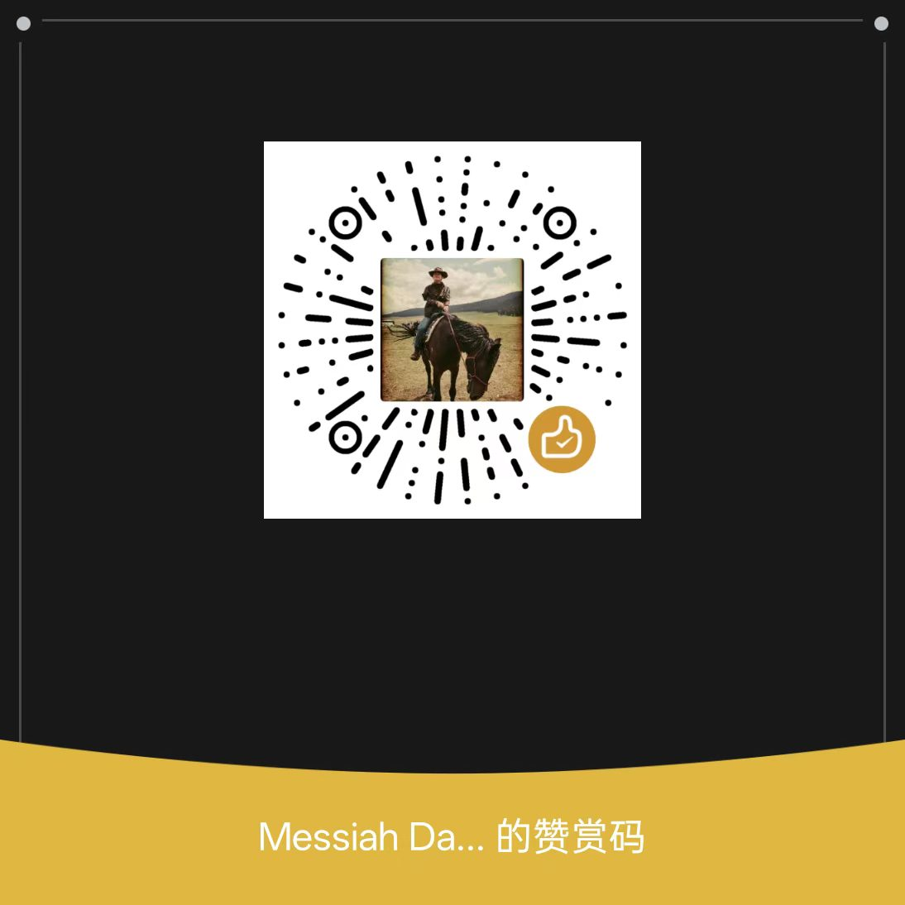

# 🏯 Polaris：天工开物 · 认知自动化开发工厂

**「垂拱而治」（Wu-wei Governance）·「事务内核」（Transaction Kernel）·「认知连续」（Cognitive Lifeform）**

*Polaris is not another chat-style coding agent. It is a transaction-governed software factory kernel for unattended, auditable, and recoverable AI software delivery.*

---

## 一句话看懂 Polaris 的野心

传统 Agent 把"继续还是停止"的控制权交给 LLM，本质上是模型主导的隐式递归，容易陷入死循环或幻觉；
**Polaris 则把 LLM 降级为受限的决策组件。** 由系统内核接管执行、审计、预算、提交与停止，将 AI 从"聪明的对话助手"升级为**可无人值守、可追责、可回滚的工业级软件生产流水线**。

---

## 📜 目录

- [🚀 为什么你应该加入 Polaris](#-为什么你应该加入-polaris)
- [🏆 护城河技术清单](#-护城河技术清单)
- [🧠 哲学顶层：认知生命体架构](#-哲学顶层认知生命体架构)
- [👥 角色体系：三省六部制](#-角色体系三省六部制)
- [🧩 技术架构总览](#-技术架构总览)
- [🚀 快速开始](#-快速开始)

---

## 🚀 为什么你应该加入 Polaris

### 你将解决 AI 工程领域最艰难的问题

| 普通项目 | Polaris |
|---------|---------|
| 写一个 Agent prompt | 设计 Agent 的 **"心跳节奏"**——Transaction Kernel 如何保证每 Turn 只产生一个不可逆决策 |
| 调用几个 API | 构建 **"认知生命体"**——前额叶(Orchestrator)、海马体(ContextOS)、小脑(WorkflowRuntime) 如何协作 |
| 写写 Python 代码 | 实现 **AI 的 Linux 内核**——文件系统、进程调度、内存管理全部为 AI 运行时重新设计 |
| 拼接 RAG | 打造 **四层正交记忆系统**——TruthLog + WorkingState + ReceiptStore + ProjectionEngine 严格隔离 |

### 测试与质量状态

> 注意: 此前展示的 `pytest --collect-only` 数字不代表实际通过率。
> 当前正在进行测试基础设施整改，真实覆盖率报告见 `src/backend/htmlcov/`。

```
# 收集数量（非通过数量）
pytest --collect-only -q → 13511 collected / 62 errors (2026-04-24)
# 真实覆盖率: 23.3% (69360/297487 lines)
```

整改目标:
- [ ] LLM Provider 集成测试覆盖
- [ ] HTTP Router 契约测试覆盖
- [ ] 核心模块 `roles.kernel` 内部覆盖率提升

### 你不是一个人在战斗

> "加入 Polaris 前：每天担心 LLM 陷入死循环  
> 加入 Polaris 后：KernelGuard 会物理熔断，我只需要设计更好的恢复策略"

---

## 🏆 护城河技术清单

### 1. 🫀 TransactionKernel：AI 的心跳控制器

**代码路径**: `polaris/cells/roles/kernel/internal/turn_transaction_controller.py`

```python
# 这不是 if-else，这是物理定律
KernelGuard.assert_single_decision(turn_id, decision_count)
KernelGuard.assert_single_tool_batch(turn_id, tool_batch_count)
KernelGuard.assert_no_hidden_continuation(turn_id, state_trajectory)
```

**为什么难以复制**: 全球唯一一个**生产级**强制执行 `len(TurnDecisions)==1` 的 Agent 系统。你的代码就是 AI 的心脏起搏器——每分钟跳 60 次，每次跳动都是一个不可逆的决策。

**加入你能**:
- 设计状态机驱动的决策仲裁
- 实现 panic + handoff_workflow 熔断协议
- 让 AI "心跳"既不过快（死循环）也不过慢（停滞）

---

### 2. 🧠 ContextOS：永不污染的认知隔离架构

**代码路径**: `polaris/kernelone/context/context_os/runtime.py`

```
┌─────────────────────────────────────────────────────────────┐
│  ContextOS 4-Layer Orthogonal Architecture                  │
├─────────────────────────────────────────────────────────────┤
│  TruthLog (Append-only)     → 不可篡改的审计源              │
│  WorkingState (Mutable)      → 运行时状态，但绝不直接喂给 LLM │
│  ReceiptStore (Referenced)   → 大文件只存引用，不重复         │
│  ProjectionEngine (Read-only) → 严格只读投影生成             │
└─────────────────────────────────────────────────────────────┘
```

**为什么难以复制**: 传统 Agent 把原始 tool output 直接塞进 prompt，Polaris 通过 4 层正交隔离保证**控制平面字段永不进入数据平面**。这是 工程级认知 hygiene，不是 prompt 技巧。

**加入你能**:
- 设计内容寻址存储（ContentStore with SHA256 deduplication）
- 实现 ref_count 生命周期管理
- 将 109KB 上下文压缩到 <25KB 且零信息损失

---

### 3. 🌊 StreamShadowEngine：跨 Turn 预知引擎

**代码路径**: `polaris/cells/roles/kernel/internal/stream_shadow_engine.py`

```python
# 当前 Turn 还在执行，下一个 Turn 的工具调用已经被预测并预执行
if self.has_valid_speculation(session_id):
    result = self.consume_speculation(session_id)  # 零延迟交付
else:
    result = await self.start_cross_turn_speculation(...)
```

**为什么难以复制**: 这是 AI 的"直觉"——在意识决策前，潜意识已经准备好了答案。ADOPT/JOIN/CANCEL/REPLAY 事务语义是独创的。

**加入你能**:
- 实现 ADOPT/JOIN/CANCEL/REPLAY 推测决议
- 设计 ShadowTaskRegistry 推测任务注册表
- 构建 StabilityScorer + CandidateDecoder 增量解析

---

### 4. 🏛️ Cell 波粒二象性：代码的高维 IR

**代码路径**: `docs/graph/catalog/cells.yaml` (51 Cells)

```
Wave (Discovery)     → 语义检索、聚类、上下文压缩
     ↓
Particle (Truth)     → 契约、边界、状态所有权
     ↓
Projection (Delivery) → 文件系统上的物理投影
```

**为什么难以复制**: 传统代码组织是"文件夹"，Polaris 代码是**高维架构 IR**。每个 Cell 声明：
- `owned_paths` - 状态所有权
- `depends_on` - 合法依赖
- `effects_allowed` - 副作用白名单
- `state_owners` - 单一写入源

**加入你能**:
- 设计 Graph-First 架构约束（50+ Fitness Rules）
- 实现 Cell 演化蓝图（Cell Evolution Schema）
- 构建 9 阶段 CI 治理流水线

---

### 5. 💾 Akashic Memory：三层融合的混合记忆

**代码路径**: `polaris/kernelone/akashic/`

```
VectorStore (embedding similarity) ─┐
FullTextStore (keyword match)      ─┼─→ 融合评分 (0.4/0.3/0.3)
GraphStore (entity relationships) ──┘
```

**为什么难以复制**: 问"给我所有关于认证的代码"，返回的是语义相关代码 + 关键词匹配文档 + 实体关系图谱，按融合相关性排序。

**加入你能**:
- 实现 LanceDB 向量检索 + JSONL 回退
- 设计 fusion_weights 可配置权重融合
- 构建 TierCoordinator 跨层提升/降级事务

---

### 6. 📦 ContentStore：内容寻址存储

**代码路径**: `polaris/kernelone/context/context_os/content_store.py`

```python
# 任何文本内容只存储一次，其他位置只持有 ContentRef (hash+size)
content_hash = sha256(content)[:24]
if content_hash in self._content_map:
    ref_count[content_hash] += 1  # 引用计数 +1
else:
    self._content_map[content_hash] = content  # 首次存储
```

**为什么难以复制**: 同一文件在 20 个 snapshot 中只占一份存储空间，引用计数自动管理，ref_count==0 时才回收。

**加入你能**:
- 实现 SHA256[:24] 内容哈希 + 碰撞检测
- 设计 80% 内存水位线 + LRU 回退
- 构建内容图谱内嵌快照持久化

---

### 7. 🔄 NATS JetStream 自愈流

**代码路径**: `polaris/infrastructure/messaging/nats/client.py`

```python
# 消息持久化，服务器重启后自动 replay
await self._js.publish(
    subject,
    payload,
    stream=self._stream,
    headers={"partition": str(partition)},
)
# 流自动重建，连接指数退避重连
await self._recover_runtime_stream_if_needed()
```

**为什么难以复制**: 消息中间件不是新概念，但**自愈流**（自动重建 stream）+ 消费者组偏移量管理 + 优雅降级（无 NATS 时内存回退）组合是独特的。

**加入你能**:
- 实现 JetStream 持久化 + 消费者组
- 设计被动 replay + 主动确认语义
- 构建 5 分钟 TTL 实例缓存 + 故障驱逐

---

### 8. 🔍 LanceDB 语义代码搜索

**代码路径**: `polaris/infrastructure/db/repositories/lancedb_code_search.py`

```python
# 内容哈希幂等索引，批量 upsert 自动去重
chunks = [KnowledgeChunkRecord(
    content=chunk_text,
    line_start=line_start,
    line_end=line_end,
    owner=file_path,
    embedding=embed(chunk_text)  # numpy array
) for chunk_text in chunks]
```

**为什么难以复制**: AST 级分块（80 行/块，10 行重叠）+ 向量相似度阈值过滤 + ghost 数据清理（JSONL↔LanceDB 同步）。

**加入你能**:
- 设计 tree-sitter AST 分块算法
- 实现增量索引 + 阈值过滤
- 构建 owner + tenant_id + graph_entity_id 边界强制

---

### 9. 🏭 EDA Task Market：异步任务集市

**代码路径**: `polaris/cells/runtime/task_market/`

```
PM 发布任务 → Claim (抢占) → Lease (租约)
    → Execute (执行) → Ack (确认) / Fail (失败)
    → Requeue / DeadLetter
```

**为什么难以复制**: 完整的有限状态机 + 优先级队列（low/medium/high/critical）+ dependency_digest 变更验证 + max_attempts 重试。

**加入你能**:
- 实现 TaskWorkItem 完整状态机
- 设计 visibility_timeout 自动回收
- 构建 DeadLetter + HITL 人工介入链路

---

### 10. 📜 TurnDecision 冰冻契约

**代码路径**: `polaris/cells/roles/kernel/public/turn_contracts.py`

```python
@dataclass(frozen=True, slots=True)
class TurnDecision:
    kind: TurnDecisionKind  # TOOL_BATCH / FINAL_ANSWER / HANDOFF_WORKFLOW
    effect_type: EffectType  # READ / WRITE / COMPUTE
    execution_mode: ExecutionMode  # SPECULATIVE / PARALLEL / ...
```

**为什么难以复制**: Pydantic v2 frozen 模型 + `@validator` 约束 + 1753 个测试验证契约合规性 = 编译期+运行时双重保证。

**加入你能**:
- 设计 Frozen IR 模型 + 不可变语义
- 实现 NonEmptyString / ValidWorkspacePath 验证器
- 构建 HandoffPack 跨角色交接契约

---

### 11. 🛡️ ContinuationPolicy：AI 的免疫系统

**代码路径**: `polaris/cells/roles/runtime/internal/continuation_policy.py`

```
max_auto_turns      → 防止僵尸死循环
stagnation_v2       → 2 轮 artifact hash 未变 + 无推测 = 强制终止
repetitive_failure  → 3 轮相同错误 = 熔断器断开
```

**为什么难以复制**: 不是"错误处理"，是**物理定律**。can_continue() 返回 (bool, reason)，明确告诉 AI 应该继续、重试还是求助。

**加入你能**:
- 实现 FailureClass → 恢复策略映射
- 设计 semantic stagnation + hash stagnation 双层检测
- 构建 adaptive threshold learning 自动调参

---

### 12. 📊 Tiered Summarizer：内容感知压缩

**代码路径**: `polaris/kernelone/context/compaction.py`

```python
# 按内容类型自动选择策略
if is_log_or_error(content):
    strategy = "sumy"  # TextRank 抽取式
elif is_code(content):
    strategy = "tree-sitter"  # AST 保持结构
elif is_dialogue(content):
    strategy = "transformers"  # 生成式摘要
# 但 error/exception/failed/timeout 关键词永远保留
```

**为什么难以复制**: 错误信息永远不会被摘要掉。正确的压缩策略给正确的内容类型。

**加入你能**:
- 实现 LLMLingua + TreeSitter + ORTools 多策略
- 设计 NetworkXCycleDetector 循环引用检测
- 构建 importance keyword 强制保留机制

---

### 13. 🔭 Omniscient Audit：端到端追踪

**代码路径**: `polaris/kernelone/audit/` + `polaris/cells/audit/`

```
LLM 调用拦截 → 工具执行拦截 → 任务生命周期拦截
     ↓
对话轮次拦截 → 上下文操作拦截 → Agent 告警拦截
     ↓
Schema Registry → Redaction (敏感数据) → OpenTelemetry 导出
```

**为什么难以复制**: "告诉我 AI 做了什么以及为什么"从调查变成查询。审计追踪是 AI 的黑匣子。

**加入你能**:
- 实现 interceptor 注入链（llm/tool/task/dialogue/context/agent/alert）
- 设计 storm_detector 异常检测
- 构建高可用模式 + 漂移检测

---

### 14. 🔌 KernelOne OS Substrate：AI 的 Linux

**代码路径**: `polaris/kernelone/` (992 Python files)

```
fs/          → 文件系统抽象 (KernelFileSystemAdapter)
db/          → 数据库抽象 (SQLite/SQLAlchemy/LanceDB)
locks/       → 分布式锁 (FileLock/SQLiteLock/RedisLock)
ws/          → WebSocket 会话 (InMemory/Redis)
effect/      → 副作用追踪 (Effect + EffectReceipt)
runtime/     → 车道式并发 (ASYNC/BLOCKING/SUBPROCESS)
storage/     → 3 层存储布局 (RAMDISK/WORKSPACE/GLOBAL)
```

**为什么难以复制**: 不是封装，是**重新定义 OS 为 AI 运行时服务**。所有副作用显式声明、可审计。

**加入你能**:
- 设计 Protocol-based 接口（197+ @runtime_checkable）
- 实现 9 阶段引导链 + 双检锁 DI 容器
- 构建 effect tracker 完整链路审计

---

### 15. 🌱 Cognitive Lifeform：哲学可执行化

**代码路径**: `docs/blueprints/COGNITIVE_LIFEFORM_ARCHITECTURE_ALIGNMENT_MEMO_20260417.md`

```
主控意识 (前额叶)  → RoleSessionOrchestrator.execute_stream()
     ↓
工作记忆 (小纸条)  → StructuredFindings 跨 Turn 传递
     ↓
海马体 (记忆固化)  → ContextOS + Commit Protocol
     ↓
肌肉记忆 (小脑)    → DevelopmentWorkflowRuntime
     ↓
心脏 (神经放电)    → TurnTransactionController + KernelGuard
     ↓
潜意识预感 (预激)  → StreamShadowEngine 跨 Turn 推测
     ↓
生理防线 (痛觉)   → ContinuationPolicy 熔断
```

**为什么难以复制**: 哲学不再是 PPT，而是**可执行、可测试、可审计的代码**。每个开发者都知道自己在构建什么。

---

## 🧠 哲学顶层：认知生命体架构

| 抽象概念 | 工程实体 | 为什么重要 |
|---------|---------|-----------|
| **主控意识** | `RoleSessionOrchestrator` | 裁决"此刻该做什么" |
| **心脏** | `TurnTransactionController` | 不可逆的单次心跳 |
| **肌肉记忆** | `DevelopmentWorkflowRuntime` | read→write→test 闭环自动化 |
| **海马体** | `ContextOS` + `Commit Protocol` | Durable Truth 记忆固化 |
| **免疫系统** | `ContinuationPolicy` | 防止死循环、资源耗尽 |
| **直觉预感** | `StreamShadowEngine` | 思考与行动时间重叠 |

---

## 👥 角色体系：三省六部制

| 角色 | 古名 | 加入你能做什么 |
|------|------|---------------|
| **Architect** | 中书令 | 设计 spec.md，指导技术方向 |
| **PM** | 尚书令 | 写 PM_TASKS.json 任务合同 |
| **Chief Engineer** | 工部尚书 | 画 Blueprint 施工蓝图 |
| **Director** | 工部侍郎 | 严格按图施工，写代码 |
| **QA** | 门下侍中 | 一票否决，独立证据验收 |
| **FinOps** | 户部尚书 | 管 Token 预算，防资产流失 |

**为什么分工严格？因为 AI 既当裁判又当运动员就会造假。**

---

## 🧩 技术架构总览

### KernelOne OS Substrate (AI 的 Linux)

```
polaris/kernelone/
├── fs/          # 文件系统：原子写入、UTF-8 强制、路径隔离
├── db/          # 数据库：SQLite/SQLAlchemy/LanceDB 多适配器
├── locks/       # 分布式锁：TTL、自旋重试、分布式抢占
├── ws/          # WebSocket：InMemory/Redis 双模式
├── effect/      # 副作用追踪：Effect + EffectReceipt 审计链
├── runtime/     # 执行引擎：ASYNC/BLOCKING/SUBPROCESS 三车道
├── storage/     # 存储布局：RAMDISK/WORKSPACE/GLOBAL 三层
├── context/     # 上下文：ContextOS 四层 + Akashic Memory
├── events/      # 事件总线：MessageBus + TypedEventBridge
├── audit/       # 审计：Hash 链 + Omniscient E2E Tracing
└── benchmark/   # 基准测试：Latency/Throughput/Memory/Chaos
```

### Cell 生态 (59 Cells)

| 类别 | 代表 Cell | 做什么 |
|------|---------|--------|
| **Runtime** | `runtime.task_market` | 异步任务集市 |
| **LLM** | `llm.control_plane` | Provider 组合边界 |
| **Roles** | `roles.kernel` | 角色执行内核 |
| **Orchestration** | `orchestration.pm_planning` | 合同生成 |
| **Factory** | `factory.pipeline` | 流水线编排 |
| **Audit** | `audit.evidence` | 证据事件 |
| **Archive** | `archive.run_archive` | 运行归档 |

---

## 🚀 快速开始

### 环境配置

```bash
# 一键安装
npm run setup:dev

# 启动 Dashboard
npm run dev
```

### 加入开发

```bash
# 启动后端
python src/backend/server.py --host 127.0.0.1 --port 49977

# 单独运行角色（类似 Claude Code）
python -m polaris.delivery.cli.architect.cli --mode interactive --workspace .
python -m polaris.delivery.cli.chief_engineer.cli --mode interactive --workspace .
python -m polaris.delivery.cli.director.cli --workspace . --iterations 1
```

### 运行测试

```bash
# 全部测试
pytest --collect-only -q  # 13511 collected / 62 errors (2026-04-24)

# 运行 lint + typecheck + test
ruff check . --fix && ruff format . && mypy . && pytest . -q
```

---

## 📈 项目规模

| 指标 | 数值 | 统计方式 |
|------|------|----------|
| Python 文件 | 2732 | `find src/backend/polaris -name "*.py" \| wc -l` (2026-04-24) |
| Cell 数量 | 59 | `grep "^  - id:" src/backend/docs/graph/catalog/cells.yaml \| wc -l` (2026-04-24) |
| 测试收集 | 13511 | `pytest --collect-only -q` (2026-04-24) |
| 真实覆盖率 | 23.3% | `pytest --cov=polaris` (69360/297487 lines) |
| 架构约束规则 | 50+ |
| Protocol 接口 | 197+ |
| 冰冻数据类 | 1668 |

---

## ☕ 请作者喝杯咖啡

如果 Polaris 对你有所帮助，欢迎请作者喝杯咖啡！

<table>
  <tr>
    <td align="center">
      <br/>
      <strong>支付宝 Alipay</strong>
    </td>
    <td width="60"></td>
    <td align="center">
      <br/>
      <strong>微信支付 WeChat Pay</strong>
    </td>
  </tr>
</table>

---

## 许可协议

MIT License
