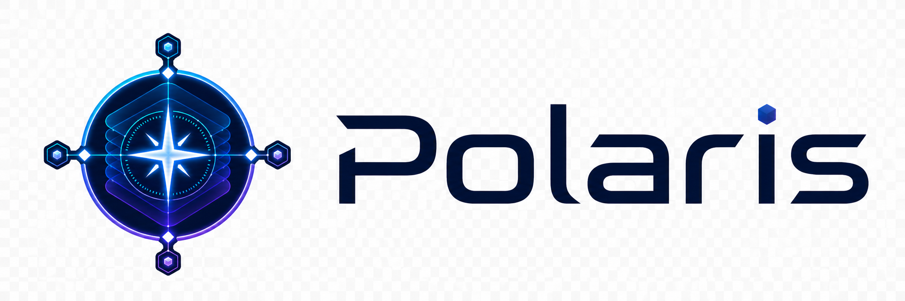
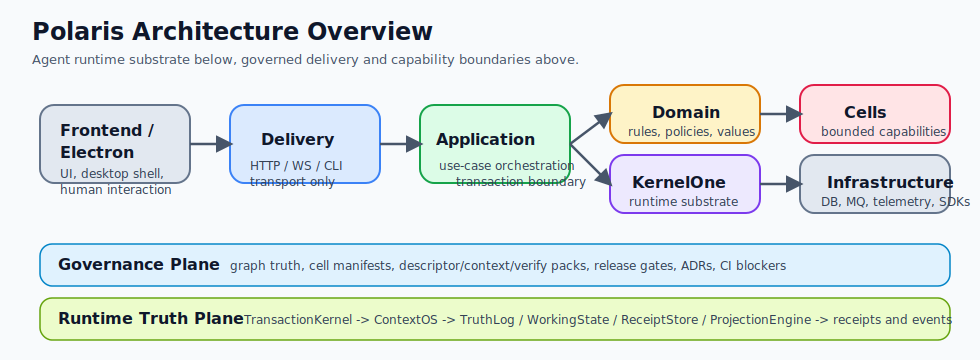

<p align="center">
  
</p>

# Polaris

Polaris 是一个面向复杂软件交付场景的 AI Agent 治理与运行时平台。  
它的目标不是再做一个“会聊天、会调工具”的 Agent 壳，而是把 Agent 执行变成 **可事务化、可审计、可回滚、可验证** 的工程系统。

英文版说明见 [README.en.md](./README.en.md)。

从架构上看：

- `KernelOne` 是底层运行时基座，负责上下文、执行、副作用、存储布局与事件等通用能力
- `Cells` 是业务能力边界，负责把复杂系统拆成可治理的能力单元
- `TransactionKernel` 和 `ContextOS` 是最关键的运行时真相链

## 项目简介

Polaris 是一个面向复杂软件交付场景的 AI Agent 治理与运行时平台。  
它想解决的不是“模型能不能再多调几个工具”，而是更底层的问题：

- Agent 的一次执行如何具备明确边界
- 上下文如何从消息堆积升级为运行时系统
- 工具调用和状态修改如何进入可审计链路
- 多角色、多阶段、长链路任务如何形成可验证闭环

可以把 Polaris 理解成两层：

1. `KernelOne`
   面向 AI Agent 的底层运行时基座，负责上下文、执行、副作用、存储布局、事件和运行时契约等平台无关能力。
2. `Polaris`
   建立在 `KernelOne` 之上的治理与交付系统，负责多角色协作、任务编排、执行调度、审计验收、质量门禁与桌面工作台。

这意味着 Polaris 更接近 **Agent Runtime + Governance Platform**，而不是单纯的 Prompt 模板集合或聊天式编码助手。

### 当前状态

当前仓库状态应被理解为：

- **Alpha**
- **主干架构明确，但收敛仍在进行中**
- **`src/backend/polaris/` 是后端 canonical 根目录**
- **旧入口和兼容层仍存在，但不应继续承载新主实现**

如果你在评估项目，请把它看成一个“方向明确、工程量巨大、仍在持续收敛的运行时平台”，而不是一个已经完全稳定封板的产品。

## 核心架构

### 架构总览图



这张图可以先帮助你建立一个最简模型：

- `Frontend / Electron` 负责 UI 与桌面壳层
- `delivery` 负责 HTTP / WebSocket / CLI 等传输入口
- `application` 负责用例编排和事务边界
- `domain` 负责业务规则
- `kernelone` 负责 Agent Runtime Substrate
- `cells` 负责业务能力边界
- `infrastructure` 负责数据库、消息、遥测和外部适配

底部两条横向平面代表 Polaris 真正关心的两个问题：

- `Governance Plane`：graph、manifest、packs、ADR、release gate、CI blocker
- `Runtime Truth Plane`：TransactionKernel、ContextOS、TruthLog、WorkingState、ReceiptStore、ProjectionEngine

### 分层结构

Polaris 当前后端 canonical 主干围绕以下分层展开：

- `bootstrap/`：启动装配与生命周期管理
- `delivery/`：HTTP / WebSocket / CLI 入口
- `application/`：用例编排与事务边界
- `domain/`：业务规则与领域模型
- `kernelone/`：Agent Runtime 底座
- `infrastructure/`：数据库、消息、遥测与外部适配器
- `cells/`：能力边界与治理单元

这套结构的目标不是把目录整理得更“好看”，而是把传输协议、用例编排、运行时能力、业务规则和外部依赖真正拆开，让系统在复杂度增长后仍然可维护、可测试、可审计。

### 核心概念

### 1. KernelOne

`KernelOne` 是 Polaris 的通用运行时基座，代码位于 [src/backend/polaris/kernelone](/C:/Users/dains/Documents/GitLab/polaris/src/backend/polaris/kernelone)。  
它负责承载平台无关的技术能力，包括：

- Context runtime
- execution substrate
- storage layout / KFS
- event and audit primitives
- provider/tool/runtime contracts

### 2. TransactionKernel

`TransactionKernel` 是 turn 级执行内核，核心目标是让 Agent 的一次执行具备明确的提交边界，而不是无限 continuation。  
相关代码和治理资产主要位于：

- [src/backend/polaris/cells/roles/kernel](/C:/Users/dains/Documents/GitLab/polaris/src/backend/polaris/cells/roles/kernel)
- [adr-0071](/C:/Users/dains/Documents/GitLab/polaris/src/backend/docs/governance/decisions/adr-0071-transaction-kernel-single-commit-and-context-plane-isolation.md)

### 3. ContextOS

`ContextOS` 是上下文运行时，目标是把“事实日志、工作状态、大对象引用、只读投影”分层管理，而不是把所有内容直接塞进 prompt。  
相关代码位于 [src/backend/polaris/kernelone/context](/C:/Users/dains/Documents/GitLab/polaris/src/backend/polaris/kernelone/context)。

### 4. Cells

`Cells` 是 Polaris 的能力边界模型。  
每个 Cell 应该有明确的职责、依赖、公开契约和治理资产，而不是靠目录约定和隐式依赖维持系统。  
图谱真相位于 [src/backend/docs/graph/catalog/cells.yaml](/C:/Users/dains/Documents/GitLab/polaris/src/backend/docs/graph/catalog/cells.yaml)。

### 5. 角色协作

当前系统围绕以下工程角色组织协作：

- `PM`
- `Architect`
- `Chief Engineer`
- `Director`
- `QA`

历史文档里可能还能看到官职隐喻；对外理解和实际开发请优先使用工程术语。统一术语表见 [docs/TERMINOLOGY.md](/C:/Users/dains/Documents/GitLab/polaris/docs/TERMINOLOGY.md)。

### 运行时主线

Polaris 真正的心脏不是 UI，而是这条运行时真相链：

1. 启动与装配：由 [backend_bootstrap.py](/C:/Users/dains/Documents/GitLab/polaris/src/backend/polaris/bootstrap/backend_bootstrap.py:45) 统一负责环境、配置、端口、FastAPI app 和 server 生命周期。
2. 传输入口：HTTP 入口通过 [app_factory.py](/C:/Users/dains/Documents/GitLab/polaris/src/backend/polaris/delivery/http/app_factory.py:91) 组装，实时事件通过 [websocket_core.py](/C:/Users/dains/Documents/GitLab/polaris/src/backend/polaris/delivery/ws/endpoints/websocket_core.py:57) 推送。
3. 会话编排：多回合角色执行由 [session_orchestrator.py](/C:/Users/dains/Documents/GitLab/polaris/src/backend/polaris/cells/roles/runtime/internal/session_orchestrator.py:448) 负责状态机、handoff 和 continuation policy。
4. 单 turn 事务：一次执行的真正事务内核是 [turn_transaction_controller.py](/C:/Users/dains/Documents/GitLab/polaris/src/backend/polaris/cells/roles/kernel/internal/turn_transaction_controller.py:136)，核心目标是杀掉隐式 continuation loop。
5. 上下文入口：所有上下文构建统一经过 [gateway.py](/C:/Users/dains/Documents/GitLab/polaris/src/backend/polaris/cells/roles/kernel/internal/context_gateway/gateway.py:77)，再落到 `StateFirstContextOS`。
6. 上下文四层：`TruthLog`、`WorkingState`、`ReceiptStore`、`ProjectionEngine` 分别位于 [truth_log_service.py](/C:/Users/dains/Documents/GitLab/polaris/src/backend/polaris/kernelone/context/truth_log_service.py:321)、[working_state_manager.py](/C:/Users/dains/Documents/GitLab/polaris/src/backend/polaris/kernelone/context/working_state_manager.py:11)、[receipt_store.py](/C:/Users/dains/Documents/GitLab/polaris/src/backend/polaris/kernelone/context/receipt_store.py:13)、[projection_engine.py](/C:/Users/dains/Documents/GitLab/polaris/src/backend/polaris/kernelone/context/projection_engine.py:86)。

这条主线决定了 Polaris 不只是“能调模型”，而是在尝试建立一个真正可治理的 Agent Runtime。

## 核心优势

### 1. Agent 执行是事务化设计，而不是无限 while-loop

Polaris 的一个核心优势，是它把 Agent 执行当成“有提交边界的运行时过程”来设计，而不是把模型、工具和状态全部塞进一个隐式循环里。  
这条主线主要落在：

- [src/backend/polaris/cells/roles/kernel](/C:/Users/dains/Documents/GitLab/polaris/src/backend/polaris/cells/roles/kernel)
- [adr-0071](/C:/Users/dains/Documents/GitLab/polaris/src/backend/docs/governance/decisions/adr-0071-transaction-kernel-single-commit-and-context-plane-isolation.md)

这件事的意义在于：

- turn 级决策、工具批次和 handoff 可以被约束
- 执行过程可以被审计、验证和逐步标准化
- 系统有机会摆脱 hidden continuation 和 transport-dependent commit

这不是“多一个概念名”，而是把 Agent 从脚本化行为推进到运行时纪律。

### 2. ContextOS 把上下文问题从 prompt 技巧提升为系统设计

很多 Agent 工程在上下文上依赖经验：消息太长了就裁、太乱了就摘要。  
Polaris 的方向不是这样。`ContextOS` 试图把上下文拆成不同层级的职责：

- 事实日志
- 工作状态
- 大对象引用
- 只读投影

核心代码在：

- [src/backend/polaris/kernelone/context](/C:/Users/dains/Documents/GitLab/polaris/src/backend/polaris/kernelone/context)

它的价值是：

- prompt 组装可以逐步脱离原始消息堆积
- 审计、压缩、回放和隔离具备更清楚的结构
- 运行时事实和控制面信息有机会真正分层

当前这条链路还在继续硬化，但它已经是 Polaris 与普通聊天式 Agent 项目最本质的差异之一。

### 3. 系统不是靠目录习惯维持，而是靠边界和治理资产维持

Polaris 的另一个优势，是它不满足于“约定大家别乱 import”。  
仓库里已经形成了比较完整的治理方向：

- 规范根目录分层
- Cell 边界
- public/internal fence
- graph truth
- descriptor/context/verify pack
- architecture/release gates

关键真相源：

- [src/backend/docs/AGENT_ARCHITECTURE_STANDARD.md](/C:/Users/dains/Documents/GitLab/polaris/src/backend/docs/AGENT_ARCHITECTURE_STANDARD.md)
- [src/backend/docs/graph/catalog/cells.yaml](/C:/Users/dains/Documents/GitLab/polaris/src/backend/docs/graph/catalog/cells.yaml)
- [src/backend/polaris/cells](/C:/Users/dains/Documents/GitLab/polaris/src/backend/polaris/cells)

这条路线真正有价值的地方在于：  
随着仓库变大，系统还能继续讨论“谁拥有状态、谁暴露契约、谁可以产生副作用”，而不是退化成全仓搜索替换。

### 4. KernelOne 的目标是可沉淀的 Agent Runtime Substrate

`KernelOne` 不是简单的工具目录，它的目标是承载平台无关、可复用的 Agent 运行时能力：

- context runtime
- execution substrate
- storage layout / KFS
- events and audit primitives
- provider/tool/runtime contracts

相关代码与规范：

- [src/backend/polaris/kernelone](/C:/Users/dains/Documents/GitLab/polaris/src/backend/polaris/kernelone)
- [src/backend/docs/KERNELONE_ARCHITECTURE_SPEC.md](/C:/Users/dains/Documents/GitLab/polaris/src/backend/docs/KERNELONE_ARCHITECTURE_SPEC.md)

这意味着 Polaris 的 ambition 不是只做“一个桌面 Agent 产品”，而是在往“Agent 基础软件层”推进。

### 5. 审计、门禁和副作用治理从一开始就是主线

Polaris 很强调一个问题：  
系统做了什么，能不能在事后说清楚，能不能在运行中阻断，能不能在变更时验证。

这种思路已经体现在当前仓库里：

- 架构与发布门禁：
  - [tests/architecture/test_kernelone_release_gates.py](/C:/Users/dains/Documents/GitLab/polaris/tests/architecture/test_kernelone_release_gates.py)
  - [quality-gates.yml](/C:/Users/dains/Documents/GitLab/polaris/.github/workflows/quality-gates.yml)
- 治理资产：
  - [src/backend/docs/governance](/C:/Users/dains/Documents/GitLab/polaris/src/backend/docs/governance)
- 运行时证据路径：
  - [runtime](/C:/Users/dains/Documents/GitLab/polaris/runtime)
  - [src/backend/workspace/meta](/C:/Users/dains/Documents/GitLab/polaris/src/backend/workspace/meta)

这条路线说明 Polaris 想做的不是“更聪明一点的 Agent”，而是“更可治理一点的 Agent 系统”。

### 6. Polaris 关注的是长链路协作，而不是单轮回答

从代码结构就能看出来，Polaris 不是围绕一次性问答设计的。  
它显式建模了：

- 多角色协作
- 任务市场
- 执行 broker
- evidence / archive / audit / runtime state

对应路径包括：

- [src/backend/polaris/cells/runtime/task_market](/C:/Users/dains/Documents/GitLab/polaris/src/backend/polaris/cells/runtime/task_market)
- [src/backend/polaris/cells/runtime/task_runtime](/C:/Users/dains/Documents/GitLab/polaris/src/backend/polaris/cells/runtime/task_runtime)
- [src/backend/polaris/cells/runtime/execution_broker](/C:/Users/dains/Documents/GitLab/polaris/src/backend/polaris/cells/runtime/execution_broker)
- [src/backend/polaris/cells/factory/pipeline](/C:/Users/dains/Documents/GitLab/polaris/src/backend/polaris/cells/factory/pipeline)

这让 Polaris 更像一个 Agent 工程平台，而不是“套了工具调用的聊天窗口”。

## 仓库结构

### 关键目录

| 路径 | 作用 |
|---|---|
| [src/backend/polaris](/C:/Users/dains/Documents/GitLab/polaris/src/backend/polaris) | 后端主实现 |
| [src/backend/polaris/kernelone](/C:/Users/dains/Documents/GitLab/polaris/src/backend/polaris/kernelone) | Agent 运行时基座 |
| [src/backend/polaris/cells](/C:/Users/dains/Documents/GitLab/polaris/src/backend/polaris/cells) | 业务能力边界 |
| [src/frontend](/C:/Users/dains/Documents/GitLab/polaris/src/frontend) | React 前端 |
| [src/electron](/C:/Users/dains/Documents/GitLab/polaris/src/electron) | Electron 壳层 |
| [src/backend/docs](/C:/Users/dains/Documents/GitLab/polaris/src/backend/docs) | 后端架构、治理与图谱文档 |
| [docs](/C:/Users/dains/Documents/GitLab/polaris/docs) | 项目级文档与蓝图 |
| [tests](/C:/Users/dains/Documents/GitLab/polaris/tests) | 仓库级测试 |
| [src/backend/tests](/C:/Users/dains/Documents/GitLab/polaris/src/backend/tests) | 后端治理/架构/集成测试 |

### 后端规范根目录

后端当前的 canonical 分层是：

- `bootstrap/`
- `delivery/`
- `application/`
- `domain/`
- `kernelone/`
- `infrastructure/`
- `cells/`
- `tests/`

这些目录都位于 [src/backend/polaris](/C:/Users/dains/Documents/GitLab/polaris/src/backend/polaris) 下。  
具体规则见 [src/backend/docs/AGENT_ARCHITECTURE_STANDARD.md](/C:/Users/dains/Documents/GitLab/polaris/src/backend/docs/AGENT_ARCHITECTURE_STANDARD.md) 和 [src/backend/docs/KERNELONE_ARCHITECTURE_SPEC.md](/C:/Users/dains/Documents/GitLab/polaris/src/backend/docs/KERNELONE_ARCHITECTURE_SPEC.md)。

## 快速开始

### 环境要求

- Python `3.10+`，推荐 `3.11+`
- Node.js `20+`
- Windows/macOS/Linux 均可开发，当前仓库内含 Electron、FastAPI、Playwright、Vitest、Pytest 工作流

### 1. 一键准备开发环境

```bash
npm run setup:dev
```

该脚本会准备前端和本地开发所需的基础环境。  
如果你只需要 Python 侧，也可以直接使用：

```bash
pip install -e .[dev]
```

### 2. 启动桌面端开发环境

```bash
npm run dev
```

这会启动前端开发服务器并拉起 Electron。

### 3. 仅启动后端

推荐使用安装后的 canonical CLI：

```bash
polaris --host 127.0.0.1 --port 49977
```

兼容方式仍然可用，但属于旧入口 shim：

```bash
python src/backend/server.py --host 127.0.0.1 --port 49977
```

canonical 实现位于 [src/backend/polaris/delivery/server.py](/C:/Users/dains/Documents/GitLab/polaris/src/backend/polaris/delivery/server.py)，兼容 shim 位于 [src/backend/server.py](/C:/Users/dains/Documents/GitLab/polaris/src/backend/server.py)。

### 4. 单独运行角色 CLI

```bash
pm --workspace . --start-from pm
director --workspace . --iterations 1
python -m polaris.cells.architect.design.internal.architect_cli --mode interactive --workspace .
python -m polaris.cells.chief_engineer.blueprint.internal.chief_engineer_cli --mode interactive --workspace .
```

### 5. 前端测试

```bash
npm test
npm run test:e2e
```

## 30 分钟上手路线

### 0-5 分钟：先看骨架文档

按顺序阅读：

1. [src/backend/AGENTS.md](/C:/Users/dains/Documents/GitLab/polaris/src/backend/AGENTS.md)
2. [src/backend/docs/AGENT_ARCHITECTURE_STANDARD.md](/C:/Users/dains/Documents/GitLab/polaris/src/backend/docs/AGENT_ARCHITECTURE_STANDARD.md)
3. [src/backend/docs/KERNELONE_ARCHITECTURE_SPEC.md](/C:/Users/dains/Documents/GitLab/polaris/src/backend/docs/KERNELONE_ARCHITECTURE_SPEC.md)

### 5-10 分钟：把桌面端跑起来

```bash
npm run setup:dev
npm run dev
```

### 10-15 分钟：单独把后端跑起来

```bash
polaris --host 127.0.0.1 --port 49977
```

### 15-20 分钟：看三条关键代码主线

优先浏览：

1. [src/backend/polaris/kernelone](/C:/Users/dains/Documents/GitLab/polaris/src/backend/polaris/kernelone)
2. [src/backend/polaris/cells/roles/kernel](/C:/Users/dains/Documents/GitLab/polaris/src/backend/polaris/cells/roles/kernel)
3. [src/backend/polaris/cells/runtime](/C:/Users/dains/Documents/GitLab/polaris/src/backend/polaris/cells/runtime)

### 20-25 分钟：跑最小测试集合

```bash
npm test
python -m pytest -q tests/architecture/test_kernelone_release_gates.py
```

### 25-30 分钟：验证 E2E 与发布门禁

```bash
npm run test:e2e
python src/backend/docs/governance/ci/scripts/run_kernelone_release_gate.py --mode all
```

## 测试与质量门禁

### Python 侧最小门禁

```bash
ruff check src/backend/polaris --fix
ruff format src/backend/polaris
mypy src/backend/polaris
pytest src/backend/tests -q
```

### 架构/发布关键门禁

```bash
python -m pytest -q tests/architecture/test_kernelone_release_gates.py
python src/backend/docs/governance/ci/scripts/run_kernelone_release_gate.py --mode all
python src/backend/docs/governance/ci/scripts/run_catalog_governance_gate.py --workspace . --mode audit-only
```

### CI 工作流

当前与质量最相关的工作流位于：

- [quality-gates.yml](/C:/Users/dains/Documents/GitLab/polaris/.github/workflows/quality-gates.yml)
- [kernel_quality.yml](/C:/Users/dains/Documents/GitLab/polaris/.github/workflows/kernel_quality.yml)
- [ci.yml](/C:/Users/dains/Documents/GitLab/polaris/.github/workflows/ci.yml)

## 未来方向

### 1. 让 KernelOne 真正变成纯底座

未来的关键方向之一，不是往 `KernelOne` 里继续堆业务语义，而是反过来做纯化：

- 清理反向依赖
- 清理角色语义泄漏
- 清理绕过 `storage.layout` / KFS 的旁路写盘

目标是让 `KernelOne` 真正成为稳定、可复用、平台无关的 Agent Runtime Substrate。

### 2. 把规范主干真正落成代码主干

当前规范要求的主干是：

- `delivery -> application -> domain/kernelone`

未来最重要的架构收敛方向之一，就是让这条链路在真实代码里成立：

- `delivery` 只做 transport
- `application` 真正承担编排和事务边界
- `domain` 真正承载业务规则
- `cells` 通过 public contract 协作

这一步做成以后，Polaris 的可维护性和可验证性会明显上一个台阶。

### 3. 完成 TransactionKernel + ContextOS 的单一真相链

未来真正决定 Polaris 上限的，不是增加多少工具，而是把以下链路彻底闭合：

- `TransactionKernel` 成为唯一 durable commit authority
- `ContextOS` 成为唯一上下文真相链
- `run` 和 `stream` 不再形成第二提交通道
- handoff 不再依赖 transport 差异

这一点决定 Polaris 能不能从“能跑起来”走向“能长期稳定运行”。

### 4. 让 graph、manifest 和治理 pack 变成可执行真相

Polaris 已经有了 graph、cell manifest、packs、verification card、ADR、release gate 这些治理资产。  
未来方向不是再增加更多文档，而是让它们真正成为系统边界和变更门禁的一部分：

- `catalog/cells.yaml`
- `cell.yaml`
- `descriptor/context/verify pack`
- release gate / catalog gate / ADR / verification card

一旦这条治理链完全打通，系统演进会更像工程系统，而不是“靠核心成员脑内记忆”的项目。

### 5. 把可观测性做成 operator-grade

未来方向不仅是“日志更多”，而是：

- 统一事件事实
- 统一 receipt / evidence / archive
- 统一 runtime 状态与 UI 展示
- 让 PM / Director / QA 的链路具备可回溯、可解释、可归因的观测能力

这会直接决定 Polaris 能否支撑真正的长任务和无人值守场景。

## 当前你最应该先读什么

如果你要理解项目而不是只跑起来，建议按这个顺序读：

1. [src/backend/AGENTS.md](/C:/Users/dains/Documents/GitLab/polaris/src/backend/AGENTS.md)
2. [src/backend/docs/AGENT_ARCHITECTURE_STANDARD.md](/C:/Users/dains/Documents/GitLab/polaris/src/backend/docs/AGENT_ARCHITECTURE_STANDARD.md)
3. [src/backend/docs/KERNELONE_ARCHITECTURE_SPEC.md](/C:/Users/dains/Documents/GitLab/polaris/src/backend/docs/KERNELONE_ARCHITECTURE_SPEC.md)
4. [docs/TERMINOLOGY.md](/C:/Users/dains/Documents/GitLab/polaris/docs/TERMINOLOGY.md)
5. [src/backend/docs/graph/catalog/cells.yaml](/C:/Users/dains/Documents/GitLab/polaris/src/backend/docs/graph/catalog/cells.yaml)

如果你想看这次 README 重构背后的信息架构设计，见 [README_INFORMATION_ARCHITECTURE_BLUEPRINT_20260425.md](/C:/Users/dains/Documents/GitLab/polaris/docs/blueprints/README_INFORMATION_ARCHITECTURE_BLUEPRINT_20260425.md)。

## 支持与许可

如果你想支持项目，请给作者买10杯咖啡吧。

| 支付宝 | 微信支付 |
|---|---|
|  |  |


许可证：MIT，见 [LICENSE](/C:/Users/dains/Documents/GitLab/polaris/LICENSE)。
