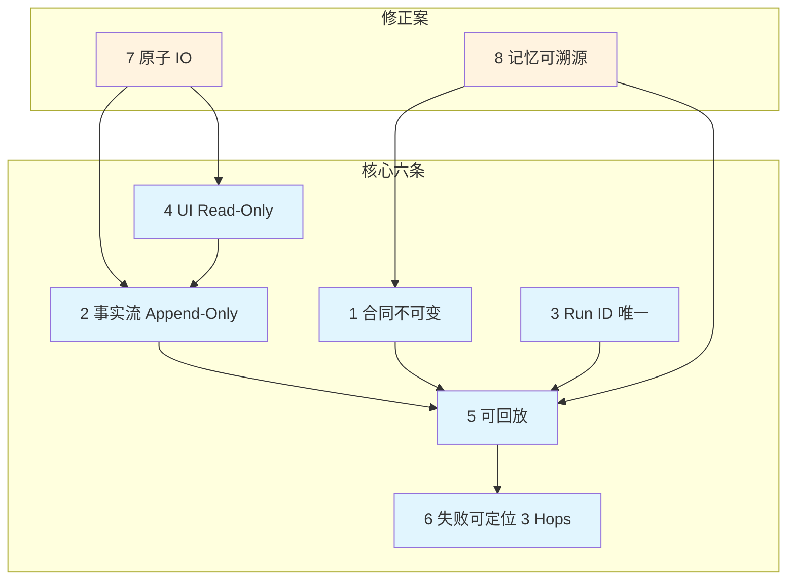

# 🧭 Polaris 系统不变量

> **v2：核心 6 + 修正 3**
>
> 目标：面向现实的单人无人值守系统，必须做到 **可控、可追溯、可回放、可定位**。
>
> 这组不变量是 Polaris 的**系统宪法**。任何新增功能都不能破坏它们。

---

## 快速总览

| # | 不变量 | 一句话说明 |
| --- | --- | --- |
| 1️⃣ | **合同不可变** | `PM_TASKS.json` 的 goal / acceptance_criteria 不可被执行侧改写，只能追加证据 |
| 2️⃣ | **事实流 Append-Only** | `events.jsonl` 只许追加，任何修正必须写入新事件 |
| 3️⃣ | **Run ID 全局唯一** | 所有产物/引用/轨迹/备忘录必须以 `run_id` 串联，否则视为无效 |
| 4️⃣ | **观察优先（UI Read-Only）** | 运行态 UI 不改任务/代码/状态，控制面只在 Loop |
| 5️⃣ | **可回放** | 仅依赖 events + trajectory + artifacts paths 可重建关键过程 |
| 6️⃣ | **失败可定位（3 Hops）** | 任一失败应在 3 hops 内定位到 Phase → Evidence → Tool Output |
| 7️⃣ | **原子写入与一致读** | 关键状态文件必须原子写，读取永远不读到半截 |
| 8️⃣ | **记忆必须可溯源** | memory/reflection 不可当事实；必须带证据 refs |
| 9️⃣ | **编码统一性** | 所有文本读写必须显式 UTF-8，防止乱码破坏证据 |
| 🔟 | **宁修不滚（Fix-Forward）** | 无人值守自动化写代码；默认禁止自动回滚，宁可保留问题代码后续修，也不白写再回滚浪费时间和 token |

> ✅ **例外**：Setup/Onboarding 模式允许“受限写入”（仅 `docs/` 与 `config`），但必须写入事件流以审计。

### 风险接受注记（单人工具）

- 当前 Polaris 运行场景按“单人本地工具”管理。
- 对于调试链路中的 API Key/Header 暴露风险，当前策略为 `accepted risk`（已知并接受），不作为本阶段阻塞项。
- 要求：该风险只在单人本地场景生效；若未来转为多人或远程部署，必须恢复为强制脱敏策略并重新评审日志输出面。

---

## 术语详解

### 1) 合同 (Contract)

**定义**: PM_TASKS.json 里由 PM Loop 下发的、对 Director Loop 具有约束力的"任务契约"。

#### 核心组成

**goal**
- **是什么**: 一句话或短段落，定义"这轮要达成的目标是什么"
- **作用**: 把"要做什么"写死，防止执行侧在过程中把目标改小/改歪
- **边界**: goal 不是实现方案，不是步骤，不是推理；它是方向与结果
- **例子**: "消除 FileMetadata 定义重复，统一为 src/types/file.ts 的单一真源，并修正所有引用"

**acceptance_criteria (AC)**
- **是什么**: 一组可验收的标准（最好是清单），用于判断任务是否"完成"
- **作用**: 
  - 给 QA 一个客观裁决依据（PASS/FAIL）
  - 给 Director 一个可执行的"终点线"
  - 防止"自说自话式完成"
- **例子**:
  - "src/types/ 下只保留一个 FileMetadata 定义"
  - "所有组件 import 指向 canonical 文件"
  - "npm run type-check 通过"
  - "docs/agent/architecture.md 更新了 canonical 位置说明"

#### ✅ 关键约束
- **合同不可变**: Director/记忆模块不能改写 goal/AC，只能追加 evidence 来证明已满足
- **强制执行**: QA 必须基于 AC 做裁决，Director 必须达成 AC 才算完成

### 2) 事实流 (Truth Stream / Event Stream)

**定义**: 系统运行过程中发生的、可审计、可追加的"事实记录"，以 events.jsonl 为主（append-only）。它记录的是**"发生了什么"**，而不是"我觉得怎样"。

#### 组成部分

**events.jsonl**
- **是什么**: 一条条 JSON 事件（action/observation）的追加流
- **通常包含**:
  - 谁（actor）: Director/QA/Tooling/System…
  - 做了什么（name）: repo_rg/apply_patch/pytest/llm_invoke…
  - 结果是什么（ok/output/exit_code/duration…）
  - 关联信息（refs）: run_id/task_id/phase/mode 等
- **解决的问题**:
  - 让过程可回放、可追责、可对比
  - 避免"日志被覆盖/状态被篡改"
  - 支撑失败 3 hops 定位

**trajectory.json**
- **是什么**: 对 events.jsonl 的"索引/目录"，把事件序列按 run/phase 分段，并串起关键产物路径
- **用途**:
  - UI 不用从头扫描全部 events 才知道本次 run 的范围
  - 回放时能快速跳到某个阶段的事件区间

**Artifacts Index**
- **是什么**: 把这次 run 生成的文件产物（PM_TASKS、RUNLOG、QA_RESPONSE、diff、memos…）以路径和元信息形式索引起来
- **用途**:
  - "证据文件在哪里？"一键可查
  - 回放时能把事件与文件对上

#### 📝 总结
**事实流 = events（发生了什么）+ trajectory（怎么串起来）+ artifacts index（证据文件在哪）**

### 3) 证据 (Evidence)

**定义**: 任何能够被复查、回放、验证的东西，用于支持某个判断（尤其是"是否满足 AC""为什么失败"）。证据必须能定位到具体来源。

#### ✅ 什么算证据？

- **可回放事件**: events.jsonl 中某段事件区间（含 tool 调用与输出）
- **产物文件**: DIRECTOR_RESULT.json / QA_RESPONSE.md / RUNLOG.md / patch diff 等
- **日志片段**: 测试失败的关键几行、Traceback 的 top frame（最好落盘并带 hash）
- **文件引用**: 某段代码片段（file + 行号范围 + 内容 hash）
- **（可选）模型调用记录**: llm_invoke 的 usage、latency、输入摘要

#### ❌ 什么不算证据？

- "我记得上次这样做行"（没有 refs 的 memory）
- "模型说已经修好了"（没有对应 diff/测试输出/事件）
- UI 上一个状态灯（如果它不能回溯到事件与产物）

#### 🎯 新不变量 #8
**Memory 必须 refs**: 记忆/反思不能当事实，只有带证据引用时才能作为可靠建议参与决策。
#### 🎯 新不变量 #9
**编码统一性**: 所有文本读写必须明确 UTF-8，防止乱码破坏证据与可回放性。


### 4) 3 Hops：Phase → Evidence → Tool Output

**定义**: 一个强制的"排障最短路径"规范：任何失败都要能在 3 跳之内定位到根因证据。

#### Hop 1：Phase（阶段）
**先回答**: 失败发生在哪个阶段？
- Planner / Evidence / Patch / Exec / QA / Reviewer / Policy Gate / Setup …
- **目的**: 把搜索空间从"全局"缩小到"一个阶段"

#### Hop 2：Evidence（证据）
**在这个阶段里，找到支撑结论的证据引用**:
- 哪个 run_id、哪个 event seq 范围、哪个产物文件、哪个代码片段引用
- **目的**: 避免"凭感觉猜"，必须能点开看

#### Hop 3：Tool Output（工具输出）
**最终定位到"哪个工具输出了错误信息/失败信号"**:
- pytest 的失败用例与堆栈
- ruff/mypy 的报错行
- npm type-check 的 error
- 某个 repo 工具返回空/超时
- 某个 llm 调用超时/格式不合规

#### 💡 价值
把排障从"翻一堆日志"变成"像 CI 一样定位"。对单人无人值守尤其关键，因为真正昂贵的是你的排障时间。

---

## 四者关系 (Relationship)

**一句话串起来**:

> **合同**定义"要达成什么、怎么才算完成"（goal + AC）→ **事实流**记录"实际发生了什么"（events + trajectory + artifacts）→ **证据**是从事实流与产物中抽出的"可验证引用"→ **3 Hops**规定"失败时必须按 Phase → Evidence → Tool 输出"快速归因

---

## 1️⃣ 合同不可变（Immutable Contract）

### 条文
`PM_TASKS.json` 的 `goal` / `acceptance_criteria` 不允许执行侧改写，只能追加 `evidence`。

### 为什么这是宪法级不变量
- 防止“目标漂移”：模型不能悄悄把目标改成容易完成的版本。
- 保证验收客观：AC 一旦可改，“成功”就不再可验证。
- 给 QA 提供稳定基线：QA 必须基于 AC 判断通过/失败。

### 反例（禁止）
- ❌ Director 修改 `acceptance_criteria` 降低标准
- ❌ 执行侧“优化目标表述”使其更易达成

---

## 2️⃣ 事实流 Append-Only

### 条文
`events.jsonl` 只能追加。任何修正/回滚必须写入新事件，禁止覆写历史。

### 为什么这是宪法级不变量
- 防止“事后洗白”：覆盖历史会让系统失去可信度。
- 支持回放/对比/回归：长期演化中能回答“何时开始变差”。
- 让 UI / 分析层完全信任数据源：无需猜测是否被修改。

### 允许的修正方式
- ✅ 追加 `correction` / `rollback_applied` 事件
- ❌ 删除或修改旧事件

---

## 3️⃣ Run ID 全局唯一

### 条文
所有产物、引用、轨迹、备忘录必须以 `run_id` 串联；缺失视为无效数据。

### 为什么这是宪法级不变量
- 避免并发污染：多 run 并行时不互相覆盖。
- 保证回放可行：能把 PM / Director / QA / events 串成闭环。
- 支持影子执行与自升级：`run_id` 是天然的证据主键。

### 反例（禁止）
- ❌ 产物文件不包含 `run_id`
- ❌ 多个并发 run 共用同一输出目录

---

## 4️⃣ 观察优先（UI Read-Only）

### 条文
运行态 UI 不修改任务、代码或状态；所有状态变更由 Loop 产生。

### 例外
Setup/Onboarding 允许受限写入：仅 `docs/` 与 `config`，且必须记录事件流。

### 为什么这是宪法级不变量
- 避免竞态与双写：UI 与脚本同时写入会导致高频难复现 bug。
- 保持控制面单一：Loop 是唯一控制源，UI 只观察与展示。
- 降低风险入口：无人值守时 UI 不能成为高危执行口。

### 反例（禁止）
- ❌ UI 直接修改 `PM_TASKS.json`
- ❌ UI 在运行态执行代码修改

---

## 5️⃣ 可回放（Replayable）

### 条文
仅依赖 `events` + `trajectory` + `artifacts paths` 能重建关键过程。

### 为什么这是宪法级不变量
- 长期演化的唯一基础：换模型/换 prompt/换 policy 仍能对比评估。
- 把 debug 变成工程分析：生成 run diff、回归报告、评测轨迹。
- 支持“故事化呈现”：任何展示都可追溯事实回放而非编造。

### 反例（禁止）
- ❌ 关键决策依赖未记录的外部状态
- ❌ 事件流缺失导致无法重建上下文

---

## 6️⃣ 失败可定位（3 Hops）

### 条文
任何失败必须在 **3 hops** 内定位到：`Phase → Evidence → Tool Output`。

### 为什么这是宪法级不变量
- 控制排障成本：单人系统最贵的是排障时间。
- 强制输出可调试结果：phase 清晰、证据可引用、输出结构化。
- 让系统具备“快速恢复能力”。

### 反例（禁止）
- ❌ 只输出“something went wrong”
- ❌ 需要翻 10+ 文件才能定位问题

---

## 7️⃣ 原子写入与一致读（Atomic IO）

> **修正案 #1**

### 条文
关键状态文件写入必须遵循：

```
write tmp → fsync → rename（原子替换）
```

读取必须满足：
- 读到旧版，或读到新版
- **禁止读到半截内容**

### 关键状态文件（必须原子写）
- `PM_TASKS.json`
- `PM_STATE.json`
- `DIRECTOR_RESULT.json`
- `DIRECTOR_STATUS.json`
- `trajectory.json`
- `policy_effective.json`
- `memory/last_state.json`
- `latest.json`（稳定指针）

### 反例（禁止）
- ❌ 直接 `open(file, 'w')` 覆盖写入
- ❌ UI 遇到 JSON parse error 直接判定状态损坏

---

## 8️⃣ 记忆必须可溯源（Memory With Evidence Refs）

> **修正案 #2**

### 条文
- Memory / Reflection **不能作为事实来源**
- 只能作为“建议/启发/提醒”
- 每条记忆必须带证据 refs：`run_id` / `event_seq` / `artifact` / `code_ref`

### 记忆分级
| 类型 | refs 要求 | 使用限制 |
| --- | --- | --- |
| `memory` | 必须 | 可用于所有决策 |
| `reflection` | 必须 | 可用于所有决策 |
| `note` | 可选 | **不可用于高风险决策** |
| `idea` | 可选 | 仅供参考，不入正式记忆库 |

### 反例（禁止）
- ❌ “我记得上次这样做没问题”但无 refs
- ❌ 仅写“上次改 X 出事”，无 run_id / event / artifact

---

## 9⃣️ 编码统一性（Encoding Uniformity）

> **修正案 #3**

### 条文
- 所有文本读写必须显式指定 UTF-8 编码
- 检测到非 UTF-8 时必须警告，并在不破坏的前提下进行转换
- 乱码数据不得作为证据或输入参与决策

### 为什么这是宪法级不变量
- 编码错误会导致证据损坏，直接影响可回放性与可追溯性
- 编码不一致会出现 UI 乱码与无法解析的文件

### 反例（禁止）
- ❌ 不指定 encoding 读写文本文件
- ❌ 将乱码内容当作证据或正常文本使用

---

## 🔟 宁修不滚（Fix-Forward, No Auto-Rollback）

> **设计根源**：Polaris 的初衷是**无人值守的自动化写代码工具**。回滚会浪费已消耗的时间和 token（成本），且“写完了再撤销”等于白写。因此系统从根源上采用 **Fix-Forward**：宁愿代码出问题，也保留当前写入，后续通过修缺陷、迭代任务去纠正，而不是自动回滚导致“代码白写”。

### 条文
- **默认禁止自动回滚**：执行阶段与 QA 阶段均不自动执行 `restore_snapshot`；`hard_rollback_enabled`、`KERNELONE_ENABLE_AUTO_ROLLBACK`、`rollback_on_fail` 默认均为 false。
- **快照仅作参考**：执行前快照仅用于人工/运维事后参考或显式触发的恢复，不参与默认决策。
- **优先写前阻断**：通过 preflight、scope gate、capability gate 在落盘前拦截非法或高风险写入，而不是“先写再回滚”。

### 为什么这是宪法级不变量
- **成本**：回滚 = 已消耗的 token 与时间归零，在无人值守长跑中不可接受。
- **目标一致**：无人值守下“有问题的可修代码”优于“被回滚掉的白写代码”。
- **架构一致**：与“事实流 Append-Only”“可回放”兼容：修正通过新事件与后续任务体现，而非覆写/回滚历史。

### 反例（禁止）
- ❌ 默认开启执行期或 QA 期自动回滚
- ❌ 将回滚作为常规纠错路径设计
- ❌ 在未显式配置的前提下因 gate 失败而自动恢复快照

### 允许的例外
- ✅ 运维/用户**显式**开启 `hard_rollback_enabled` 或 `rollback_on_fail` 时的回滚
- ✅ 仅记录“可回滚点”到事件流，供人工决策

---

## 执行策略（可配置）

为适配不同机器与开发阶段，修正案 #1 / #2 支持**分级策略**（Settings → 不变量策略）：

- **原子写入 (IO)**：`strict`（fsync + 原子替换） / `relaxed`（跳过 fsync，但仍原子替换）
- **Memory refs**：`strict`（缺 refs 直接丢弃） / `soft`（保留但标记未验证） / `off`（不检查）

> 默认：IO = `strict`，Memory refs = `soft`。生产/回归建议保持严格模式。

---

## 与新模块的一致性要求

- **LLM 资格测试**属于 setup run，必须产生 `run_id` 与 append-only 事件。
- **模型切换/配置变更**必须记录到事件流，保证可回放与可审计。

---

## 自动检查建议（可落地）

### 静态检查（CI/Lint）

```bash
# 禁止直接写关键文件，必须用 atomic_write_json
rg --type py "open\(.*(PM_TASKS|DIRECTOR_RESULT|PM_STATE|trajectory).*['\"]w['\"]" backend/

# 检查 memory_add 是否带 refs 参数
rg --type py "memory_add\([^)]*\)" backend/ | rg -v "refs="
```

### 运行时检查
- 关键 JSON 写入时校验是否走原子写入函数
- JSON 读失败时记录 `io_race_detected` 事件并重试
- Memory 写入时 refs 为空自动降级为 `note`
- 高风险动作前校验 memory 是否具备 refs

---

## 关系图（核心 6 + 修正 3 + 设计根源 1）

注：修正项 7/8/9 为横向约束，覆盖所有流程；#10 宁修不滚为设计根源，约束执行/修复策略（默认禁止自动回滚），故未在关系图中展开。



---

## Context Engine v2 中的不变量体现

### Contract Integration
- **ContractProvider** 必须包含完整的 goal + AC
- **ContextPack** 中合同项具有最高优先级
- **Director 策略**强制要求 evidence 满足 AC
- **QA 裁决**100% 基于 AC，不接受"模型说已完成"

### Truth Stream Integration  
- **ContextPack 构建**写入 `context.build` 事件（包含压缩决策）
- **Provider 选择**记录 `context.item` 事件（每项选择的reason和refs）
- **Context 快照**记录 `context.snapshot` 事件（artifact 路径 + hash）
- **LLM 调用**记录 `llm.invoke` 事件（usage、latency、token统计）
- **压缩日志**完整记录到 events.jsonl，确保可回放

### Evidence Integration
- **所有 ContextItem** 必须包含 `refs` 字段
- **MemoryProvider** 强制 refs 检查，无 refs 降级为 note
- **Artifacts 文件化**提供可回放的证据引用
- **文件引用**包含 file + 行号范围 + content hash

### 3 Hops Integration
- **ContextPack compression_log** 记录每个决策的证据链
- **事件流**支持按 phase 快速定位和过滤
- **UI 展示**提供 Phase → Evidence → Tool Output 的导航
- **失败定位**保证 3 次点击内找到根因

### Invariant Sentinel（自动合规检查）
- 每轮 Loop 结束自动检查：合同不可变 / 事实流 append-only / Memory refs
- 违规写入 `invariant.check` / `invariant.violation` 事件
- UI 可直接跳转到违规的 evidence 与 tool output

### 在 Context Engine 中的强制检查
```python
# Contract 不可变检查
if contract_modified_by_director:
    raise ContractViolationError("Director cannot modify goal/AC")

# Evidence refs 强制检查  
if not item.refs and item.kind in ['memory', 'reflection']:
    item.kind = 'note'  # 降级为note，不能用于高风险决策
    
# 3 Hops 路径检查
if not can_locate_failure_in_3_hops(failure_event):
    raise DebuggingViolationError("Failure not traceable in 3 hops")
```

---

## 验收标准增强

### Contract (v2)
- ✅ PM_TASKS.json 包含明确的 goal 和 AC
- ✅ ContextEngine 中合同项优先级最高
- ✅ Director/Executor 不能修改 goal/AC
- ✅ QA 裁决 100% 基于 AC

### Truth Stream (v2)
- ✅ events.jsonl append-only，原子写入
- ✅ trajectory.json 正确索引 run/phase
- ✅ artifacts index 包含所有产物文件路径
- ✅ ContextPack 构建过程完全可审计

### Evidence (v2)
- ✅ 所有 MemoryItem 包含有效 refs
- ✅ ContextItem refs 可定位到具体文件/事件
- ✅ 无 refs 的内容标记为 "note" 而非 "evidence"
- ✅ Artifacts 文件化提供持久证据

### 3 Hops (v2)
- ✅ 任何失败能在 3 次点击内定位根因
- ✅ UI 提供 Phase → Evidence → Tool Output 导航
- ✅ 排障时间 < 5 分钟（已知问题模式）
- ✅ ContextPack 压缩决策完全可解释

---

_最后更新：2026-02-02 (新增 Context Engine v2 集成章节)_
