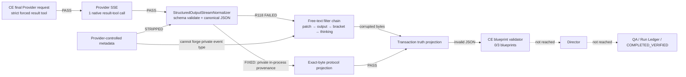

# R118 Execution Fact Graph

Status: `CLOSED_VERIFIED`  
Scope: Polaris platform only; no target-project mutation.

## First failed edge

`canonical structured-result protocol → StreamEventHandler content projection`

- Expected: schema-validated canonical JSON stays byte-identical.
- Actual: a typed protocol payload was reinterpreted as assistant prose.
- Effect: independent delimiter buffers reordered legal JSON containing `[]`
  and Rust/TypeScript `<...>` signatures.

## Corrected invariant

Only a private in-process event type minted after the reserved result tool
passes caller-schema validation may bypass free-text filters or materialize
`structured_output_transport` evidence. Public metadata and a matching SHA-256
are necessary audit facts but never sufficient provenance.

## Diagnostic operating rule

For each failed run, build two linked graphs:

1. Static graph: `symbol → caller → dependent → test`.
2. Runtime fact graph:
   `final Provider request → Provider response → protocol/tool normalization →
   Tool Lifecycle/effect receipt → TaskBoundary → TaskRuntime → Run Ledger →
   QA → Bench report`.

Repair only the first edge whose expected and actual facts diverge. Do not
retry the project until the defect record, focused gate, broad gate, and
independent review all close.
