# R119 Execution Fact Graph

Status: `AUDIT_CLOSED`  
Scope: Polaris platform only; no target-project mutation.

```mermaid
flowchart LR
    A["TASK-1 Provider request"] -->|PASS| B["11 write_file effects<br/>7 committed files"]
    B -->|effect receipts PASS| C["TASK-1 physical Rust API"]
    C -->|R119-E1 FAILED<br/>semantic index empty ⇒ all physical evidence omitted| D["TASK-2 final Provider request<br/>predicted CE interface only"]
    D -->|invented FlavorAxis| E["TASK-2 4 committed files"]
    E -->|cargo check E0432| F["Artifact / verifier failure"]

    E -->|R119-E2 FAILED<br/>tests ⇒ failed_gate_evidence required| G["TASK-3 context audit"]
    G -->|pre-Provider rejection| H["No Provider Request<br/>No Tool Lifecycle<br/>No tests"]
    H --> I["TaskRuntime unresolved"]
    I --> J["Run Ledger TOOL_LIFECYCLE_MISSING"]
    J --> K["QA not reached"]
    K --> L["Bench COMPLETED_VERIFIED=0"]

    C -. FIX: hashed cross-language physical source evidence .-> M["Dependent-child context closure"]
    E -. FIX: first-pass tests require parent artifacts, not prior failure .-> M
    M --> N["TASK-2/TASK-3 final Provider requests"]

    O["PromptBuilder target files<br/>src/a.ts"] -->|strong path fact| P["Language selection"]
    P -. BEFORE: eager workspace scan .-> Q["recursive /tmp rglob<br/>>23 min validation stall"]
    P -->|FIX: lazy fallback only| R["prompt built<br/>0.83s"]
```



## Static graph

```text
resolve_director_execution_strategy
  → _evidence_requirements
  → TaskExecutionStrategyV1.evidence_requirements
  → context_audit._required_evidence_refs
  → missing_required_refs_from_evidence_coverage
  → FinalRequestEvidenceCoverageError

DirectorAdapter
  → _inject_director_actual_sibling_exports
  → _build_director_actual_sibling_exports_payload
  → build_symbol_index_snapshot
      └─ Rust physical_exports = {}
  → _build_director_workspace_interface_lines
      └─ early return before language-neutral file walk
  → final Provider request context

PromptBuilder.build_code_generation_prompt
  → build_language_section
  → select_guidance
      ├─ metadata / explicit contract / target path / hard check
      └─ _language_from_workspace only when stronger facts are absent
```

## First failed edge

`committed TASK-1 physical effects → dependent TASK-2 final Provider request`

- Expected: actual parent source facts are projected regardless of parser/language.
- Actual: absence of Rust semantic exports erased all physical-source evidence.
- Effect: TASK-2 guessed a nonexistent `FlavorAxis` interface.

The second failed edge is the same missing closure expressed as policy:
first-pass TASK-3 needed parent implementation facts, but the strategy required a
prior failed gate that cannot yet exist.

## Corrected invariant

Every task with declared/resolved dependencies must receive an auditable,
bounded snapshot of materialized parent artifacts before Provider dispatch.
Semantic symbols are preferred enrichment, not the availability gate for
physical source facts. First-pass verification consumes parent artifacts;
repair consumes failed-gate evidence.

Language selection follows the same fact-graph rule: traverse expensive,
lower-authority discovery edges only when higher-authority facts did not
resolve the node. Filesystem discovery is a fallback, never an eager side
effect.

## Diagnostic operating rule

For every failed run, maintain two linked graphs:

1. Static graph: `symbol → caller → dependent → test`.
2. Runtime fact graph:
   `Provider Request → Provider Response → Tool Lifecycle → Effect Receipt →
   TaskBoundary → TaskRuntime → Run Ledger → QA → Bench Report`.

Repair only the earliest divergent edge. Another Bench is forbidden until the
defect record, red-to-green tests, broad gates, post-edit graph review, and
independent review all close.
