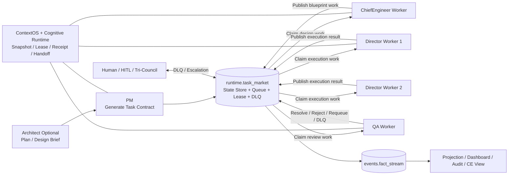
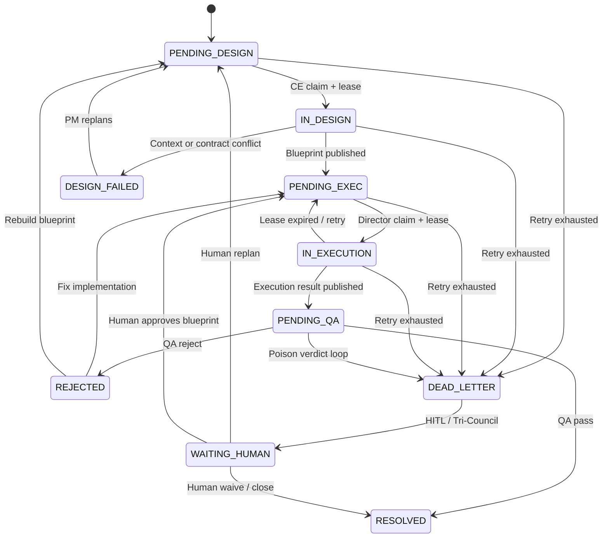
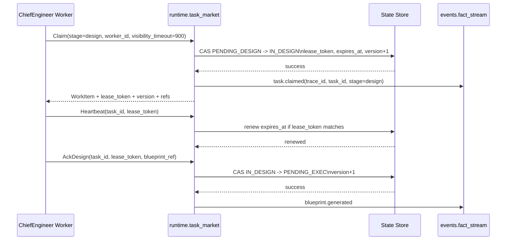

# AI Agent 协作架构重构蓝图：从同步调用链到异步事件驱动的任务集市架构（Task Bazaar）

- 版本：`v1.1（世界最佳实践完善版）`
- 目标发布日期：`2026-04-14`
- 编制日期：`2026-04-14`
- 状态：`正式蓝图（目标态治理规范；当前仓处于 staged migration，异步主链尚未完全切换）`
- 适用范围：`Polaris / Cognitive Lifeform` 下所有涉及 `PM`、`ChiefEngineer`、`Director`、`QA`、`Architect` 的多 Agent 协作场景，以及未来所有长生命周期 Agentic 工作流
- 主题：`EDA + NATS JetStream Pull Consumer + Producer/Consumer + Task Bazaar / Task Broker + Saga + CQRS + Outbox Pattern`

> 本文档是 Polaris 多 Agent 协作重构的唯一权威目标态基石文档。
> 它定义工业级 Agentic OS 的协作控制面、迁移路径、治理门禁与验收标准。
> 当前执行真相仍以 `AGENTS.md`、`docs/AGENT_ARCHITECTURE_STANDARD.md`、`docs/graph/catalog/cells.yaml`、`docs/graph/subgraphs/*.yaml` 为准。  
> 当前仓已声明 `runtime.task_market` 并落地部分 `shadow/mainline/mainline-full` 路径，但 `pull-based durable consumer`、`outbox atomicity`、`projection dashboard`、`HITL` 主链仍在迁移中。
> 本文档的职责是：为 Polaris 从“同步角色链”升级为“异步任务集市”提供唯一、可审计、可演进的目标态蓝图，并对标 2026 年业界最佳实践：`Temporal` 的耐久执行思想、`NATS JetStream` 的高性能流、`PostgreSQL JSONB` 的状态机建模、`OpenTelemetry` 的全链路可观测性。

---

## 0. 执行摘要

Polaris 当前主业务角色链，图谱上已经清晰表达为：

`orchestration.pm_planning -> orchestration.pm_dispatch -> chief_engineer.blueprint -> director.execution -> qa.audit_verdict`

这条链路在架构意图上已经具备“规划 -> 蓝图 -> 执行 -> 验收”的分层，但物理实现仍保留强同步调用链特征，因此会持续暴露典型链路雪崩问题：

1. 上游角色需要等待下游角色在线且成功返回。
2. `pm_dispatch`、`workflow_runtime`、`director` 之间仍存在“编排即调用”的主链倾向。
3. 当前仓虽已具备 `runtime.task_market`、`runtime.task_runtime`、`events.fact_stream`、`JetStream`、`DLQ`、`HITL`、`trace_id`、`SQLite WAL` 等零件，但尚未完全收敛为单一业务级控制面。

核心裁决：

1. 所有多 Agent 协作必须收敛为 `Pull (Claim + Lease) -> Compute (LLM + Tool) -> Push (Ack + Fact)`。
2. 角色只和 `runtime.task_market` 交互，不再把下游角色当作同步依赖。
3. 目标态协作中枢 = `Task Bazaar = Task Market + State Store + Outbox + Fact Stream + Projection + HITL`。
4. `workflow_runtime` 回归 worker 内部 Saga / 长任务步骤引擎，`runtime.execution_broker` 回归技术执行 broker，`events.fact_stream` 继续做 append-only fact stream。

从 2026 年业界实践看，LLM Agent 必须被视为高延迟、非确定、可能中断的外部 I/O 节点，而不是稳定函数调用。试图用同步 RPC / 调用栈串联这类 actor，会系统性违背弹性系统的 `bulkhead`、`backpressure`、`at-least-once + idempotent consumer` 原则，最终演化为：

1. `Cascading Latency`
2. `No Bulkhead Failure Spread`
3. `No Horizontal Scaling of Consumers`

目标态收益是设计验收目标，而不是当前事实：

1. 端到端吞吐提升 `3-5x`，支持 Director 横向扩展和自动恢复。
2. 最慢节点不再阻塞全局，任务可通过 `visibility timeout` 与 `lease` 自动回收。
3. 任意 Agent 崩溃后，任务应在 `5 分钟` 内自动恢复被重新 claim。
4. `DLQ` 率控制在 `<= 0.3%`，`trace_id` 覆盖率达到 `100%`。
5. 支持 `100+` 并发 Director、`HITL`、`Tri-Council`、`ContextOS` / `Cognitive Runtime` sidecar 并存。

这不是“加个队列”，而是 Polaris 成为工业级 Agentic Operating System 的结构性前提。

---

## 1. 当前事实与问题诊断

### 1.1 当前图谱事实

当前图谱已经给出重要边界：

1. `orchestration.pm_planning` 负责 PM 任务合同生成。
2. `orchestration.pm_dispatch` 负责任务派发与生命周期推进。
3. `chief_engineer.blueprint` 负责蓝图生成，不执行写代码。
4. `director.execution` 负责基于蓝图执行。
5. `qa.audit_verdict` 负责独立验收。
6. `runtime.task_runtime` 已被定义为单一任务生命周期运行时。
7. `runtime.execution_broker` 已被定义为统一执行提交门面，但它是“进程/异步任务/阻塞 I/O broker”，不是“业务任务集市”。
8. `events.fact_stream` 已被定义为运行时事实流写入与 fanout 基础设施。
9. `orchestration.workflow_runtime` 已拥有工作流状态持久化和活动编排能力。

这说明 Polaris 不是从零开始。它已经有很多“EDA 零件”，只是没有完成“总线化”和“角色解耦化”。

### 1.2 当前代码事实

当前仓库中，以下能力已经存在且可复用：

1. `polaris/cells/runtime/task_runtime/internal/service.py`
   - 已提供 canonical task row 的创建、claim、update、reopen、session、lease 类能力。
2. `polaris/cells/runtime/task_market/internal/service.py`
   - 已落地 `publish/claim/renew/ack/requeue/dead_letter` 服务骨架，并具备 `FSM`、`lease`、`SQLite/JSON` store、`human_review`、`saga`、`reconciler` 等基础能力。
3. `polaris/cells/runtime/task_market/public/contracts.py`
   - 已定义 `Publish/Claim/Renew/Ack/Fail/Requeue/MoveToDeadLetter/Query` 等核心契约。
4. `polaris/cells/orchestration/pm_dispatch/internal/state_bridge.py`
   - 已提供 TaskBoard 到 workflow store 的异步状态桥。
5. `polaris/cells/runtime/execution_broker/internal/service.py`
   - 已提供统一的进程/异步任务提交和日志排水。
6. `polaris/infrastructure/messaging/nats/ws_consumer_manager.py`
   - 已提供 `JetStream durable consumer` 能力，可复用为 Pull Consumer 主链基础设施。
7. `polaris/kernelone/audit/omniscient/context_manager.py`
   - 已提供 `trace_id` 传播基础。
8. `polaris/kernelone/cognitive/hitl.py`
   - 已提供 Human-in-the-Loop 审批队列雏形，但仍是 sidecar，不是主链 authority。
9. `polaris/cells/runtime/projection/**`
   - 已存在 runtime projection 能力，可作为后续 `CQRS query model` 的接入点。
10. `docs/cognitive_runtime_architecture.md`
   - 已明确 `Cognitive Runtime` 当前为 `shadow-sidecar`，不是生产主链 authority。

### 1.3 当前问题不在“有没有组件”，而在“谁是唯一主链 authority”

Polaris 当前最核心的问题不是完全缺少消息系统，而是业务主链 authority 仍未彻底统一：

1. `runtime.task_market` 已存在，但 `claim/ack/requeue` 仍处于 staged migration，`mainline-full` 仍包含 inline orchestration，不是最终形态的 durable Pull Consumer 主链。
2. `runtime.execution_broker` 是技术执行 broker，不是业务任务 broker。
3. `events.fact_stream` 是事实流，不是任务队列；而当前 `task_market` 的 fact emit 仍属于 best-effort，缺少严格 `outbox atomicity`。
4. `workflow_runtime` 是工作流引擎，不应继续承担“角色直接相互唤起”的主链语义。
5. `pm_dispatch` 当前仍承担过多“直接派给下游角色”的职责，未来应收缩为“发布合同到任务集市 + 维护派发治理”的上游 orchestrator。

### 1.4 为什么同步角色链必然失效

在 LLM Agent 系统里，同步链路不是“还可以优化”的方案，而是结构性反模式：

1. `LLM` 调用高延迟、非确定，且容易被 budget、permission、tool runtime、provider timeout 中断。
2. Agent 本质上是可恢复、可重试、可替换的不稳定 actor，应按 `BASE + at-least-once + idempotent` 设计，而不是按强同步函数调用设计。
3. 一旦把这些不稳定节点串成同步链，就会同时出现：
   - `Blocking`: 上游等待下游，吞吐被最慢节点锁死。
   - `Failure Spread`: 任一角色异常会扩散为全局失败。
   - `Scaling Failure`: 即使拉起更多 Director，只要提交链仍是串行主链，整体吞吐也不会线性提升。

---

## 2. 核心裁决：为什么“任务集市”是唯一可持续路径

### 2.1 任务集市不是“又一个队列”，而是协作范式变更

所谓“任务集市”，不是简单往系统里塞 Redis/Kafka/NATS 就结束。它本质上是协作范式重构：

1. 协作单位从“函数调用”变成“状态化工作项”。
2. 角色协作从“直接依赖对方在线”变成“依赖中立任务市场”。
3. 成功与失败的判断从“调用返回值”变成“状态跃迁 + 不可变事件 + 审计证据”。

换句话说，任务集市是 Polaris 的业务级 OS 总线，而不是单纯的基础设施。

### 2.2 为什么这条路是 Polaris 的唯一长期正确路径

我给出的判断是直接的：

**如果 Polaris 要承载长任务、多角色、多轮次、多人并行 Director、Cognitive Runtime、ContextOS、Graph-Constrained Semantic Search 这些复杂能力，那么业务协作层必须进入事件驱动和市场化调度。**

理由如下：

1. 同步角色链天然不适合高延迟 AI。
2. 并行 Director 只有在“可竞争消费 + 可恢复 claim + 冲突可检测”的前提下才安全。
3. Human-in-the-loop、Tri-Council、DLQ 等治理机制，本质上都是异步回路，不适合同步 call stack。
4. ContextOS、Cognitive Runtime、Semantic Search 都属于“辅助裁决层”，它们应该被作为任务处理时的能力侧车，而不是把角色编排继续耦合在一起。

### 2.3 一句最重要的工程判断

**任务队列不是架构真相，状态机才是。**

这句话必须明确。

在 Polaris 里：

1. 队列可以丢、可以重投、可以重复投递。
2. 事件可以至少一次送达。
3. 只有状态存储中的版本化任务状态、lease、attempt、trace、artifact ref 才是最终真相。

这意味着目标态不是追求“exactly once message delivery”，而是追求：

**at-least-once delivery + idempotent consumer + compare-and-swap state transition + auditable facts**

这才是工程上长期可靠的做法。

---

## 3. 目标态总体架构

### 3.1 角色重新定义

在目标态下，角色不再被定义为“调用者/被调用者”，而是“市场参与者”。

| 角色 | 目标态职责 | 市场角色类型 |
| --- | --- | --- |
| `Architect` | 可选。生成项目计划书、重大架构说明、DLQ/升级会审兜底 | 上游计划生产者 + 升级消费者 |
| `PM` | 生成 Task Contract、管理优先级、追踪进度、处理设计失败回流 | 合同生产者 + 治理消费者 |
| `ChiefEngineer` | 领取待设计工作项，生成 Blueprint，发布待执行工作项 | 设计消费者 + 执行生产者 |
| `Director` | 领取待执行工作项，执行代码变更，发布执行结果和证据 | 执行消费者 + QA 生产者 |
| `QA` | 领取待验收工作项，发布 verdict，必要时 reopen / DLQ | 验收消费者 + 回流生产者 |
| `Human / HITL` | 审批高风险任务、处理 DLQ、介入 Tri-Council | 人类兜底消费者 |

需要特别说明两点：

1. `PM` 不是“纯生产者”，因为它还必须消费进度、失败和 DLQ 事件来进行再规划。
2. `Director` 也不是“纯消费者”，因为它执行完成后必须生产结构化执行结果。

### 3.2 总体逻辑

目标态系统中，角色之间互不认识。它们只认识任务集市。



### 3.3 目标态核心组件

目标态不是单一组件，而是七个固定部件：

1. `Task Bazaar / Task Market`
   - 业务级控制面。
   - 负责 publish、Pull claim、lease、visibility timeout、requeue、priority、DLQ、stage coordination。
2. `State Store`
   - `Phase 1`: `SQLite WAL + CAS`
   - `Phase 2`: `PostgreSQL JSONB + row version`
   - 保存 work item、state version、attempt、lease、artifact refs、compensation markers。
3. `Outbox Relay`
   - 把状态跃迁与事实发布绑定为原子单元。
   - relay 进程负责把 outbox 记录投递到 `events.fact_stream` / `JetStream`。
4. `Fact Stream`
   - 负责广播不可变事实事件，用于审计、投影、trace、dashboard。
5. `Projection Layer`
   - 负责 `CQRS query model`、PM/CE/Director/QA/DLQ 看板和跨 trace timeline。
6. `Artifact Store`
   - 负责 blueprint、patch、verify pack、receipt、handoff pack 等引用型资产。
7. `Context / Cognitive Sidecar`
   - 负责 context snapshot、scope lease、receipt、handoff、HITL；任务市场只传 `ref + hash`，不传大对象正文。

### 3.4 目标态里哪些东西不能被混淆

以下几个概念绝对不能混为一谈：

1. `runtime.execution_broker`
   - 进程/异步任务执行 broker。
   - 不是任务市场。
2. `events.fact_stream`
   - append-only 事实流。
   - 不是工作队列。
3. `workflow_runtime`
   - 工作流与活动执行引擎。
   - 不是角色之间的业务市场。
4. `task_runtime`
   - canonical task lifecycle owner。
   - 不是多阶段消息总线。
5. `task_market`
   - 新的业务协作中枢。
   - 才是角色间异步解耦的主链。

---

## 4. 推荐技术路线与选型裁决

### 4.1 先给结论

基于当前仓库事实，我不建议第一步引入 Redis 作为唯一中心，也不建议上来就 Kafka 或额外引入新的 workflow runtime。

推荐路线：

1. `Phase 1`：`NATS JetStream (Pull Consumer) + SQLite WAL + Outbox`
2. `Phase 2`：`NATS JetStream + PostgreSQL JSONB + row versioning`
3. `Phase 3`：可选引入 `Redis` 作为 lease accelerator，但绝不作为 truth source

### 4.2 为什么首选 JetStream

仓库当前已经存在 NATS / JetStream 相关基础：

1. `delivery/ws/endpoints/*`
2. `infrastructure/messaging/nats/*`
3. `JetStreamConsumerManager`
4. 应用启动期已有 NATS bootstrap 语义

这意味着：

1. 复用优先。
2. `JetStream` 原生支持 `Pull Consumer`、`Durable Consumer`、`Ack/Replay`、按 workspace / stream 分层的主题设计。
3. 现有 WebSocket runtime.v2 实时通道可以直接继承事件流能力。
4. 不需要再平行引入第二套实时消息设施。

### 4.3 为什么第一阶段不应把 Redis 当唯一真相

Redis 很适合做缓存、队列、lease，但不适合在 Polaris 当前阶段直接作为唯一 source-of-truth。原因：

1. Polaris 当前更需要“可审计的版本化状态”，不是极致低延迟内存 KV。
2. 任务状态必须和 artifact / trace / receipts / state version 严格对齐。
3. `SQLite(WAL)` 在单机、开发、灰度阶段更容易做一致性控制和本地调试。

Redis 可以作为辅助能力存在，但不应成为唯一事实源。

### 4.4 为什么现在不推荐 Kafka

Kafka 当然能做，但对 Polaris 当前阶段不是最优：

1. 运维重量更高。
2. 单机开发体验更差。
3. 当前仓库已经有 NATS/JetStream 基建，重复造轮子不符合 `Reuse First`。
4. Polaris 当前更需要轻量 durable queue + lease + audit，而不是再引入一整套更重的消息平台。

### 4.5 技术选型裁决

| 层 | Phase 1 推荐 | Phase 2 推荐 | 备注 |
| --- | --- | --- | --- |
| Broker | `NATS JetStream Pull Consumer` | `NATS JetStream Pull Consumer` | competing consumer + replay |
| State Store | `SQLite WAL + CAS` | `PostgreSQL JSONB + row version` | Single Source of Truth |
| Outbox | `SQLite outbox table + relay` | `PostgreSQL outbox + relay / CDC optional` | 保证状态更新与 fact 发布原子性 |
| Event Fanout | `events.fact_stream + JetStream subject` | 同上 | append-only facts |
| Query / Projection | `runtime.projection` + task-market projection | `CQRS query model / materialized views` | 读写分离 |
| Lease/Lock | `DB CAS + lease token` | `DB CAS + optional Redis accelerator` | 5 分钟恢复目标 |

---

## 5. Polaris 当前能力与目标态映射

### 5.1 可直接复用的当前 Cell

| 当前 Cell / 模块 | 当前职责 | 目标态去向 |
| --- | --- | --- |
| `orchestration.pm_planning` | 生成 PM task contract | 保留，作为上游合同生产者 |
| `orchestration.pm_dispatch` | 派发和推进 | 收缩为“发布到任务集市 + 进度治理” |
| `chief_engineer.blueprint` | 生成 blueprint | 保留，改成常驻/可轮询 worker 消费者 |
| `director.execution` | 执行代码修改 | 保留，改成竞争消费执行 worker |
| `qa.audit_verdict` | 验收 | 保留，改成 review queue 消费者 |
| `runtime.task_runtime` | canonical task lifecycle | 保留，作为 task state owner |
| `runtime.execution_broker` | 进程和异步执行提交 | 保留，不准扩展成业务任务 broker |
| `events.fact_stream` | append-only 事实流 | 保留，作为 pub/sub 事实总线 |
| `orchestration.workflow_runtime` | workflow engine + store | 保留，用于 worker 内部长任务而非角色耦合主链 |
| `context.engine` / `ContextOS` | 上下文投影 | 保留，作为 snapshot source |
| `factory.cognitive_runtime` | shadow-sidecar receipt/handoff | 保留，后续可升格为 authority sidecar |

### 5.2 当前不足以直接复用为主链的模块

| 模块 | 问题 | 目标态处理 |
| --- | --- | --- |
| `kernelone.events.message_bus.MessageBus` | 偏进程内，不是 durable market | 继续做局部 Actor bus，不做主任务市场 |
| `pm_dispatch.internal.state_bridge` | 是 bridge，不是 broker | 过渡期保留，最终让 task market 直接写状态 |
| `execute_pm_run()` 当前单 role entry | 仍是同步语义起点 | 改成只启动某个角色的发布/消费 worker 模式 |
| `ChiefEngineer` 仍存在 deferred / optional 逻辑残留 | 与目标必经蓝图链冲突 | 统一改为所有写代码任务必须先经 blueprint |

### 5.3 必须巩固为单一业务协作中枢的 Cell

`runtime.task_market` 已经在当前 graph 中声明为 public runtime Cell。
当前任务不是再次“新增概念”，而是把它从 `shadow/mainline` 过渡能力收敛为唯一业务协作 broker。

后续必须收敛的职责：

1. 发布工作项到队列。
2. Pull claim + lease + heartbeat + visibility timeout。
3. requeue / retry / priority / backoff。
4. DLQ / poison item / `WAITING_HUMAN` 管理。
5. 幂等写入、状态跃迁 `CAS`、Saga 补偿。
6. `Outbox` 持久化与 relay。
7. 为 projection 提供统一 query 面。

需要特别强调：

**不要把这些职责继续塞进 `runtime.execution_broker`。**

`execution_broker` 是技术执行 broker。  
`task_market` 是业务协作 broker。  
两者边界必须严格分开。

---

## 6. 任务集市的核心数据模型

### 6.1 总体原则

所有市场通信必须使用结构化契约，而不是自由文本。

基础原则：

1. 每个消息都必须带 `schema_version`。
2. 每个消息都必须带 `trace_id`、`run_id`、`task_id`。
3. 每个工作项都必须带 `stage`、`attempt`、`lease_token`、`idempotency_key`。
4. 每个工作项都必须引用上下文快照或蓝图资产，而不是复制大段原文。

### 6.2 统一 Envelope

```python
class TaskMarketEnvelope(BaseModel):
    schema_version: int
    message_id: str
    trace_id: str
    run_id: str
    task_id: str
    saga_step_id: str | None = None
    outbox_id: str | None = None
    stage: str
    event_name: str
    source_cell: str
    source_role: str
    worker_id: str | None = None
    causation_id: str | None = None
    correlation_id: str | None = None
    published_at: str
    workspace: str
    payload_ref: str | None = None
    cost_tokens: int | None = None
    llm_provider: str | None = None
    payload: dict[str, Any]
    metadata: dict[str, Any] = {}
```

### 6.3 PM -> CE：Task Contract

`Task Contract` 是上游治理合同，不是提示词拼接物。

最少字段：

```python
class TaskContractV1(BaseModel):
    schema_version: int = 1
    trace_id: str
    run_id: str
    task_id: str
    parent_task_id: str | None = None
    title: str
    goal: str
    priority: Literal["low", "medium", "high", "critical"]
    deadline_at: str | None = None
    stage: Literal["pending_design"]
    requires_blueprint: bool = True
    workspace: str
    dependency_graph_ref: str
    context_snapshot_ref: str
    context_snapshot_hash: str
    target_files: list[str]
    scope_paths: list[str]
    acceptance_criteria: list[str]
    constraints: list[str]
    forbidden_paths: list[str]
    artifact_refs: dict[str, str]
    metadata: dict[str, Any] = {}
```

裁决：

1. 任何 `workspace write` 类任务，`requires_blueprint` 必须为 `True`。
2. 任何 Director-bound task，必须显式给出 `target_files` 或 `scope_paths`。
3. PM 不得用“后续再看”替代结构化 acceptance criteria。

### 6.4 CE -> Director：Blueprint Package

```python
class BlueprintPackageV1(BaseModel):
    schema_version: int = 1
    trace_id: str
    run_id: str
    task_id: str
    blueprint_id: str
    source_task_contract_ref: str
    context_snapshot_ref: str
    context_snapshot_hash: str
    function_signatures: list[str]
    target_files: list[str]
    scope_paths: list[str]
    guardrails: list[str]
    dependency_constraints: list[str]
    verification_plan: list[str]
    no_touch_zones: list[str]
    predicted_risks: list[str]
    apply_strategy: Literal["patch", "surgical_edit", "new_file", "mixed"]
    artifact_refs: dict[str, str]
    metadata: dict[str, Any] = {}
```

裁决：

1. Director 无蓝图不得执行。
2. Blueprint 必须显式指出 `no_touch_zones`。
3. Blueprint 必须带 `context_snapshot_hash`，保证 Director 和 CE 在同一上下文基线下工作。

### 6.5 Director -> QA：Execution Result

```python
class ExecutionResultV1(BaseModel):
    schema_version: int = 1
    trace_id: str
    run_id: str
    task_id: str
    blueprint_id: str
    execution_id: str
    worker_id: str
    success: bool
    changed_files: list[str]
    changed_file_hashes: dict[str, str]
    patch_ref: str | None = None
    verify_pack_ref: str | None = None
    receipt_refs: list[str] = []
    test_results: list[str] = []
    summary: str
    error_code: str | None = None
    metadata: dict[str, Any] = {}
```

### 6.6 QA Verdict

```python
class QaVerdictV1(BaseModel):
    schema_version: int = 1
    trace_id: str
    run_id: str
    task_id: str
    verdict: Literal["resolved", "rejected", "requeue_exec", "requeue_design", "dead_letter"]
    findings: list[str]
    evidence_refs: list[str]
    reopened_stage: Literal["pending_exec", "pending_design", "dead_letter", "resolved"]
    metadata: dict[str, Any] = {}
```

### 6.7 DLQ Item

```python
class DeadLetterItemV1(BaseModel):
    schema_version: int = 1
    trace_id: str
    run_id: str
    task_id: str
    failed_stage: str
    reason: str
    attempt_count: int
    last_error_code: str | None = None
    artifact_refs: dict[str, str]
    escalation_policy: Literal["tri_council", "architect", "human", "drop"] = "tri_council"
    metadata: dict[str, Any] = {}
```

---

## 7. 状态机：任务集市必须建立严格 FSM

### 7.1 核心原则

任务生命周期必须满足四条铁律：

1. 状态单向推进。
2. 任何跃迁都必须带 event fact。
3. 任何跃迁都必须可追溯到 `trace_id/run_id/task_id/worker_id`。
4. 任何终态都必须具备证据引用。
5. `requeue / reopen / dead_letter / waiting_human` 必须视为显式的 `Saga compensate / escalate` 动作，而不是顺手改状态。

### 7.2 推荐状态图



### 7.3 推荐状态表

| 状态 | 拥有者 | 进入条件 | 正常出口 | 超时/异常出口 |
| --- | --- | --- | --- | --- |
| `PENDING_DESIGN` | `runtime.task_market` | PM 发布任务合同 | `IN_DESIGN` | `DEAD_LETTER` |
| `IN_DESIGN` | `runtime.task_market` + CE lease | CE claim 成功 | `PENDING_EXEC` | `DESIGN_FAILED` / `PENDING_DESIGN` |
| `DESIGN_FAILED` | CE + PM | 蓝图生成失败 | `PENDING_DESIGN` | `DEAD_LETTER` |
| `PENDING_EXEC` | `runtime.task_market` | Blueprint 已发布 | `IN_EXECUTION` | `DEAD_LETTER` |
| `IN_EXECUTION` | `runtime.task_market` + Director lease | Director claim 成功 | `PENDING_QA` | `PENDING_EXEC` / `DEAD_LETTER` |
| `PENDING_QA` | `runtime.task_market` | 执行结果已发布 | `RESOLVED` | `REJECTED` / `DEAD_LETTER` |
| `REJECTED` | QA | 验收未通过 | `PENDING_EXEC` 或 `PENDING_DESIGN` | `DEAD_LETTER` |
| `WAITING_HUMAN` | HITL | DLQ 升级或人工审批 | `PENDING_*` 或 `RESOLVED` | `DEAD_LETTER` |
| `DEAD_LETTER` | `runtime.task_market` | 重试耗尽/毒任务 | `WAITING_HUMAN` | 终态 |
| `RESOLVED` | QA/Human | 验收通过或人工关闭 | 终态 | 无 |

### 7.4 关于 `WAITING_HUMAN`

仓库当前已经有两块相关基础：

1. `TaskStatus.WAITING_HUMAN`
2. `polaris/kernelone/cognitive/hitl.py`

这很好，但必须升级成主链状态，而不是“附加功能”。  
目标态里：

1. `WAITING_HUMAN` 是正式的 task market 状态。
2. 它必须有 timeout、升级策略、通知渠道和 resume path。
3. 它不能只是某个 Agent 内部的临时 await 点。

---

## 8. Claim、Lease、Visibility Timeout 与恢复机制

### 8.1 目标态规则

领取任务时必须原子完成：

1. `claim`
2. `lease_token` 生成
3. `state_version` compare-and-swap
4. `visibility_timeout` 设置

任一部分失败都视为 claim 失败。

并且消费模型必须是 `broker pull + state CAS`，而不是 broker 主动 push 任务到 worker。

### 8.2 推荐时序图



### 8.3 Visibility Timeout 规则

建议默认值：

| 阶段 | 默认可见性超时 |
| --- | --- |
| `IN_DESIGN` | `15 min` |
| `IN_EXECUTION` | `30 min` |
| `PENDING_QA` consumer lease | `30 min` |
| `WAITING_HUMAN` | `12 h` 到 `24 h`，取决于风险级别 |

### 8.4 续租规则

所有长任务必须 heartbeat：

1. 心跳周期建议为 lease TTL 的 `1/3`。
2. 续租必须校验 `lease_token` 和 `state_version`。
3. 续租失败说明 worker 已失去所有权，后续 ack 必须拒绝。

### 8.5 恢复规则

如果 worker 崩溃：

1. lease 到期后工作项重新暴露。
2. 新 worker claim 后继续处理。
3. 旧 worker 若恢复后提交 stale ack，状态存储必须拒绝。

这才是真正的断点续传，而不是“重启后希望一切正常”。

---

## 9. 幂等性、乐观锁与冲突控制

### 9.1 幂等性是硬要求，不是优化项

任务市场里所有消费者都必须按“消息至少一次送达”来设计。

因此必须具备：

1. `idempotency_key`
2. `state_version`
3. `lease_token`
4. `artifact hash`

### 9.2 Director 并行的最大风险：脑裂与代码冲突

你要的多人并行 Director 模式，真正的技术难点不是拉起多进程，而是防冲突：

1. Director A 修改共享模块。
2. Director B 还拿着旧快照继续改同一模块。
3. 两者都提交成功，最后结果不可预测。

### 9.3 对策：双层冲突防护

必须同时具备两层防护：

1. **市场层**
   - `scope_paths`、`target_files`、`parallel_group`、`shardable`、`max_parallel_hint`
   - 决定是否允许并行领取。
2. **提交层**
   - 对修改文件做 `pre_apply_hash` / `post_apply_hash` 校验
   - 如果主干文件已变化，执行结果必须回滚到 `PENDING_EXEC` 或 `PENDING_DESIGN`

### 9.4 个人裁决：先做“受控并行”，不要一开始就做“任意并行”

更稳妥的阶段路线：

1. Phase 1：仅允许 scope 不重叠的 Director 并行。
2. Phase 2：支持公共模块冲突检测后自动 requeue。
3. Phase 3：引入 task worktree / patch worktree 做真正的隔离执行。

这比在同一工作区里盲目并发修改安全得多。

---

## 10. Pub/Sub 与 Producer/Consumer 的边界

### 10.1 两种通信语义必须分开

目标态系统里存在两种完全不同的通信：

1. **Work Queue**
   - 用于“谁来处理这个工作项”。
   - 语义是 competing consumer。
2. **Fact Stream**
   - 用于“系统里已经发生了什么事实”。
   - 语义是 pub/sub broadcast。

### 10.2 不要把广播事件当工作队列

`task.completed` 广播出去，不代表某个 QA 一定处理了。  
真正能驱动 QA 领取工作的，应该是：

1. `runtime.task_market` 创建 `PENDING_QA` work item
2. QA worker 对 review queue 进行 claim

### 10.3 推荐 subject / stream 设计

如果采用 JetStream，建议使用清晰的 subject 分层：

| 用途 | 建议 subject |
| --- | --- |
| 设计工作项 | `hp.task_market.<workspace>.design.pending` |
| 执行工作项 | `hp.task_market.<workspace>.exec.pending` |
| 验收工作项 | `hp.task_market.<workspace>.qa.pending` |
| DLQ | `hp.task_market.<workspace>.dlq` |
| 事实流 | `hp.events.<workspace>.fact.*` |
| 审计流 | `hp.events.<workspace>.audit.*` |
| 观测流 | `hp.events.<workspace>.trace.*` |

### 10.4 推荐的消息处理原则

1. Broker 负责投递与 durable consumer。
2. State Store 负责最终状态判定。
3. 事件事实流只表达“已经发生”。
4. Query 端不得隐式 requeue、不得顺手刷新索引、不得顺手改状态。

---

## 11. 与 ContextOS、Cognitive Runtime、Semantic Search 的关系

### 11.1 与 ContextOS 的关系

任务集市不是 ContextOS 的替代者，二者职责完全不同：

1. `ContextOS`
   - 负责“给某个角色/某个任务投影出最小、可治理、可追踪的上下文”。
2. `Task Market`
   - 负责“把这个任务放给谁做、做到了哪里、失败如何回流、如何恢复”。

正确关系是：

**Task Market 只传上下文引用，不传整块上下文正文。**

因此每个 work item 必须至少持有：

1. `context_snapshot_ref`
2. `context_snapshot_hash`
3. `descriptor_refs`
4. `scope_summary`

### 11.2 与 Cognitive Runtime 的关系

当前 `Cognitive Runtime` 仍是 `shadow-sidecar`，这一事实必须诚实保留。

目标态里它不负责替代任务市场，而负责：

1. `scope lease`
2. `validate_change_set`
3. `record_runtime_receipt`
4. `export_handoff_pack`
5. `promote / reject` 的辅助治理

换句话说：

1. `Task Market` 负责“任务流转”。
2. `Cognitive Runtime` 负责“认知与执行治理辅助”。

二者是正交关系，不应互相吞并。

### 11.3 与 HITL 的关系

`polaris/kernelone/cognitive/hitl.py` 当前提供了审批队列原型。  
目标态下应把它正式接入以下路径：

1. 高风险 blueprint 审批
2. 高风险执行前审批
3. DLQ -> `WAITING_HUMAN`
4. Tri-Council 升级后的最终人工裁决

### 11.4 与 Graph-Constrained Semantic Search 的关系

语义检索仍必须服从 Graph。

正确用法是：

1. Task Market 只存 `context refs` / `descriptor refs`
2. 角色 worker 在 claim 后，通过 ContextOS 和 Context Catalog 组装自己需要的上下文
3. 语义检索永远只能在 graph 允许的候选集合内排序

**队列不能决定可见边界，Graph 才能决定。**

---

## 12. 状态拥有权与存储布局建议

### 12.1 单写原则

目标态必须继续遵守 current graph 的单写原则。

推荐分工：

| 状态 | 拥有者 |
| --- | --- |
| `runtime/tasks/*` | `runtime.task_runtime` |
| `runtime/contracts/*` | `runtime.state_owner` |
| `runtime/events/*` | `events.fact_stream` |
| `runtime/cognitive_runtime/*` | `factory.cognitive_runtime` |
| `runtime/task_market/*` | `runtime.task_market` |

### 12.2 推荐新增路径

建议新增：

1. `runtime/task_market/work_items/*`
2. `runtime/task_market/outbox/*`
3. `runtime/task_market/dead_letters/*`
4. `runtime/task_market/human_reviews/*`
5. `runtime/task_market/checkpoints/*`
6. `runtime/task_market/projections/*`

如果第一阶段走 SQLite，则这些路径更适合作为导出和审计镜像，而 primary store 应集中在单一 `task_market.db` / outbox 表中。

### 12.3 推荐表结构

建议至少有以下逻辑表：

1. `work_items`
2. `work_item_transitions`
3. `outbox_messages`
4. `dead_letter_items`
5. `human_review_requests`
6. `artifact_refs`
7. `projection_offsets`

如果保留更细粒度的归档，也可以拆分：

1. `work_item_attempts`
2. `work_item_leases`
3. `work_item_receipts`
4. `work_item_costs`

### 12.4 一个关键工程判断

`events.fact_stream` 负责不可变事件。  
`task_market` 负责可变任务状态。  
这两个维度不要混写到同一张表里，否则后面必然同时失去：

1. 可审计性
2. 查询性能
3. 状态一致性

---

## 13. 可观测性：异步系统必须先做追踪，再做扩容

### 13.1 全局 TraceID 必须贯穿一切

异步系统最大的死法不是失败，而是“失败后不知道死在哪里”。  
因此每个链路必须全程携带：

1. `trace_id`
2. `run_id`
3. `task_id`
4. `message_id`
5. `causation_id`
6. `worker_id`
7. `lease_token`

### 13.2 所有工件必须可按 `trace_id` 回溯

以下资产必须能按 `trace_id` 反查：

1. PM 合同
2. CE blueprint
3. Director patch/result
4. QA verdict
5. DLQ item
6. HITL request
7. runtime receipt / handoff pack
8. log / event / audit evidence

### 13.3 看板不是锦上添花，而是运行条件

目标态必须具备统一观测栈，而不是只有零散日志：

1. `OpenTelemetry`
   - publish / claim / renew / ack / fail / requeue / HITL 每个边界都必须形成 span。
2. `Prometheus`
   - 至少暴露 `claim_rate`、`ack_latency_seconds`、`lease_renew_failures_total`、`dlq_rate`、`consumer_backlog`、`recovery_time_seconds`。
3. `Grafana`
   - 按 workspace / stage / role 展示实时状态与回放视图。

统一看板至少包含：

1. 每个队列积压量
2. 每个 stage 的运行数/失败数/超时数
3. 每个 worker 当前 claim 数
4. 每个 trace 的最新状态
5. DLQ 列表
6. 人工审批等待列表

### 13.4 推荐投影视图

| 看板 | 面向角色 |
| --- | --- |
| `PM Dispatch Board` | PM |
| `ChiefEngineer Blueprint Board` | CE |
| `Director Execution Board` | Director lead |
| `QA Verdict Board` | QA |
| `DLQ / HITL Board` | Architect / Human |
| `Cross-trace Timeline` | 全局运维 / 审计 |

---

## 14. 治理规则

### 14.1 目标态硬门禁

后续所有多 Agent 协作重构，必须满足以下硬门禁：

1. `no_direct_role_call`
   - 角色之间不得再依赖直接同步业务调用作为主链。
2. `task_market_is_single_business_broker`
   - `PM/CE/Director/QA` 的业务协作必须且只能通过 `runtime.task_market` 中转。
3. `outbox_atomic`
   - 状态跃迁与事实发布必须通过 `Outbox` 或等价事务机制原子绑定。
4. `director_requires_blueprint`
   - 所有 Director 任务必须带 `blueprint ref / blueprint_id`。
5. `task_market_messages_are_versioned`
   - 所有市场消息必须 `100%` 通过 `Pydantic / JSON Schema` 校验且带 `schema_version`。
6. `task_market_query_has_no_side_effect`
   - 所有 query 路径不得隐式改状态。
7. `stale_lease_ack_rejected`
   - 所有 lease 续约和 ack 必须校验 `lease_token` 与 `state_version`。
8. `waiting_human_has_timeout_policy`
   - `WAITING_HUMAN` 必须有超时、升级与恢复路径。
9. `retry_exhaustion_must_enter_dlq`
   - 所有重试耗尽任务必须进 `DLQ`，不得无限循环。

并且 `events.fact_stream` 作为 `runtime/events/*` 的单写者规则继续保持有效。

### 14.2 当前 graph 层需要同步的内容

这份文档一旦进入实施，至少要同步评估：

1. `docs/graph/catalog/cells.yaml`
2. `docs/graph/subgraphs/execution_governance_pipeline.yaml`
3. `docs/graph/subgraphs/pm_pipeline.yaml`
4. `docs/governance/ci/fitness-rules.yaml`
5. `runtime.task_runtime` / `events.fact_stream` / `runtime.execution_broker` / `orchestration.pm_dispatch` 的公开契约

### 14.3 当前需要补齐 Schema / Validation Gate 的契约

当前 graph 已声明以下 public contracts；后续重点不是重新命名，而是补齐 schema、payload 约束、outbox / consumer 验证门禁：

1. `PublishTaskWorkItemCommandV1`
2. `ClaimTaskWorkItemCommandV1`
3. `RenewTaskLeaseCommandV1`
4. `AcknowledgeTaskStageCommandV1`
5. `FailTaskStageCommandV1`
6. `MoveTaskToDeadLetterCommandV1`
7. `RequeueTaskCommandV1`
8. `QueryTaskMarketStatusV1`
9. `TaskLeaseGrantedEventV1`
10. `TaskDeadLetteredEventV1`

---

## 15. 失败处理、DLQ 与 Tri-Council

### 15.1 推荐失败策略

失败必须分层：

1. `transient`
   - 网络波动、provider timeout、进程崩溃、短暂锁冲突
   - 行为：自动 retry / requeue
2. `contract`
   - schema 缺失、字段非法、上下文快照失效
   - 行为：打回上游阶段
3. `structural`
   - blueprint 与代码库严重错位、重复冲突、长期无法收敛
   - 行为：DLQ + Tri-Council

### 15.2 DLQ 进入规则

建议以下条件进入 `DEAD_LETTER`：

1. 同阶段重试次数 `>= 3`
2. 连续 lease 超时 `>= 2`
3. blueprint/context hash 不一致且无法自动恢复
4. QA 循环 reject 超过阈值
5. 人工审批超时后仍无明确处理策略

### 15.3 Tri-Council 路径

推荐顺序：

1. `Director -> ChiefEngineer -> PM`
2. 若仍失败，再升级 `Architect`
3. 最后进入 `Human-in-the-Loop`

### 15.4 人类兜底不是“人工 debug 一切”

人类介入必须也是结构化的：

1. 能看到 `trace_id`
2. 能看到失败阶段
3. 能看到最新 blueprint / patch / verdict / evidence refs
4. 能做有限几个动作：
   - `requeue_design`
   - `requeue_exec`
   - `force_resolve`
   - `close_as_invalid`
   - `shadow_continue`

---

## 16. Director 多人并行模式的正式裁决

### 16.1 并行不是“多开几个 Director”这么简单

Director 并行的真正定义应该是：

1. 同一 PM run 下多个 `PENDING_EXEC` 工作项可同时被 claim。
2. 每个工作项都受 `scope_paths` / `target_files` / `guardrails` 约束。
3. 冲突检测失败后必须自动回流，不得继续盲写。

### 16.2 推荐三阶段并行模式

1. `Mode A: Single`
   - 单 Director，串行执行。
2. `Mode B: Safe Parallel`
   - 仅 scope 不重叠任务并行。
3. `Mode C: Isolated Parallel`
   - 为每个 Director 分配隔离 worktree 或 patch sandbox，再做 merge/verify。

### 16.3 当前仓库已有的并行基础

当前已有：

1. `director_execution_mode`
2. `max_directors`
3. `parallel_group`
4. `shardable`
5. `max_parallel_hint`

目标态要做的不是重新发明，而是把这些字段真正提升到 task market 调度层。

---

## 17. 与 Polaris 角色制度的统一口径

结合你已明确的流程，目标态下的 Polaris 角色链应统一为：

1. `Architect（中书令）`
   - 可选
   - 负责理解需求、形成项目计划书和架构说明
   - 也是高阶升级会审角色
2. `PM（尚书令）`
   - 必选
   - 负责拆解计划书、生成 task contract、发布工作项、跟踪进度
3. `ChiefEngineer（工部尚书）`
   - 必选
   - 负责把 PM 任务升级为 blueprint
   - 对所有会触发 workspace write 的任务拥有设计前置权
4. `Director（工部执行群）`
   - 必选
   - 负责按 blueprint 施工
   - 后续支持多人并行竞争消费
5. `QA（门下）`
   - 强烈建议必选
   - 负责独立验收、reopen、requeue、DLQ 裁决

一句话总结：

**Architect 可选，PM 必选，ChiefEngineer 必选，Director 必选，QA 应视作正式主链角色。**

---

## 18. 推荐实施路线图（4 周）

### 18.1 M0：任务集市底座落地

目标：

1. 固化 `runtime.task_market` 为唯一业务协作 broker
2. 落地核心 schema、状态表、lease 逻辑、`FSM + CAS`
3. 引入 `Outbox` 基础设施并接入 `events.fact_stream`

输出：

1. `PublishTaskWorkItemCommandV1`
2. `ClaimTaskWorkItemCommandV1`
3. `RenewTaskLeaseCommandV1`
4. `QueryTaskMarketStatusV1`
5. `outbox_messages` / relay skeleton

### 18.2 M1：PM 发布合同，CE 改为消费设计队列

目标：

1. `pm_dispatch` 不再直接把任务推给 CE
2. PM 只发布 `PENDING_DESIGN`
3. CE worker 轮询/订阅 design queue

门禁：

1. PM 合同发布成功率 100%
2. CE claim 成功后能稳定写 blueprint ref

### 18.3 M2：Director 脱离直接调用链

目标：

1. Director 只从 `PENDING_EXEC` claim
2. 移除直接“CE -> Director”主链依赖
3. 引入 heartbeat + visibility timeout

门禁：

1. Director 崩溃后任务 5 分钟内可恢复领取
2. stale ack 被正确拒绝

### 18.4 M3：QA / DLQ / HITL / Tri-Council 闭环

目标：

1. QA 从 `PENDING_QA` 竞争消费
2. DLQ 正式接线
3. `WAITING_HUMAN` 与 HITL 接线
4. 统一 trace 看板

门禁：

1. 所有终态都有 evidence refs
2. DLQ item 可被重放和人工处理

### 18.5 M4：灰度切换与压测

目标：

1. 单角色 worker 灰度
2. 多 Director 并发压测
3. 与 ContextOS / Cognitive Runtime / Semantic Search 联合验证

门禁：

1. 100 个并发任务压测可稳定运行
2. 自动恢复与 DLQ 机制通过演练

---

## 19. PR 切分建议

建议不要做“大爆炸重构”，而是至少拆成以下 PR：

1. `PR-00`：`Outbox` 基础设施 + relay 骨架
2. `PR-01`：`runtime.task_market` contracts + state schema + FSM
3. `PR-02`：接入 `events.fact_stream`、trace propagation、pull consumer contract
4. `PR-03`：PM 只发布 `PENDING_DESIGN`
5. `PR-04`：CE design consumer + claim/lease
6. `PR-05`：Director exec consumer + visibility timeout + safe parallel guard
7. `PR-06`：QA review consumer + verdict publishing
8. `PR-07`：DLQ + HITL + Tri-Council
9. `PR-08`：Dashboard / projection / trace query
10. `PR-09`：graph / governance / schemas 同步
11. `PR-10`：灰度开关、回滚开关、压测脚本

---

## 20. 验收指标

### 20.1 必达指标

1. 所有市场消息 `100%` 通过 schema 校验。
2. 任意 worker 崩溃后，工作项能在 `5 分钟` 内恢复继续处理。
3. 端到端 `trace_id` 覆盖率达到 `100%`。
4. 无 blueprint 的 Director 执行数必须为 `0`。
5. query 路径偷写状态事件数必须为 `0`。
6. `DLQ` 进入率控制在 `<= 0.3%`。
7. `outbox -> fact_stream` 丢事实数必须为 `0`。

### 20.2 推荐经营指标

1. 平均任务周期下降 `>= 40%`
2. 平均 claim 成功率
3. 平均重试次数
4. 平均 QA reject 回流率
5. 平均人工介入率
6. 队列积压长度 `p95`
7. 并行 Director 利用率 `>= 70%`

---

## 21. 关键风险与对策

| 风险 | 概率 | 影响 | 对策 |
| --- | --- | --- | --- |
| 队列积压 | 中 | 高 | 动态扩容 worker + backlog 告警 + priority queue |
| schema 演进不兼容 | 中 | 高 | schema_version + 向后兼容 + consumer contract tests |
| stale lease 导致重复执行 | 中 | 高 | lease_token + CAS + stale ack reject |
| 多 Director 冲突 | 高 | 高 | scope guard + file hash check + safe parallel first |
| 观测缺失 | 高 | 高 | 强制 trace_id + dashboards + fact stream |
| 把 `execution_broker` 错当 task broker | 中 | 高 | graph 与 docs 明确边界，强制 `runtime.task_market` 成为唯一业务 broker |
| Human-in-the-loop 延迟 | 中 | 中 | priority queue + webhook + timeout escalation |

---

## 22. 对当前仓库最重要的几个裁决

### 22.1 `runtime.execution_broker` 不能继续背锅

它是进程/异步执行 broker。  
不要再把业务任务协作继续往这里堆。

### 22.2 `pm_dispatch` 要收缩，不要继续膨胀

未来它应该主要负责：

1. 发布 PM 合同
2. 观察和治理分发状态
3. 处理失败回流

而不是继续承担“同步直接叫下游角色干活”的职责。

### 22.3 `workflow_runtime` 要回到工作流引擎本位

它适合做：

1. worker 内部长任务
2. activity orchestration
3. state persistence

但不适合继续做跨角色主协作总线。

### 22.4 `ChiefEngineer` 必须成为正式主链，而不是可选旁路

任何需要 Director 写代码的任务，都必须先经过 blueprint。  
这条规则在任务集市模式下反而更容易强制，因为 `PENDING_EXEC` 只能由 blueprint 事件生成。

### 22.5 `Cognitive Runtime` 不要被误当成任务调度器

它负责认知治理、receipt、handoff、scope、validation。  
任务市场负责任务流转。  
这两者必须互补，而不是相互吞并。

---

## 23. 建议的代码落点

建议后续实现优先落在：

1. `polaris/cells/runtime/task_market/`
2. `polaris/cells/runtime/task_runtime/`
3. `polaris/cells/events/fact_stream/`
4. `polaris/cells/orchestration/pm_dispatch/`
5. `polaris/cells/chief_engineer/blueprint/`
6. `polaris/cells/director/execution/`
7. `polaris/cells/qa/audit_verdict/`
8. `polaris/kernelone/cognitive/`
9. `polaris/kernelone/context/`

建议重点改造的现有文件：

1. `polaris/cells/orchestration/pm_dispatch/internal/orchestration_command_service.py`
2. `polaris/cells/orchestration/pm_dispatch/internal/dispatch_pipeline.py`
3. `polaris/cells/orchestration/pm_dispatch/internal/state_bridge.py`
4. `polaris/cells/chief_engineer/blueprint/internal/chief_engineer_preflight.py`
5. `polaris/cells/director/execution/public/service.py`
6. `polaris/cells/runtime/task_runtime/internal/service.py`
7. `polaris/cells/runtime/execution_broker/internal/service.py`
8. `polaris/kernelone/events/message_bus.py`
9. `polaris/kernelone/cognitive/hitl.py`
10. `polaris/cells/roles/kernel/internal/context_gateway.py`

---

## 24. 最终结论

这次重构的本质，不是“把 PM 改成异步”或“加一个消息队列”，而是给 Polaris 的多 Agent 协作建立真正的工业级控制面：

1. **角色只处理任务，不互相硬耦合。**
2. **状态机是业务真相，事件流是事实记录，队列是分发手段。**
3. **Outbox + CQRS + Pull Consumer 是主链可靠性的必要条件，不是锦上添花。**
4. **ContextOS、Cognitive Runtime、Semantic Search 都站在任务市场之上，为任务处理提供上下文和治理，而不是继续充当角色互相调用的理由。**
5. **ChiefEngineer 必须成为 Director 之前的强制蓝图门。**
6. **Director 并行必须建立在 claim、lease、冲突检测和回流机制之上。**

如果 Polaris 要成为“长远可靠”的 Agentic OS，这份蓝图不是可选增强，而是结构性前提。

---

## 25. 后续实施时的执行口径

后续凡是涉及多 Agent 协作的设计、编码、评审、治理门禁，统一按以下口径执行：

1. 默认把新协作能力设计为 `task_market` 模式，而不是同步角色调用。
2. 默认把 `PM -> CE -> Director -> QA` 看作异步 stage，而不是函数调用栈。
3. 默认把 `trace_id + state_version + lease_token + artifact_refs` 视为一等公民。
4. 默认先复用 `runtime.task_runtime`、`events.fact_stream`、`workflow_runtime`、`execution_broker`、`ContextOS`、`Cognitive Runtime` 的已有能力。
5. 默认不把目标态伪装成现状；所有未完成项必须显式标注为 migration gap。

从 `2026-04-14` 起，所有新增协作能力默认按 `task_market` 模式设计；任何继续扩大同步角色链的方案，都应被视为架构回退。

---

## 26. 实施附录：PR-by-PR 改造矩阵

本节给出推荐的最小可执行 PR 切分。  
原则是：

1. 每个 PR 都必须可独立评审。
2. 每个 PR 都必须有明确的写入范围。
3. 每个 PR 都必须能对应一个清晰的回滚点。

### 26.1 PR-01：固化 `runtime.task_market` Cell 骨架

目标：

1. 固化 `runtime.task_market` 的 graph truth、public contract、outbox baseline。
2. 明确它不是 `execution_broker` 的别名，也不是 `task_runtime` 的包装器。

建议新增或收敛文件：

1. `polaris/cells/runtime/task_market/cell.yaml`
2. `polaris/cells/runtime/task_market/README.agent.md`
3. `polaris/cells/runtime/task_market/public/contracts.py`
4. `polaris/cells/runtime/task_market/public/service.py`
5. `polaris/cells/runtime/task_market/internal/service.py`
6. `polaris/cells/runtime/task_market/internal/models.py`
7. `polaris/cells/runtime/task_market/internal/store.py`
8. `polaris/cells/runtime/task_market/internal/lease_manager.py`
9. `polaris/cells/runtime/task_market/internal/dlq.py`
10. `polaris/cells/runtime/task_market/tests/test_contracts.py`
11. `polaris/cells/runtime/task_market/tests/test_service.py`

同步文档：

1. `docs/graph/catalog/cells.yaml`
2. `docs/graph/subgraphs/execution_governance_pipeline.yaml`
3. `docs/graph/subgraphs/pm_pipeline.yaml`

### 26.2 PR-02：Task Market 状态存储与状态机落地

目标：

1. 先用 `SQLite + WAL` 落地状态表。
2. 支持最小状态流转：`PENDING_DESIGN -> IN_DESIGN -> PENDING_EXEC -> IN_EXECUTION -> PENDING_QA -> RESOLVED/REJECTED/DEAD_LETTER`

建议新增/修改文件：

1. `polaris/cells/runtime/task_market/internal/store_sqlite.py`
2. `polaris/cells/runtime/task_market/internal/fsm.py`
3. `polaris/cells/runtime/task_market/internal/errors.py`
4. `polaris/cells/runtime/task_market/tests/test_fsm.py`
5. `polaris/cells/runtime/task_market/tests/test_store_sqlite.py`

建议数据库逻辑对象：

1. `work_items`
2. `work_item_attempts`
3. `work_item_leases`
4. `work_item_transitions`
5. `dead_letter_items`

### 26.3 PR-03：PM 只发布设计工作项

目标：

1. PM 不再把任务直接推进到下游角色运行链。
2. `pm_dispatch` 只负责发布 `PENDING_DESIGN` 工作项和状态治理。

建议修改文件：

1. `polaris/cells/orchestration/pm_dispatch/public/contracts.py`
2. `polaris/cells/orchestration/pm_dispatch/public/service.py`
3. `polaris/cells/orchestration/pm_dispatch/internal/dispatch_pipeline.py`
4. `polaris/cells/orchestration/pm_dispatch/internal/orchestration_command_service.py`
5. `polaris/cells/orchestration/pm_dispatch/internal/state_bridge.py`
6. `polaris/cells/orchestration/pm_dispatch/tests/test_dispatch_pipeline.py`
7. `polaris/cells/orchestration/pm_dispatch/tests/test_dispatch_contract.py`

需要删除或降级的语义：

1. PM 直接驱动 CE/Director 的主链假设
2. “一次 submit run 即绑定多个角色直接连续执行”的默认路径

### 26.4 PR-04：ChiefEngineer 改为设计队列消费者

目标：

1. CE 从 `PENDING_DESIGN` claim 工作项。
2. CE 完成 blueprint 后只发布 `PENDING_EXEC`，不直接调用 Director。

建议修改文件：

1. `polaris/cells/chief_engineer/blueprint/public/contracts.py`
2. `polaris/cells/chief_engineer/blueprint/public/service.py`
3. `polaris/cells/chief_engineer/blueprint/internal/chief_engineer_preflight.py`
4. `polaris/cells/chief_engineer/blueprint/internal/chief_engineer_agent.py`
5. `polaris/cells/chief_engineer/blueprint/tests/test_chief_engineer_preflight.py`

新增要求：

1. blueprint 发布必须带 `context_snapshot_ref/hash`
2. blueprint 产物必须显式带 `guardrails`
3. 无 blueprint 不得生成 `PENDING_EXEC`

### 26.5 PR-05：Director 改为执行队列消费者

目标：

1. Director 只从 `PENDING_EXEC` 领取任务。
2. 引入 `lease_token`、`visibility timeout`、`heartbeat`

建议修改文件：

1. `polaris/cells/director/execution/public/contracts.py`
2. `polaris/cells/director/execution/public/service.py`
3. `polaris/cells/director/execution/service.py`
4. `polaris/cells/director/execution/internal/task_lifecycle_service.py`
5. `polaris/cells/director/execution/internal/worker_pool_service.py`
6. `polaris/cells/director/execution/internal/worker_executor.py`
7. `polaris/cells/director/execution/tests/test_task_lifecycle_contract.py`
8. `polaris/cells/director/execution/tests/test_service_convergence.py`

必须实现：

1. stale ack reject
2. lease 过期后自动 requeue
3. blueprint 缺失时立即 blocked / reject

### 26.6 PR-06：QA 改为 review queue 消费者

目标：

1. QA 只从 `PENDING_QA` 领取验收任务。
2. 验收结果决定 `RESOLVED`、`REJECTED`、`requeue_exec`、`requeue_design`

建议修改文件：

1. `polaris/cells/qa/audit_verdict/public/contracts.py`
2. `polaris/cells/qa/audit_verdict/internal/qa_service.py`
3. `polaris/cells/qa/audit_verdict/internal/quality_service.py`
4. `polaris/cells/qa/audit_verdict/tests/test_contracts.py`
5. `polaris/cells/qa/audit_verdict/tests/test_integration.py`

### 26.7 PR-07：DLQ + HITL + Tri-Council

目标：

1. 任何重试耗尽工作项都进入 DLQ。
2. `WAITING_HUMAN` 成为正式主链状态。
3. Tri-Council 升级路径进入正式调度。

建议修改文件：

1. `polaris/kernelone/cognitive/hitl.py`
2. `polaris/domain/entities/task.py`
3. `polaris/cells/runtime/task_market/internal/dlq.py`
4. `polaris/cells/runtime/task_market/internal/human_review.py`
5. `polaris/cells/runtime/task_market/tests/test_dlq.py`
6. `polaris/cells/runtime/task_market/tests/test_hitl.py`

### 26.8 PR-08：Trace / Projection / Dashboard

目标：

1. 所有 work item、artifact、event、verdict 可通过 `trace_id` 统一追踪。
2. 补齐 PM / CE / Director / QA / DLQ 看板所需 projection。

建议修改文件：

1. `polaris/cells/events/fact_stream/public/contracts.py`
2. `polaris/cells/events/fact_stream/public/service.py`
3. `polaris/cells/runtime/projection/**`
4. `polaris/delivery/http/audit_router.py`
5. `polaris/delivery/ws/endpoints/**`

### 26.9 PR-09：Graph / Governance / Schemas 同步

目标：

1. 让图谱真相、治理门禁、Schema 与实现一致。

建议修改文件：

1. `docs/graph/catalog/cells.yaml`
2. `docs/graph/subgraphs/execution_governance_pipeline.yaml`
3. `docs/graph/subgraphs/pm_pipeline.yaml`
4. `docs/governance/ci/fitness-rules.yaml`
5. `docs/governance/ci/pipeline.template.yaml`
6. `docs/governance/schemas/*.yaml`

### 26.10 PR-10：灰度开关与回滚

目标：

1. 支持同步链与任务市场链并存一小段时间，但只能有一个 canonical 主链。
2. 支持快速回退。

建议新增配置：

1. `KERNELONE_TASK_MARKET_MODE=off|shadow|mainline`
2. `KERNELONE_TASK_MARKET_BACKEND=sqlite|postgres`
3. `KERNELONE_TASK_MARKET_REQUIRE_BLUEPRINT=true|false`
4. `KERNELONE_TASK_MARKET_MAX_ATTEMPTS=<int>`

---

## 27. 文件级改造清单

本节回答“第一轮真正要动哪些文件”。

### 27.1 新增目录建议

建议新增完整目录：

```text
polaris/cells/runtime/task_market/
  cell.yaml
  README.agent.md
  public/
    __init__.py
    contracts.py
    service.py
  internal/
    __init__.py
    service.py
    models.py
    fsm.py
    store.py
    store_sqlite.py
    lease_manager.py
    dlq.py
    human_review.py
    query_service.py
  tests/
    test_contracts.py
    test_fsm.py
    test_store_sqlite.py
    test_service.py
    test_dlq.py
    test_human_review.py
```

### 27.2 第一轮重点修改的已有文件

按优先级排序：

1. `polaris/cells/orchestration/pm_dispatch/internal/orchestration_command_service.py`
2. `polaris/cells/orchestration/pm_dispatch/internal/dispatch_pipeline.py`
3. `polaris/cells/chief_engineer/blueprint/internal/chief_engineer_preflight.py`
4. `polaris/cells/director/execution/service.py`
5. `polaris/cells/director/execution/internal/task_lifecycle_service.py`
6. `polaris/cells/runtime/task_runtime/internal/service.py`
7. `polaris/cells/events/fact_stream/public/service.py`
8. `polaris/kernelone/cognitive/hitl.py`
9. `polaris/cells/roles/kernel/internal/context_gateway.py`

### 27.3 这些文件各自的职责变化

`pm_dispatch/internal/orchestration_command_service.py`

1. 当前：提交单 role / workflow run。
2. 目标：PM 只发布 design work item，或者启动某个 worker 类型，而不是直接串行叫下游。

`pm_dispatch/internal/dispatch_pipeline.py`

1. 当前：带有“派发即推进执行”的倾向。
2. 目标：只构建 work item、更新状态、记录派发事实。

`chief_engineer_preflight.py`

1. 当前：更像 preflight + blueprint 产出函数。
2. 目标：成为 design-stage consumer 的核心执行业务。

`director/execution/service.py`

1. 当前：仍较强依赖直接执行路径。
2. 目标：接收已 claim 的执行工作项，而不是主动拉全局任务。

`runtime/task_runtime/internal/service.py`

1. 当前：已具备 canonical lifecycle 和 claim session 基础。
2. 目标：与 `task_market` 建立更明确的 owner/bridge 关系，避免双重状态真相。

`events/fact_stream/public/service.py`

1. 当前：append fact event。
2. 目标：为 task market、QA、DLQ、HITL 提供统一 fact 记录。

`kernelone/cognitive/hitl.py`

1. 当前：审批队列原型。
2. 目标：正式承接 `WAITING_HUMAN` / `Tri-Council` 升级链。

---

## 28. Graph 与 Governance 同步清单

本节回答“除了代码，还必须同步哪些真相资产”。

### 28.1 `cells.yaml` 必须新增和修订的内容

当前 graph 已声明 `runtime.task_market`。
这里需要同步的，不再是“新增概念”，而是修正文档与治理语义：

1. 明确 `runtime.task_market` 是唯一业务协作 broker，而不是 staged helper。
2. `effects_allowed` 不得再把 `runtime.task_market` 声明为 `runtime/events/*` writer；事实写入必须继续经由 `events.fact_stream`。
3. 在 `verification.gaps` 中显式保留：
   - `pull-based durable consumer mainline` 仍在 staged rollout
   - `outbox relay` 尚未成为生产主链
   - `HITL / WAITING_HUMAN` authority 尚未完全切入

### 28.2 `execution_governance_pipeline.yaml` 推荐改造

当前主链应从：

`pm_planning -> pm_dispatch -> chief_engineer.blueprint -> director.execution -> qa.audit_verdict`

逐步改成：

`pm_planning -> pm_dispatch -> runtime.task_market -> chief_engineer.blueprint -> runtime.task_market -> director.execution -> runtime.task_market -> qa.audit_verdict`

注意：

1. 这不表示每个阶段都要同步阻塞等待。
2. 这是 graph 层的“受控协作边”，不是函数调用栈。

### 28.3 `pm_pipeline.yaml` 推荐改造

建议显式表达：

1. PM 合同生成
2. PM 发布 design work item
3. runtime.task_market 持有 `PENDING_DESIGN`
4. CE 作为 design consumer

### 28.4 建议新增 Governance Rules

在 `docs/governance/ci/fitness-rules.yaml` 中新增候选规则：

1. `no_direct_role_call`
2. `task_market_is_single_business_broker`
3. `outbox_atomic`
4. `director_requires_blueprint`
5. `task_market_messages_are_versioned`
6. `task_market_query_has_no_side_effect`
7. `stale_lease_ack_rejected`
8. `waiting_human_has_timeout_policy`
9. `dlq_path_exists_for_retry_exhaustion`

### 28.5 建议新增 Schema

建议新增：

1. `docs/governance/schemas/task-market-envelope.schema.yaml`
2. `docs/governance/schemas/task-contract.schema.yaml`
3. `docs/governance/schemas/blueprint-package.schema.yaml`
4. `docs/governance/schemas/execution-result.schema.yaml`
5. `docs/governance/schemas/qa-verdict.schema.yaml`
6. `docs/governance/schemas/dead-letter-item.schema.yaml`

---

## 29. 测试矩阵与门禁清单

本节回答“实现后到底怎么证明它真的可靠”。

### 29.1 单元测试

建议新增：

1. `polaris/cells/runtime/task_market/tests/test_contracts.py`
2. `polaris/cells/runtime/task_market/tests/test_fsm.py`
3. `polaris/cells/runtime/task_market/tests/test_lease_manager.py`
4. `polaris/cells/runtime/task_market/tests/test_store_sqlite.py`
5. `polaris/cells/runtime/task_market/tests/test_dlq.py`
6. `polaris/cells/runtime/task_market/tests/test_human_review.py`

### 29.2 集成测试

建议新增：

1. `polaris/tests/orchestration/test_task_market_pm_to_ce.py`
2. `polaris/tests/orchestration/test_task_market_ce_to_director.py`
3. `polaris/tests/orchestration/test_task_market_director_to_qa.py`
4. `polaris/tests/orchestration/test_task_market_dlq_requeue.py`
5. `polaris/tests/orchestration/test_task_market_trace_chain.py`

### 29.3 并发测试

建议新增：

1. `polaris/tests/orchestration/test_task_market_competing_claims.py`
2. `polaris/tests/orchestration/test_task_market_visibility_timeout.py`
3. `polaris/tests/orchestration/test_task_market_stale_ack.py`
4. `polaris/tests/orchestration/test_director_safe_parallel_scope_conflict.py`

### 29.4 门禁命令建议

按阶段至少执行：

```powershell
ruff check . --fix
ruff format .
mypy polaris/cells/runtime/task_market
pytest polaris/cells/runtime/task_market/tests -v
pytest polaris/tests/orchestration/test_task_market_* -v
python docs/governance/ci/scripts/run_catalog_governance_gate.py --workspace . --mode fail-on-new --baseline tests/architecture/allowlists/catalog_governance_gate.baseline.json
python docs/governance/ci/scripts/run_contextos_governance_gate.py --workspace .
python docs/governance/ci/scripts/run_cognitive_life_form_gate.py --workspace .
```

### 29.5 必测故障场景

必须覆盖以下场景：

1. 两个 CE 同时 claim 一个 `PENDING_DESIGN` 任务
2. Director claim 后崩溃，任务可重新暴露
3. stale lease 的 ack 被拒绝
4. blueprint 缺失时 Director 无法执行
5. QA 重复 reject 后进入 DLQ
6. `WAITING_HUMAN` 超时后升级
7. trace_id 从 PM 一直贯穿到 QA verdict

---

## 30. 配置、开关与灰度发布

### 30.1 建议新增配置项

建议先放在运行时配置层，而不是硬编码：

1. `KERNELONE_TASK_MARKET_MODE=off|shadow|mainline`
2. `KERNELONE_TASK_MARKET_STORE=sqlite|postgres`
3. `KERNELONE_TASK_MARKET_DESIGN_VISIBILITY_TIMEOUT_SECONDS`
4. `KERNELONE_TASK_MARKET_EXEC_VISIBILITY_TIMEOUT_SECONDS`
5. `KERNELONE_TASK_MARKET_QA_VISIBILITY_TIMEOUT_SECONDS`
6. `KERNELONE_TASK_MARKET_MAX_ATTEMPTS`
7. `KERNELONE_TASK_MARKET_REQUIRE_BLUEPRINT`
8. `KERNELONE_TASK_MARKET_ENABLE_SAFE_PARALLEL_DIRECTOR`

### 30.2 灰度节奏

推荐灰度顺序：

1. `off`
   - 仅记录影子事件，不改变主链
2. `shadow`
   - 同步链仍是主链，task market 记录并校验
3. `mainline-design`
   - PM -> CE 先切到 task market
4. `mainline-exec`
   - CE -> Director 再切到 task market
5. `mainline-full`
   - QA / DLQ / HITL 全量切换

### 30.3 回滚规则

回滚必须满足：

1. 能关闭 `task_market mainline`
2. 不丢失已记录的 fact event
3. 不污染 `runtime.task_runtime` canonical rows
4. 不导致 CE/Director 任务重复写入 workspace

---

## 31. 开工顺序建议

如果从现在，也就是 `2026-04-14` 起继续推进，我建议的真实开工顺序不是“先上消息队列”，而是下面这条：

1. 先补 `Outbox + relay`
2. 再固化 `runtime.task_market` contracts + store + FSM
3. 再让 PM 发布 `PENDING_DESIGN`
4. 再把 CE 改成 design consumer
5. 然后再切 Director
6. 最后再接 QA / DLQ / HITL

原因很简单：

1. PM -> CE 是最自然、风险最低的第一条异步链
2. CE -> Director 牵涉 workspace write，风险最高，必须放在第二批
3. QA / DLQ / HITL 是治理闭环，不能先于主链存在

### 31.1 不建议的开工顺序

以下顺序不建议：

1. 先把 Director 改成并行
2. 先引入 Redis 再想状态模型
3. 先改 WebSocket 看板再改任务主链
4. 先把 `execution_broker` 扩成 task broker

这些顺序都会制造更多历史债，而不是收敛。

### 31.2 我对下一步的直接建议

如果按工程收益排序，下一步最应该落的是：

1. `PR-00` 建 `Outbox + relay`
2. `PR-01` 固化 `runtime.task_market`
3. `PR-02` 建 `FSM + SQLite store`
4. `PR-03` 改 PM 发布设计工作项

做到这四步，Polaris 的任务集市主链就不再只是概念，而会开始变成真实系统。
