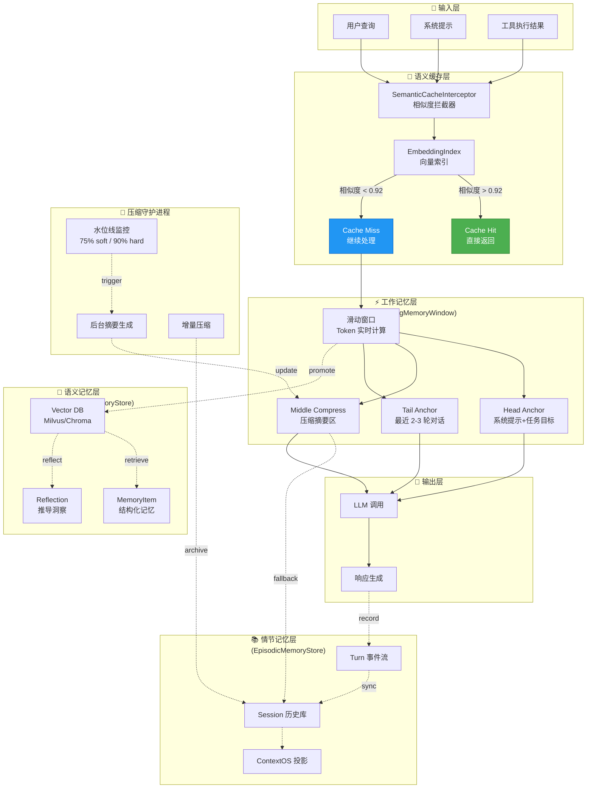
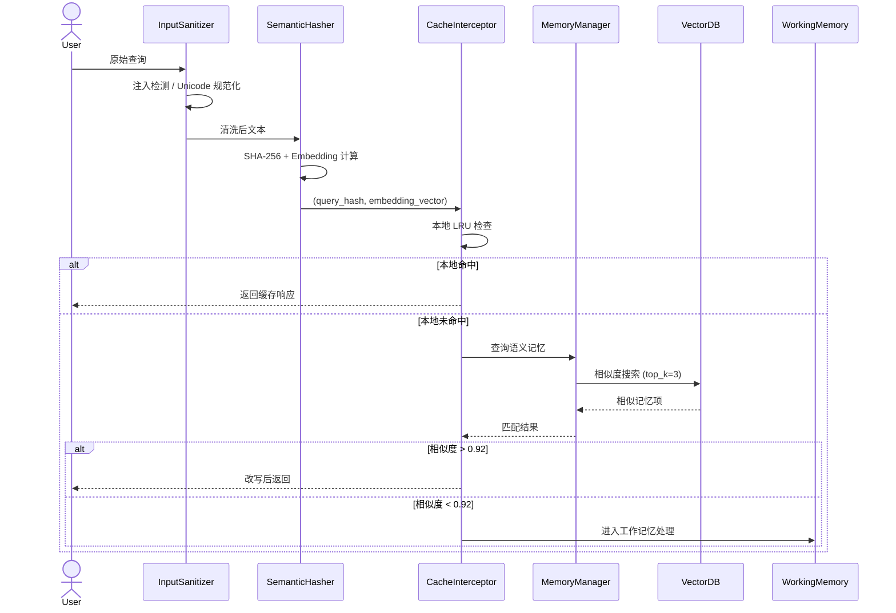
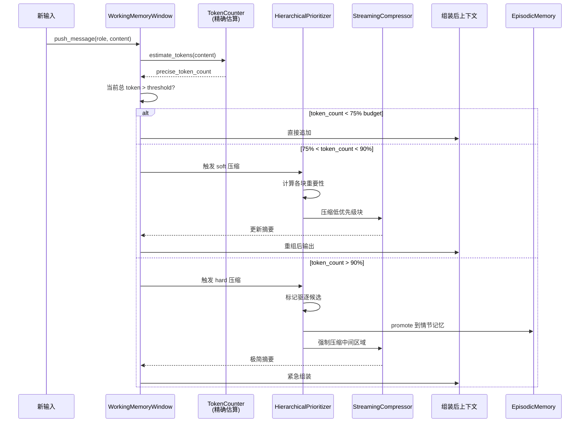
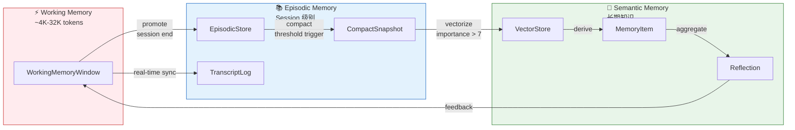
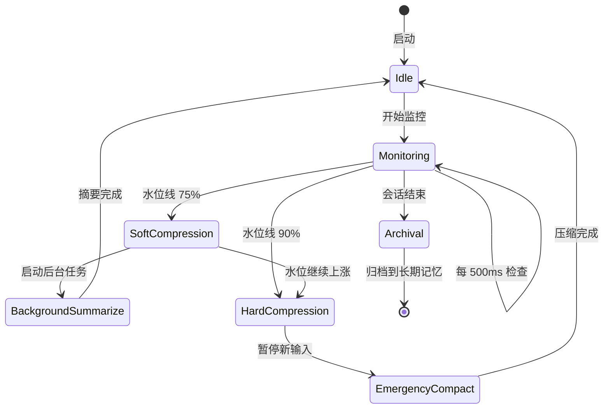
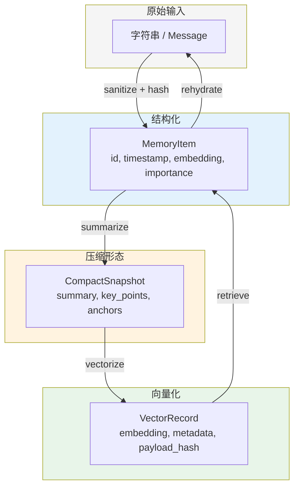

# 阿卡夏之枢：记忆引擎状态流图

## 整体架构（上帝模式视图）

---

## 详细数据流向

### 1. 输入处理流（Input Flow）

### 2. 工作记忆管理流（Working Memory Flow）

### 3. 记忆晋升/降级流（Memory Promotion Flow）

### 4. 压缩守护进程流（Compression Daemon Flow）

---

## 状态转换表

### WorkingMemoryWindow 状态机

| 当前状态 | 事件 |  guard 条件 | 下一状态 | 动作 |
|----------|------|-------------|----------|------|
| Healthy | push_message | tokens < 75% | Healthy | 直接追加 |
| Healthy | push_message | 75% <= tokens < 90% | SoftCompressing | 触发后台压缩 |
| Healthy | push_message | tokens >= 90% | HardCompressing | 强制压缩+拒绝新输入 |
| SoftCompressing | compact_complete | tokens < 75% | Healthy | 更新摘要 |
| SoftCompressing | push_message | tokens >= 90% | HardCompressing | 升级压缩级别 |
| HardCompressing | emergency_complete | tokens < 80% | SoftCompressing | 降级恢复 |

### SemanticCache 状态机

| 当前状态 | 事件 | guard 条件 | 下一状态 | 动作 |
|----------|------|------------|----------|------|
| Idle | query_received | - | Hashing | 计算语义哈希 |
| Hashing | local_hit | key in LRU | CacheHit | 返回缓存 |
| Hashing | local_miss | key not in LRU | Embedding | 计算向量 |
| Embedding | similarity_search | - | Searching | 查询向量库 |
| Searching | high_similarity | score > 0.92 | CacheHit | 改写返回 |
| Searching | low_similarity | score < 0.92 | CacheMiss | 透传处理 |
| CacheHit | response_sent | - | Idle | 更新 LRU |
| CacheMiss | response_received | - | Idle | 可选缓存 |

---

## 关键数据结构演进

