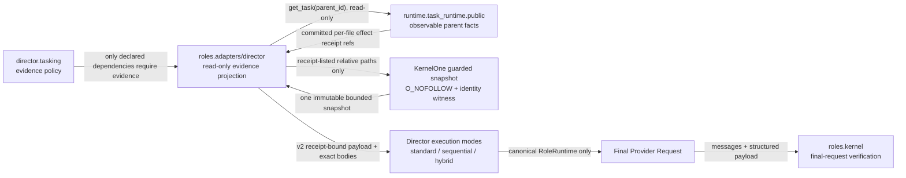

# R119 Dependency Artifact Fact Edge Blueprint

Status: `IMPLEMENTATION_ACTIVE_NOT_SCHEDULABLE`

## Problem

R119 proved that a dependent Director task can receive the Chief Engineer's
predicted interface without receiving the physical interface that its parent
task actually committed.  The first divergent edge is:

```text
parent Provider Response
  -> parent Tool Lifecycle
  -> committed physical Effect Receipts
  -> TaskRuntime observable parent row
  -X-> dependent child final Provider Request
```

The rejected R119 implementation filled that edge by scanning the whole
workspace.  Independent review rejected it because the payload was caller
forgeable, was not bound to parent TaskRuntime/effect facts, performed
unbounded directory traversal, read files twice, and made root test tasks
require nonexistent sibling evidence.

## Static ownership graph



No Cell acquires new mutation authority.  `roles.adapters` consumes the
existing public TaskRuntime read model and KernelOne filesystem primitive.
`roles.kernel` verifies the final request; it does not query TaskRuntime or
read the workspace.

CodeGraph post-edit review found two execution-mode contract drifts that the
original point-to-point graph did not expose:

- Sequential passed `_invoke_role_dialogue_with_timeout` without its required
  timeout and stage arguments.
- Hybrid rebuilt a reduced `task/description` message and created an
  `EngineContext` without an injected LLM caller, bypassing both the trusted
  dependency message and the canonical RoleRuntime request boundary.

Both branches now receive a bounded wrapper around the canonical Director
RoleRuntime caller.  Hybrid uses the same full Director message builder and
injects that caller into `EngineContext.llm_caller`; no Director engine mode is
allowed to invent a second Provider transport.

## Runtime fact graph


The payload is evidence, not a new truth store.  Its authority is the
TaskRuntime projection plus the referenced physical effect receipt.  The file
body is a point-in-time observation bound by a guarded descriptor identity and
SHA-256.

## V2 evidence contract

`polaris.actual_sibling_exports.evidence.v2` contains:

- exact child dependency ids and covered parent task ids;
- one module row per receipt-bound parent artifact;
- parent task id, source fact ref/hash, effect receipt id/hash/binding hash;
- repository-relative path, byte count, SHA-256, guarded device/inode/time
  witness, and the exact bounded UTF-8 body delivered to the model;
- a canonical payload snapshot SHA-256.

The adapter must delete caller-provided `actual_sibling_exports`.  Only an
internal trusted snapshot object built from TaskRuntime and guarded reads can
be promoted into the role runtime context.

## Safety and budget invariants

1. No `os.walk`, `rglob`, semantic whole-workspace scan, or cwd fallback.
2. Empty/non-absolute workspace fails closed.
3. Read only paths named by successful, authoritative, durable physical effect
   receipts in declared parent tasks.
4. Paths are relative and KernelOne validates every segment with retained
   descriptors and `O_NOFOLLOW`.
5. Maximum 16 parents, 32 files, 64 KiB per file, and 256 KiB total.
6. One guarded read creates both the structured payload and the prompt body.
7. Missing parent, missing receipt, symlink, oversize file, invalid UTF-8,
   duplicate path conflict, or hash/body mismatch produces no accepted
   `actual_sibling_exports` evidence.
8. Root tasks never require sibling evidence merely because their task type is
   `tests` or `validation`.
9. Bugfix/repair tasks still require failed-gate evidence; if also dependent,
   they require both evidence classes.
10. Standard, Sequential, and Hybrid Director modes must all dispatch LLM
    prompts through the canonical RoleRuntime caller with the same trusted
    dependency snapshot; missing caller injection is a fail-closed defect.

## Final-request verification

The final request passes `actual_sibling_exports` coverage only when:

- schema is exactly v2;
- dependency ids equal covered parent ids and are non-empty;
- all required receipt/hash/path/body fields are valid;
- module and total counts match;
- module SHA-256 equals the exact body bytes;
- canonical snapshot SHA-256 recomputes;
- the final provider messages contain the snapshot marker and every exact
  module body.

Schema-only, unrelated-parent, caller-preset, modified-body, modified-hash, or
metadata-only payloads fail closed.

## Verification ladder

1. Red tests: policy matrix, preset rejection, receipt binding, unrelated
   exclusion, guarded-read failures, and final-message tamper cases.
2. Focused tests for Director Tasking, Director Adapter, and final-request
   sampling audit.
3. Full Cell suites for the three affected Cells.
4. Ruff, format check, mypy, compileall, diff check.
5. Post-edit CodeGraph blast-radius review.
6. Independent read-only review must return CLEAR.
7. Only then may one fresh isolated Bench be scheduled.

## Premortem

- **Receipt path is missing from TaskRuntime projection:** fail closed and
  surface missing evidence; never scan for substitutes.
- **Parent changes between two reads:** impossible in this design because each
  file is read once; KernelOne revalidates retained descriptors.
- **Payload reaches metadata but not the model:** final-message binding rejects
  the request before Provider dispatch.
- **Large parent dominates context:** hard per-file/total budgets reject the
  projection; future compaction must be separately designed and audited.
- **Legacy v1 payload slips through:** v1 is not accepted as final-request
  `actual_sibling_exports` evidence.
- **An alternate Director engine bypasses the fact edge:** execution-mode
  wiring tests require the full Director message, exact context, bounded
  timeout wrapper, and canonical caller for Sequential and Hybrid.
