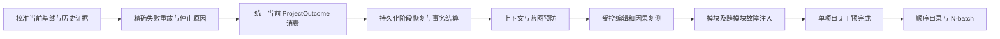
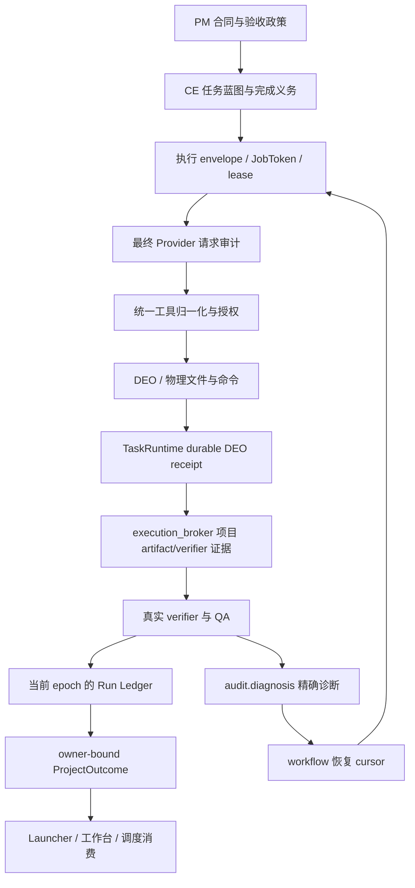

# Polaris 无人值守自动化开发：历史复盘、目标架构与下一步总方案

- 文档日期：2026-09-30，Asia/Taipei。
- 类型：工程方案与实施基线；不是运行成功证明，也不是新的平台事实源。
- 核对仓库：`/home/dains/Documents/polaris`。
- 核对 HEAD：`0d475c60474f2b1ea4a06ea136c0f817d2c49bfa`。
- 本轮范围：历史记忆、已归档运行证据、当前代码/契约/文档的只读核对，以及方案文档交付；没有运行新的 Provider/Bench，没有修改平台产品代码或目标项目。
- 写入前工作区已有 `.serena/project.yml` 修改，属于既有工作，予以保留。
- 配套执行文档：[详细任务包](../../../../docs/superpowers/plans/2026-09-30-polaris-unattended-development.md)。
- 配套证据索引：[计划基线 JSON](../governance/audits/polaris-unattended-plan-baseline-20260930.json)。
- 底层重构取舍：[如果由我重构底座](POLARIS_FOUNDATION_REFACTOR_DECISION_20260930.md)。

## 0. 阅读方法与决策摘要

这份方案服务于两个对象：负责底座的主 Agent，以及按目录顺序运行项目的 Bench Agent。前者修通用机制、验收模块；后者调用平台、保全证据、报告失败，不得手工修生成项目来获得绿色结果。

下一步的首要交付不是增加语言 regex、重写全部架构、无限延长超时，或者再跑一遍 PM 到 QA。首要交付是：把已有的局部成功可靠保存，把每次失败转换为可重放的诊断与受控恢复决定，使平台能在同一项目里完成“定位、编辑、复测、结算、继续”。

建议保留现有 Cell/KernelOne、PM → CE → Director 主链、TaskRuntime、DEO、execution_broker、Run Ledger、ProjectOutcome、repair kernel；补齐关键连接处和验收覆盖。模块化以状态所有权、公开契约和独立门禁为单位，不以“拆了多少文件”为成果。

近期先建立一个可恢复、可审计、可明确停止的项目闭环，再扩大到目录和语言矩阵。项目真的不可修时，应保留有效交付、给出结构化阻塞；不能为了声称无人值守吞掉错误，也不能遇到局部失败就重建整个项目。

### 0.1 五个必须纠正的旧结论

1. **“一个项目都没有完成过”已不符合现有历史证据。** L1-01 有 fresh isolated 成功档案；L1-02 有阶段恢复后的成功档案。两份关键归档的 SHA-256 本轮复核一致。其他项目也有历史闭环记忆，但必须分别验证，不能据此宣布当前 HEAD 全绿。
2. **“所有剩余问题都是模型上限”证据不足。** 最终工具 schema、scope、deadline、receipt、进度判定、恢复预算都曾出现机制问题。只有完整 owner 证据排除这些因素后，才能采用既有 model-ceiling 权威结论。
3. **“ProjectOutcome/收敛器不存在，需要新建”已过时。** 当前存在 `ProjectOutcomeV1`、`ProjectOutcomeAuthorityQueryV1`、owner-binding、阶段恢复与收敛相关实现。下一步以复用、接线与验收为主。
4. **“四支柱 smoke 绿，所以交付已验证”不完整。** 项目要求的行为测试、required modality、QA、当前 epoch 和最终结算仍是完成条件。`--help` 成功不能覆盖业务测试失败。
5. **“进程运行更久证明修复生效”不成立。** 必须观察修复分支、规范化 receipt、当前候选与成功阶段。r92 越过 CE 只能证明本轮 CE 阶段通过，不能独立证明 r91 的异常形状在 live 中再次出现并被修复。

### 0.2 推荐执行主线



图表达实施依赖，不替代 `src/backend/docs/graph` 的运行时架构权威；并行任务必须服从真实 owned_paths。

## 1. 目标、非目标与完成定义

### 1.1 最终目标

用户输入一个范围明确的软件或游戏需求后，Polaris 能执行规划、蓝图、代码生成、依赖准备、验证、局部修复和最终交付；在授权预算内无需人持续盯日志、选修复文件、重置任务或手工修改生成项目。

“支持任何语言”应落实为可扩展的语言/工具链能力协议，而不是承诺每一种语言、引擎、平台都已验证。已验证能力必须按语言、版本、工具链、项目形态、环境、模型绑定和证据日期公开；未知能力保持未验证或明确不支持。

### 1.2 四种不同的成功，禁止混写

| 结论 | 必需证据 | 不能推出什么 |
|---|---|---|
| 模块修复通过 | 对应缺陷 RED/GREEN、模块测试与静态门禁 | 不能推出项目已完成 |
| 项目经工程协助后完成 | 同一项目最终权威结果及物理门禁；注明平台补丁/人工干预 | 不能推出初始版本无人值守成功 |
| 项目无干预完成 | 固定平台版本与配置，从启动到完成无工程师干预；允许平台自身受控恢复 | 不能推出跨语言稳定性 |
| 某能力矩阵稳定 | 冻结矩阵、有效分母、重复批次、失败和干预全量计入 | 不能推出所有语言/所有需求都成功 |

### 1.3 项目级完成条件

完整完成需要当前契约下所有 required 条件共同成立：

- 目标产物确实落盘；当前 artifact hash 与授权 receipt 一致。
- 依赖/环境准备成功，或经过明确且受认可的 `not_applicable` 规则。
- 至少一个真实 build/test/lint 门禁执行；合同要求的其他验证也必须全部通过。
- CLI/Web/API/游戏入口真实执行，并验证相应功能；CLI help 或静态页面只能证明入口可达。
- 必需行为测试、业务不变量、交付深度及其他合同要求通过。
- 当前 delivery epoch 没有未解决的 required failed/missing evidence。
- QA 的实际执行类型、结论及有效 epoch 清楚；确定性 verifier 不冒充 QA LLM 调用。
- TaskBoundary、TaskRuntime、Run Ledger、Factory 当前阶段及最终 owner-bound ProjectOutcome 一致；`quality_gate` 成功结果已持久化。
- 没有未结算物理副作用、重复活跃 writer、未解决的回滚失败或权限漂移。

历史失败回执保持 append-only。新的有效复测可以按既有 epoch/revision 规则替代其当前适用性，但不得删除历史，也不得无条件让“最后一次 pass”覆盖所有失败。

### 1.4 本计划不做

- 不以主 Agent 或外部子 Agent 直接修改目标项目源文件/测试来获取成功。
- 不绕过 CE、不把外部 Claude/Grok/Codex 审计报告接入平台完成权威。
- 不通过降低既有测试断言、关闭 strict 配置、增加 stub、填充行数或改量具消除红色。
- 不创建第二个 ProjectOutcome、第二个 graph truth、第二套 runtime 根或产品实时通道。
- 不把文件拆分、测试数量增加、commit 数量、token 使用量当成业务完成率。

## 2. 历史证据与当前可信基线

### 2.1 证据等级

| 标签 | 含义 | 本文使用方式 |
|---|---|---|
| CURRENT_SOURCE | 本轮读取当前代码/契约 | 证明实现入口存在，不代表运行通过 |
| ARCHIVED_RUNTIME | 本轮读取历史运行产物或复核哈希 | 证明该历史 run 的事实，不代表当前版本复现 |
| HISTORICAL_RECORD | 记忆、旧报告、测试计数 | 形成回归案例；执行前复核 |
| HYPOTHESIS | 合理但尚未动态证明 | 必须列出区分实验，不能当已知根因实施 |
| PROPOSED | 本计划目标策略/接口扩展 | 不描述成当前能力，不提前改生产规则 |

本轮没有重新跑全仓测试、cascade 或 live Bench；因此当前平台整体绿/红状态是 **未重新验收**，不是沿用任何历史 `149 passed` 或 `9/9`。

### 2.2 已核实的里程碑

| 项目/版本边界 | 历史结果 | 本轮核对 | 下一步解释 |
|---|---|---|---|
| L1-01 `factory_a05700ed9ffd` | fresh isolated，Factory completed、QA PASS、build/test/浏览器证据 | r44 audit 文件哈希匹配文档 | 保留首个闭环证明；不归零 |
| L1-02 `factory_0dcb1e13baa7` | Director/QA 局部恢复后 completed；22/22 Node tests | r48 factory-run 文件存在、completed、哈希匹配 | 证明可阶段恢复；归类工程协助闭环 |
| L1-03～L1-05、L2-20、L3-22/23 | 记忆记录多个 same-run 完成 | 本轮未逐个复验全部原始回执 | 纳入迁移清单，逐项绑定证据，不虚构总成功率 |
| L3-24 r90 | build/入口成功，行为及深度仍失败；局部修复和归因改进 | 仓库缺陷记录存在 | 局部改进不等于项目完成 |
| L3-24 r91 | CE 结构失败；窄归一化和回归已记录 | 缺陷记录、源码存在 | 形状修复仍须区分离线证据与 live 触发证明 |
| L3-24 r92 `factory_2f185d17e083` | PM/CE/Director 成功，QA 失败 | 原始 audit 和 workspace validation 本轮读取 | 当前计划最具体的回放案例，不直接宣布所有后续项目不可运行 |

哈希复核：

- r44 `factory_audits.json`：`d8d97c5694ff689c29a36fc09fc392334fc03fecf4d043be801cb17f612e5a5e`。
- r48 `factory-run.json`：`23017506823a0055dfeb670b9da92407f59ee77506ffb59f31c34f800ee102af`。

### 2.3 r92 的精确事实与尚未证明部分

本轮只读读取：

`/tmp/factory-bench-l3-24-r92/workspaces/2fe7e253010b-f94ff3b5c62771a2/L3-24-023d7314133040b6/b3db5341607a96dd1beb3d88/.polaris/runtime/qa/workspace-validation.json`

确认事实：

1. 总墙钟历史记录 1257.1 秒；最终失败阶段 `quality_gate`。
2. `effective_commands` 中 C++ syntax 与 CMake build 都通过；unittest 与 delivery-depth 都失败。
3. 两个当前行为失败：`test_day_extremes_1_and_30`、`test_reveal_missing_index_returns_error`。分别有 `no entry at index 29`、退出码 `2 != 1` 的断言证据。
4. `test_domain.DomainShimTests` 被 skip，理由写成 `g++ not available for domain shim build`，但同一运行编译器门禁成功。需要分离真实环境缺失与 shim 编译失败，不能据此认定平台没有编译器。
5. 当前深度 8 个生产文件、632/650 行、2 个测试文件、29 个断言；差 18 行只是一个残差，不能代替行为验收。
6. `repair.max_rounds=8`，记录 10 个 round；最后 round=10，candidate accepted，`diagnostic_count_before=12`、after=3、`verifier_effect=progress`，但 `verifier_authoritative_success=false`。
7. `nonprogress_rounds_since_last_progress=0`，`convergence_stop_reason` 为空。

当前源码进一步确认：Factory 有 `range(max_rounds + 2)`，helper 明确允许最多两个带条件的额外轮次。因此 8/10 本身并不是失控证明。待动态证明：停止到底来自正常轮数边界、额外轮准入、总预算、取消还是其他控制路径。代码中的有限循环是调查线索，不能独立证明当时走了哪条退出分支。下一次动作是重放/插桩该决定，不是先把 8 改为 80。

### 2.4 当前已有能力与文档漂移

本轮 CodeGraph/源码定位发现：

- `runtime.projection` 已有 pure outcome query 和 direct-owner authority query；它们用途不同。
- `runtime.execution_broker` 已有项目 artifact/verifier 权威、receipt 和受控执行。
- `audit.diagnosis` 已有 `query_exact_run_causal_audit`，可聚合精确 run 的多层证据。
- `director.runtime` 已有 repair coverage、plan probe、scheduler 和 revalidation。
- Factory 已有阶段恢复实现；应验收其适用条件和持续恢复能力。
- TaskRuntime 的当前 manifest 记录了比旧 DEO-1C 记忆更后的实现阶段；“已在 manifest 声明”仍需门禁/运行证据确认。
- graph catalog 的部分描述、旧 roadmap 和 module solidification 文档与新实现/registry 存在时间差。

P00 必须制作逐条“当前实现—历史声明—验证证据”对照；不能单凭旧蓝图再造已经存在的能力，也不能把一个新类名当作完整接线。

### 2.5 三个优先级最高的安全反证项

下列均为 CURRENT_SOURCE 暴露的 HYPOTHESIS；本轮没有执行并发/崩溃试验，不宣称已经产生真实重复写入或假绿。

| 编号 | 发现 | 区分实验 | 负责包 |
|---|---|---|---|
| H1 | DEO 新回归要求 exact claim replay 重新返回 grant；旧 concurrency 回归/README 要求 replay 无 grant；fence 消费还有进程内状态 | 两进程 claim、丢 ACK 后新进程重建 context、fence 消费后 crash；检查一个 operation 的真实 effect 次数 | P04 |
| H2 | settlement barrier 当前部分路径将 open_effect_count 作为诊断而非阻止 release；closed/release_allowed 本来就不等于 passed | task terminal 但子进程/receipt 尚未完成、旧 owner 晚到写、abort/dead-letter recovery | P04 |
| H3 | ProjectOutcome owner adapter 依次读取多 owner；强身份/hash 校验存在，但一致性切面仍需反证 | 在读取六轴中途 reopen/rework/改变 artifact，要求 stale 事实不能合成 completed_verified | P02 |

安全关闭失败是正确能力，不能把 failed run 永远锁住。恢复丢失 ACK 也是正确需求，不能为禁止重复执行直接删掉合法 recovery。必须先证明两类需求能够同时满足。

## 3. 为什么过去推进效率低

### 3.1 反复失败模式及对应防线

| 历史模式 | 造成的浪费/风险 | 下一步固化机制 |
|---|---|---|
| 用墙钟/源码片段猜 retry 路径 | 修了非 streaming，实际走另一路；环境变量未证明生效 | 每个 physical attempt 记录真实入口、有效配置和边界时间 |
| 先怪模型、再查请求 | 工具缺失/角色串线/上下文被裁未发现 | 最终请求角色与必需工具/证据覆盖门禁 |
| 字符串/关键词门当语义权威 | shell helper、反向“不要 placeholder”、成功消息含 error 字段被误伤 | 类型化字段优先，文本启发式降置信度，负例回归 |
| physical effect 与项目 receipt 分裂 | 文件在，但项目账本看不到；TaskRuntime 误失败 | 单 effect owner、hash-bound receipts、可恢复结算 |
| coverage 匹配被当成修复成功 | 无 plan、无 edit、无 verifier 的空转 | coverage/plannable/applied/revalidated 分态 |
| 只按错误数量判断进度 | 编译屏障解除后暴露测试被回滚；截断变少冒充改善 | 同 verifier 身份、错误多重集、因果屏障证明 |
| 错误 owner 或丢 sibling 上下文 | 修 observer test、改错源文件、导出定义反复漂移 | 动态失败文件/符号与不可变授权交集 |
| 重试从 PM 全链重来 | 合同/拓扑随机变化、token 浪费、既有成果丢失 | 当前阶段和当前任务的持久化恢复 |
| 租约/超时/结算预算混在一起 | LLM 成功后工具/receipt 被取消；加 settle reserve 又阻止准入 | provider、execution、settlement、总 deadline 分账 |
| 清 runtime 但旧 authority 留存 | inode 漂移、锁安全原语 fail-closed | workspace incarnation 生命周期与受控退休 |
| 观测断线取消执行、巨型状态帧 | Launcher 假死、全扫描、UI 错误刷屏 | 观测隔离、增量投影、摘要加证据引用 |
| 失败候选回滚抹掉其他工作 | 并发修改丢失、旧 hash 覆盖新产物 | 精确 effect 集合、CAS 回滚和 quarantine |
| 绿色基线未经确认就大拆分 | fixture/import/registry 漂移反复重验 | 结构调整与行为修复分包，基线与影响面门禁 |
| 大量 patch/大量测试被当成果 | 业务没有更接近完成，无法知道剩余量 | 以未关闭残差、成功恢复率和干预率衡量 |
| 记忆只加结论不写纠正 | “已完成”“模型上限”“唯一路径”长期误导 | append-only 证据＋显式 supersedes 修正关系 |

### 3.2 工程协作本身的缺陷

历史中多次出现“agent 活跃域所以无法继续”、反复最终报告、人工一轮一轮授权、自动提交把 dirty 清空后被误认成验证通过。正确做法是预先给任务包定义 owner、文件排他范围、验收门禁、可恢复条件和报告字段。阻塞后应继续不冲突的定位/回归/资料整理，并等待明确的 readiness 事件；不能靠不断启动竞争 provider 的新 Bench 表现进度。

对子 Agent 的治理也要可执行：最多三个并行工作桶；共享契约变化先串行冻结接口；主 Agent 独立复核 diff、门禁和证据，不把外部审计成功当平台成功。

## 4. 架构选择与模块化方案

### 4.1 三种路线

| 路线 | 优点 | 代价 | 结论 |
|---|---|---|---|
| 继续逐错误追加分支 | 单点看似快 | 规则耦合、跨阶段一致性未解决、维护爆炸 | 只用于已证实的最小局部缺陷 |
| 全量重写/微服务化 | 可重新设计 | 丢失历史防线、迁移周期长、双轨事实风险 | 当前不采用 |
| 现有 Cell 上做契约收敛与垂直闭环 | 复用已验证成果；可逐包验收 | 要严谨处理旧路径切换与历史数据 | 推荐 |

### 4.2 模块划分依据

每个模块必须回答：谁写状态、谁授权副作用、输入输出是什么、失败归谁、如何独立验收、跨模块如何恢复。模块大小不按行数固定；同一事务的不变量不能因为文件拆分而分散到互不知情的 owner。

| 能力 | 既有 owner/边界 | 下一步重点 |
|---|---|---|
| PM 合同 | PM/规划相关 Cell | 需求、命令 authority、质量政策冻结；普通代码失败不重规划 |
| CE 蓝图/拓扑 | `chief_engineer.blueprint` | 可执行完成合同、所有权/依赖/符号、受控局部 schema repair |
| 最终请求与工具生命周期 | `roles.kernel` 及已登记 provider/工具边界 | 请求一致性、归一化先于授权、native/text 路径对齐 |
| 任务 claim、lease、DEO authority 与 durable DEO receipt | `runtime.task_runtime` | claim/fence/receipt/recovery/parent-close 唯一 owner；adapter mutation port 消费权限执行 |
| 项目 artifact/verifier/process 证据 | `runtime.execution_broker` | 项目回执与物理验证；按 identity/hash 关联 DEO receipt，不替代其 owner |
| 确定性修复 | `director.runtime` | coverage→plan→policy→effect→revalidate；语义发明禁入 |
| QA/验证 | `factory.verification_guard` 与已登记 QA owner | failed/missing/skipped/不可用分别处理；失败交回原 owner |
| 有效账本 | `control_plane.run_ledger` | append-only 历史、当前 epoch/revision、失败证据适用性 |
| 最终结果 | `runtime.projection` | sole owner-bound `ProjectOutcomeV1`；UI/调度只消费 |
| 执行恢复编排 | `orchestration.workflow_runtime` / `workflow_orchestration` | 受控 cursor、局部 retry、预算、停止与恢复事件 |
| 目标策略 | 已有 `resident.autonomy` 与外部工程调度 | 各自保持既有状态所有权；不另造目标账本 |
| 审计 | `audit.diagnosis` | 精确 run 因果报告和证据缺口；不授予执行权限 |
| 实例及 UI | `instances`、delivery WS、前端 transport | workspace 绑定、主端口保护、仅事件推送 |

以上是阅读地图，最终 owned_paths/depends_on/state_owners 以当前 `src/backend/docs/graph`、Cell manifest 为准。跨 Cell 使用 public port；由 bootstrap 注入 owner 客户端，不能为方便聚合造成 Cell 循环依赖。

### 4.3 数据与权威流



静态代码图用于发现调用和状态 owner；运行因果图用于证明某次失败。二者不能互相替代。建议按 `run/task/attempt/turn/tool/candidate/verifier/epoch` 关联证据，不为了画图新建具有写权的 graph 数据库。

Factory 先依据自身 stage result、settlement barrier 和 fence 安全完成 chain；ProjectOutcome 随后聚合 chain 与其他 owner 事实。禁止 Factory 等待包含 `chain=completed` 前置条件的最终 ProjectOutcome 才写 chain 完成，避免循环依赖。

## 5. 动态调试与即时审计标准

### 5.1 每次失败固定协议

1. 锁定 workspace、project、Factory run、阶段 attempt、delivery epoch、源码 fingerprint、实际模型绑定。
2. 保全原始日志、完整命令输出、最终请求快照、原始/规范化工具参数 hash、effect/rollback/verifier receipt；先归档再清临时目录。
3. 用既有 causal audit 查询读取精确 run；报告只是证据导航，主 Agent 检验是否误取 latest/跨 workspace/过期 epoch。
4. 在首次断裂边界加最小诊断点：入口输入、决策字段、分支 reason、输出身份、耗时；记录 before/after，避免倾倒全部源代码和密钥。
5. 运行真实调用边界或确定性重放。若只存在旧日志，标记“历史回放证据”；若没有可重放条件，标记 `root_cause_unproven` 并补采集。
6. 写出可证伪假设、替代解释、区分实验，再修 owner 模块。
7. 同一失败签名 RED/GREEN、模块、cascade、原阶段恢复、fresh proof 依次验收。

### 5.2 断点/插桩位置矩阵

| 边界 | 必采字段 | 需要回答的问题 |
|---|---|---|
| 请求最终装配/发送 | role、tools、schema、coverage、有效 timeout、模型 binding、request hash | 模型实际拿到了什么？ |
| 响应解析/工具归一化 | 原始 envelope、canonical name/args、参数摘要 hash、拒绝 reason | 模型意图是否在适配层丢失/损坏？ |
| claim/preflight | lease/epoch、JobToken、scope、plan hash、owner | 为什么允许/拒绝这次操作？ |
| effect 前后 | 真实 before/after hash、路径、进程/命令、operation id | 是否真的发生变化？ |
| receipt commit | effect id、持久化 ack、dedupe/CAS 版本 | 变化是否被正式登记？ |
| candidate guard | 全部 affected paths、verifier 输入 hash、进度证明、rollback hash | 接受/拒绝是否有因果依据？ |
| 调度决定 | 当前 residual set、候选 owner、预算剩余、round、reason | 为什么继续、停止、换 owner 或等待？ |
| outcome | 六轴 owner hash、当前 QA、missing/failed、epoch | 局部事实是否被错误汇总？ |
| UI/观测 | source event id、workspace、revision、frame 大小 | 是当前阻塞、历史错误还是投影问题？ |

动态调试不等于只“打印日志”，也不要求每个问题都附加交互式 debugger。受控故障注入、真实 handler 重放、分支 trace、进程/系统调用观测都可成为动态证据；关键是证明具体执行路径。

### 5.3 诊断产物要求

复用既有 `QueryExactRunCausalAuditV1` / `AuditDiagnosisResultV1`，在其 owner 内补齐缺口。建议报告包含：

- 身份集合及 policy/toolchain/model/source fingerprint。
- `evidence_completeness`、缺失证据和可读取的 refs。
- 主要 broken edge、负责 Cell、当前 module_id，以及有序次级残差。
- 根因状态：proven / hypothesis / insufficient_evidence。
- failed verifier 与其精确命令、退出码、输入产物 hash、完整日志引用。
- 允许的下一动作、保存对象、禁行动作、stop_reason、resume_condition。
- 本次修复变化、重放命令、回归结果、剩余风险、纠正了哪一条旧结论。

“一个主根因”是调度选择，不是删除同时存在的其他失败。`module_id` 必须由 registry 解析；诊断不能通过硬编码成功状态获得调度权限。

## 6. Director 代码闭环与阶段恢复

### 6.1 主闭环

```text
读取已冻结 PM/CE authority
领取当前任务 lease / 验证 epoch
读取当前源码、依赖接口、失败 verifier 上下文
最终请求审计
模型产出可执行 edit/write/command 或结构化解释
统一归一化、授权、预检
候选事务执行并写 effect receipt
运行受影响 verifier 与已通过防回归检查
接受候选，或按 CAS 回滚本候选
结算 TaskRuntime / Run Ledger
权威 ProjectOutcome 重评
继续同阶段、进入 QA、等待依赖，或输出明确终止/恢复决定
```

### 6.2 阶段恢复决策表

| 失败类别 | 恢复边界 | 必须复用 | 允许上升条件 |
|---|---|---|---|
| provider 短暂限流/过载 | 同一次逻辑请求下的物理 attempt | 当前输入、authority、候选 | 准入/预算无法满足时等待环境，不能改完成标准 |
| CE 格式/唯一可归一化结构 | 同 CE candidate | PM hash、已合法子树 | PM 合同本身不可执行才要求 PM 变更 |
| Director 编译/测试/入口错误 | 原 owner Director 任务 | PM、CE、已接受产物和 current receipts | 需要改变接口/授权范围时提交结构化合同变更 |
| QA 证据缺失但产物存在 | verifier/broker/结算 owner | 有效产物 hash | 重新登记必须重新查 owner，不能伪造 receipt |
| QA 行为失败 | 原代码 owner 修复，然后相关 QA | 未失效的 verifier 证据 | 测试/需求冲突必须证实并变更合同，不能直接删测试 |
| 控制面投影错误 | 对应 owner 重放/投影修复 | 全部已提交 effect | 不生成目标代码 |
| observer 断开 | 重新连接与显式快照 | 活跃执行 | 不把网络断开解释为执行取消 |
| lease 丢失/取消 | 先 drain、查 effect、结算/隔离，再新 claim | 已提交 facts 与候选快照 | 不自动复活旧 lease，不重复有未知结果的 effect |

阶段恢复不是跳过 CE。合法恢复必须重新验证上游合同和 blueprint hash、workspace incarnation、权限、工具链、当前 artifact 输入。上游变更会使相关证据失效；未受影响的证据才可复用。

### 6.3 持久化恢复 cursor

优先扩展既有 workflow cursor，不新增 JSON 文件作为第二调度权威。目标字段：当前项目/任务/阶段/attempt/epoch、PM/CE/completion hash、失败诊断签名、当前与剩余 verifier、候选/回滚状态、已消耗预算、下一允许动作、阻塞依赖、stop/resume reason。

cursor 只保存定位与恢复位置，事实仍回查 owner。重启时执行 CAS claim，核对真实盘面与 effect receipt；不得将 cursor 里缓存的 `passed=true` 当作 verifier 事实。

跨进程恢复必须覆盖：claim 后崩溃、write 后 receipt 前崩溃、receipt 后 QA 前崩溃、QA 后投影前崩溃、终态 ack 丢失、重复 wake、旧 worker 恢复。对无法判定的命令副作用使用 `outcome_unknown`/隔离，不宣称通用 exactly-once。

### 6.4 “Director 失败不要回退”的精确定义

- 禁止普通代码失败触发 PM/CE 全重跑或把整个目标项目重置。
- 允许对本轮未经接受的候选做精确 CAS 回滚，保留之前接受的交付。
- 允许预算受控的原任务编辑修复；失败轮不会删除其他任务有效 receipt。
- 存在某个文件不意味着下游可安全消费。依赖释放必须依据需要的 artifact/interface/verifier readiness，不能简单用 `materialized_any_files` 放过所有失败依赖。

## 7. 修复进度、预算与停止策略

### 7.1 进度不是改了文件，也不是少了几行报错

建议复用现有 scheduler/diagnostic 类型记录下列证据向量：

`authority/effect integrity → compile frontier → link/build → behavior verifier → delivery obligations → final settlement`

判断必须在可比的命令身份、政策、工具链和测试清单下进行；分别绑定 baseline/candidate 输入 hash，由 effect receipt 证明两者转换。有效编辑必然改变部分输入 hash，不能要求前后 hash 相同。复用旧 verifier 证据才要求相关输入 hash 未变。编译屏障解除后暴露 deeper test 可以是有证据的前进；同数量换成全新错误、无 effect、删测试或隐藏输出不能算前进。

- resolved/residual/new diagnostics 保留 ID 和 occurrence multiplicity。
- 多文件接口修改只有在同 owner 或显式授权 bundle 中原子提交；修改一个声明却回滚另一个实现必须禁止。
- 验证上下文保留失败测试的 setup、调用、expected/actual 和相关定义；旧修复历史压缩成必要负约束，不反复灌入全部日志。
- 上一轮 rejected candidate 的目标和拒绝证据要保留，避免下一轮无依据换文件。
- 已修好部分形成受影响依赖图；局部复测后，在最终完成前跑完整必需验收，防止遗漏跨文件回归。

### 7.2 有限 attempt 与持续工程目标同时成立

“持续到完成”不等于每个运行无上限发请求。每个 attempt 有 provider、工具、修复和总 deadline；每个项目有累计预算和持久化恢复位置。预算耗尽应给出确定的停止类别及恢复条件。

建议初始治理政策：同一 diagnosis+candidate 连续两次无 effect/无进展触发局部停滞检查；同因果残差第三次无进展停止该策略并保全。数值作为 **待在任务包中版本化的默认政策**，不暗改现行规则。已证明进步可继续，但总 attempt/time/token/cost 预算不清零；并且必须防止跨 attempt 重置计数形成无限循环。

允许的决定包括：continue_current、retry_transport、run_verifier、repair_current_owner、wait_dependency、checkpoint_budget_exhausted、blocked_contract、blocked_environment、quarantined_effect、qualified_model_ceiling、completed。对应字段/枚举须在既有 owner 契约落地，不把这些本文标签当现有 API。

### 7.3 r92 首批任务

用同一冻结 validation 证据重放 scheduler 决策，捕获：

1. effective base round limit、extra-round policy、累计 round、剩余时间/token。
2. 最后一轮接受的 edit 及 12→3 的因果诊断变化。
3. 实际退出分支；每条退出路径必须输出非空 reason。
4. 三项残差是否进入 durable cursor，是否有唯一 owner 与安全后继动作。
5. 在 PM/CE hash 保持时，进程重启/下一 attempt 是否只接续该残差。

验收不要求它无限修到绿；要求持续进展能按授权预算接续，停滞能正确隔离，且停止原因与真实分支一致。

## 8. 前置预防：PM/CE/最终请求/写时门禁

### 8.1 PM 与 CE

PM 固定目标、范围、验收和执行命令 authority。CE 固定每个义务的唯一身份、owned files、接口、依赖、入口和 verifier 覆盖关系。冻结前检测：required 义务是否有 owner、owner 是否具有必需依赖、范围是否足够、命令/工具链是否可执行、测试和入口是否有物理路径。

代码行数、业务质量不能在蓝图阶段提前证明；只能验证结构可行性并把 deficit 传递到生成/验证。禁止“规划说够了”当作交付合格。

CE 修复采用 current candidate + diagnosis + typed patch + 原子 compose + 完整复验；同时收集所有可兼容结构错误，减少“每次只报第一个字段”带来的串行回合。归一化仅处理能够证明内容与权限不变的结构；模糊拓扑、冲突命令、重复 key、不同 owner 绝不自动猜。

### 8.2 最终 Provider Request

每次物理调用核验：角色、语言/项目类型、PM/CE hash、当前目标和 sibling contracts、失败 verifier、required tools、tool_choice、schema/aliases、输出预算和有效 deadline。修复请求带当前源码/哈希与失败信息，避免只读到了过期候选。

上下文占用低于 10%只能作为排查线索。合格标准是必需证据和工具完整且新鲜，不是把窗口填满。token ledger 分别统计 logical call、physical attempts、request input、output、cache/read，不能把 UI 多个投影加总后重复记账。

### 8.3 工具和写入

统一 ToolSpecRegistry 完成 native/text envelope、tool alias、arg_aliases 归一化，再执行授权。参数 schema 与真实 executor 签名要做契约测试；`edit_file` 的 search/replace/范围限制不能在 provider 转换时丢失。

对于缺文件，必须提供授权 create 路径和 create-capable 工具；只给 `edit_file` 不能完成新增文件义务。已有文件的精确修改优先 edit；no-op 可以是合法工具结果，但不能满足“本轮必须产生修复”的效果条件。

写时门禁只验证能够局部证明的结构/权限条件。不能要求尚未生成依赖的单文件立即通过完整项目编译；应根据声明的构建阶段和原子 bundle 决定何时验证。

## 9. QA 分级与产品质量政策

### 9.1 可软化的要求与不可软化的证据

| 类型 | 处理 |
|---|---|
| 风格、文案、非必需性能、纯建议性 review | 默认 advisory；若用户合同明确必需则仍 required |
| 临时 provider/网络故障 | 有界退避、共享准入、保持当前阶段 |
| 编译/构建/必需测试/实际入口失败 | required fail；原 owner 修复后复测 |
| 越权、stale fence、错误 workspace、缺 effect receipt | 控制/安全阻塞；不交给模型重试掩盖 |
| verifier 未执行 | missing/not_run，不能写 failed，也不能 pass |
| verifier skip | 保留 skip reason；required 且未满足可豁免规则时不能通过 |
| 明确不适用的 modality | 按合同及环境能力生成 `not_applicable`，不可事后给失败找豁免 |
| 测试假失败/假通过 | 动态复现 verifier 本身，修通用验证机制；目标测试断言保持不被工程 Agent 手工改弱 |

### 9.2 交付深度的处理

现有 Bench 650 行等阈值继续是该版本量具的要求，当前失败必须如实保留。工程上不鼓励用无意义分支、重复函数或格式填充满足数量。

产品质量建议独立版本化为行为义务、边界案例、真实输入输出、可运行入口、测试强度与安全基线。未来若决定替换行数阈值，必须单独审批评测政策、保留旧版结果和双报表，并重新建立基线；不得为了 r92 即时修改量具。

### 9.3 游戏与 Web 的验收边界

游戏并非“Canvas 不空白”就完成。按需求声明输入响应、状态更新/规则、存档/重载、资源加载、确定性种子或 headless 规则测试；视觉/浏览器能力只在环境显式提供且合同要求时硬启用。资源授权或不可用引擎必须返回明确阻塞；不能生成占位素材后宣告完成。

## 10. 运行环境、存储与观测可靠性

### 10.1 实例与 storage

- 一个 backend 绑定一个 workspace；所有 runtime 写入统一 `<workspace>/.polaris/runtime`。
- project identity 与 workspace incarnation 分离；同路径目录重建不等于原 inode authority 仍可复用。
- purge/退休必须先证明无活跃 owner、drain 完成、证据已归档，再执行受控生命周期；禁止删除 lock authority 来绕安全门。
- main `49977/5173` 长期保留给主实例；isolated 项目走 Supervisor 分配端口并注册。
- 不根据 backend health 推断 frontend 可用；本机浏览器 HTTP、前端资源、API、WS 和 workspace binding 都需证据。

### 10.2 观测不得阻断执行

runtime.v2/NATS 只发布有界摘要、身份、revision 和证据引用。大日志、源码和 full audit 单独持久化，按需读取。断线/订阅失败与 execution cancel 分离；事件 replay 使用 watermark/dedupe，不增加产品 HTTP 轮询。

EventStore/TaskRuntime 投影按 durable stream head/identity 做增量读取。性能验收覆盖逐渐增大的事件流和多个 observer；检查 CPU/内存、GET 尾延迟、frame 大小、丢帧和 backlog。目标 SLO 先测基线再冻结，不能随意填一个未测的“毫秒级”承诺。

### 10.3 UI 错误显示

显示当前阻塞、历史失败数、已恢复事件和证据可用性，分别计数。结构化 `status/ok/error_code` 优先于消息中的 `failed/error` 字样。任务视图不能把 CE 内部 review task 算进 PM 工作项，也不能因为 Director 活跃就推断 CE 蓝图完整。

`context_snapshot_ref` 需 24 hex 且同 workspace 可读取；hash 不存在、读失败、权限不匹配必须展示真实 reason，不把所有问题统称 Receipt 错误。

## 11. 语言能力、模块封板与扩展

### 11.1 当前目录与能力声明

本轮审查的 `projects_v2.json` 是 120 项、L1～L12 每层 10 项，覆盖 TypeScript、JavaScript、Python、Go、Rust、C++、Java 七类主语言。它不能证明“任何语言”支持。项目按目录 canonical ID 排序；例如 L2 从 L2-11 开始，不能按早期对话臆造 L2-01。

新增语言使用能力清单：toolchain/probe、manifest/依赖准备、source/entrypoint、compile/test/lint 命令契约、诊断适配、fixture、沙箱、可用平台。未知语言若具备已授权的通用命令协议，可进行受控试验；验证覆盖未建立前不列为 certified。

确定性规则遵循 `reserved_only`、`metadata_rule_registered`、`executable_runtime`；能力“有 slot”不意味着可执行。业务逻辑通过 Director 编辑迭代，不用平台规则枚举领域功能。

### 11.2 模块 seal 的有效范围

本轮 registry 审查：10 模块；M03/M04 sealed，M01/M02/M05/M06/M07/M08/M10 hardening，M09 open。这是当前源码声明，不是本轮门禁结果；后续精确状态仍通过 registry 查询。

seal 应绑定模块版本、public contract hash、依赖版本、测试与故障矩阵、运行证据窗口。发生相关变更时显式 unseal 并重验受影响闭包；无关 UI 文档变更无需重跑所有语言项目。

`--mode cascade` 当前只覆盖 sealed+hardening，不能因此宣称 open 模块验证完成。M09 需独立测试/量具回归，并在其就绪后进入整链验收。

## 12. Bench 推进、N-batch 与无人值守策略

### 12.1 两条验证轨道

**恢复轨道**：对当前失败项目保留 PM/CE/产物，先离线回放、只修通用平台机制、运行模块与 cascade，再恢复原阶段。此轨道产生“工程协助闭环”或“平台自身恢复闭环”的证据。

**认证轨道**：冻结新平台版本、模型绑定、工具链、策略与 catalog，在 fresh isolated workspace 从头运行；不需要每次局部失败都重置，但平台工程师不能中途修改代码。此轨道测量真正无人值守成功率。

两条轨道均不改写或删除历史失败事件/attempt。合法 same-run retry 可由原 owner 写入新 revision，并将当前 run 投影更新为 completed_verified；旧失败及工程干预记录保留，不能重新计为原候选 fresh 首次成功。不要为了证明顺序从 L1-01 反复刷起；先恢复实际 frontier，并校验此前认证证据是否仍适用。

### 12.2 N-batch 建议政策

以下是待纳入版本化验收政策的明确建议，不能自动替换现行量具：

- N=3 为第一阶段稳定性窗口。
- 一个 level-qualification batch 是该层目录的固定 10 项及全部结果；三批资格有 30 个 planned slots、10 unique projects。每槽至少一次 fresh run；重跑增加 started_fresh_runs，不能替换原失败。同一项目 same-run 三次 retry 不等于三个 batch。
- 进入层级资格前先做固定 3 个 fresh canary：覆盖 TS/JS/Python 中一种、Go/Rust 中一种、C++/Java 中一种，并包含 CLI 与 Web/服务形态和当前缺陷 archetype。canary 通过只能称小矩阵通过，不能叫 N-batch 完成。
- 连续三批必须：required 全部通过、没有新增通用根因、没有人工修目标代码/手工改状态、没有未记录策略变化。
- 分别统计 planned_slots（计划覆盖）、started_fresh_runs（实际启动）和 physical_attempts（含内部 retry）；启动前环境阻塞、foreign-owned 跳过、未运行保留计划槽位，不虚增实际运行数。
- 三批资格要求连续三个完整 batch 各 10/10；任一终态失败/取消/证据不全使当前成功 streak 归零；未启动或未完成的批次不能计入成功 streak。旧失败永远留在累计成功率分母中。
- 如果中间修改平台/模型/质量策略，保留旧结果，新兼容性版本重新建立受影响 streak；无关文档修改不重置。
- 3 批无新根因只是工程稳定性窗口，不是统计保证全世界所有需求可靠。

若全部 120 项均按三批认证，最低 360 个 fresh runs/计划槽位；按每 run 5400 秒，chain 预算合计 540 小时。按 6000 秒外层 watchdog 加最多 30 秒 kill grace，名义外层预算约 603 小时；均尚未包括额外重试、canary、门禁和平台修复。必须分层准入和预算管理，不能一次发起全量后靠缩短 timeout 节约。全目录资格要求各项证据对同一当前兼容 candidate 有效，不能拼接跨版本历史成绩。

若现行规范要求每个项目先满足 N-batch 才推进，P00 必须记录并明确选定最终政策；在批准政策变更前继续服从现行门禁。不能让不同 Agent 分别使用“每项目 N 次”和“每等级 N 批”却共同声称通过。

### 12.3 单项目运行约束

工程 Agent 默认一次只推进一个项目；平台模块回归可并行。Bench 的 `--max-failed 0` 表示禁用提前停止，不表示首失败停止；因此单项目要求由仅传一个 `--project-ids` 和外层队列保证。

保持 isolated、`--bench-session-reporting off`、单项目 5400 秒、外层 6000 秒、real-run 120 秒的既有完整验收预算；短 smoke 不能计为完整验收。每次 run 使用新唯一目录，禁止复用并 `rm -rf` 尚需追踪的历史目录。

### 12.4 调度与阻塞

外部 Bench 工程调度消费平台权威结果与诊断，不成为产品依赖。已有 workflow/Goal owners 负责产品恢复和目标状态，不另造“外部 AI 批准”成功条件。

`not_schedulable` 必须列出具体未就绪项、负责 owner、允许的本地工作、resume 条件和证据更新时间。等待是合法状态，但“重复 final 报告然后盲重跑”不是持续执行。

恢复触发可来自平台事件、进程退出、模块门禁完成等；产品实时链路继续 NATS/WS。工程测试工具的有界等待不应复制成前端轮询。provider 全局准入需要区分瞬时 429、持续配额不足、共享饱和和宕机，不能只把 retry 数加大。

## 13. 15 个实施任务包与阶段里程碑

详见配套任务文档；编号是工程工作包，不是断言现有 15 个 bug。

| 包 | 交付目标 | 前置 |
|---|---|---|
| P00 | 当前事实基线、证据清单、政策冲突裁决 | 无 |
| P01 | r92 决策动态重放、非空 stop/resume reason | P00 |
| P02 | ProjectOutcome 统一消费与真/假失败矩阵 | P00 |
| P03 | 持久化阶段恢复、累计预算与 cursor | P01、P02、P04 |
| P04 | effect/receipt/lease/崩溃恢复防线 | P00 |
| P05 | 最终请求、工具 schema 与物理调用一致性 | P00 |
| P06 | CE 可行性、候选 patch 和原子合同校验 | P00、P05 |
| P07 | Director 候选事务、因果进度和精确 owner | P03、P05、P06、P08a |
| P08 | P08a 前置统一 verifier 身份/诊断/skip；P08b 后置失效复测与 QA 集成 | P08a 依赖 P02；P08b 依赖 P08a/P07 |
| P09 | runtime 身份、存储、观测性能及 Launcher | P00、P04 |
| P10 | 七语言能力矩阵及通用工具链协议 | P06、P08 |
| P11 | 通用项目恢复/环境等待/成本预算；Bench 目录队列归 P13 | P03、P08、P09 |
| P12 | 模块封板、跨模块故障注入与准入 | P02～P11 对应依赖 |
| P13 | 当前 frontier 闭环、fresh 认证、L1-L12/N-batch | P12 |
| P14 | 文档/记忆纠错与可接手报告机制 | 从 P00 起贯穿 |

### 13.1 里程碑与禁止跨越

- **M0 基线可信**：运行版本、状态、历史证明和当前测试范围明确。不能用 clean git 代替 green tests。
- **M1 可恢复失败**：原阶段断点重放、stop reason、owner 诊断和 cursor 完整。此时仍不能声称项目成功。
- **M2 单项目闭环**：同一项目产生 current owner-bound completed_verified，且全部 required verifier 和持久化 quality_gate 成功。
- **M3 无干预稳定**：固定平台版本在 fresh 矩阵达到选定 N-batch；成功率包含全量失败尝试。
- **M4 能力扩展**：按目录推进 L1-L12，按语言/项目形态分项声明能力。

### 13.2 首 48 小时建议安排

这是可执行工作窗口，不是工期承诺；当前代码基线和环境仍需实测。

1. 先完成 P00：生成证据 inventory、模块现状、未关闭 frontier、当前门禁结果，不发无目的 Provider 调用。
2. 并行只读检查 P01/P02/P04，主 Agent 合并成一个最小写入桶；首先处理会伪造成功、丢真实 effect 或无法解释停止的缺口。
3. 对首桶完成动态复现、RED/GREEN、模块/cascade、独立审查；再决定原阶段恢复。
4. 在业务 residual 仍开放时，继续同一项目和 owner；只有原路径无法安全恢复且有证据时才 fresh。
5. 最后输出实际完成的包、测试结果、调用成本、未验收项和唯一下一任务。

## 14. 协作、验收与效率纪律

主 Agent 负责架构决策、跨 Cell 合同、排他范围、主干集成、动态证据复核和用户报告。Bench Agent 负责执行准入、单项目运行、证据归档和原生状态读取。子 Agent 一次只接一个可独立验收的工作包；源码、测试、文档范围明确。

共享主仓默认不建新分支，尊重用户偏好。不能保证文件互斥时串行；用临时隔离目录做故障注入不得触及真实目标项目，也不能把临时产物视作正式 run 证据。

提高效率的具体措施：

- 先用失败快照/纯函数/真实 handler replay，后用收费 live run。
- 每个修复只改变一个可证伪假设；结构拆分和行为变化分成不同包。
- 先定公共接口，再并行内部实现；禁止多个 Agent 同时重写同一核心文件。
- token 预算围绕当前失败证据、目标源码和 sibling API，避免完整历史反复回灌。
- 不能重复等待无新证据并声称进度；挂起时记录醒来条件，主 Agent推进独立安全工作。
- 每个用户先发现的问题都要补自动检测/回归用例，避免再靠截图发现。

## 15. 指标与完成报告

| 指标 | 分母/语义 |
|---|---|
| task step 成功率 | 当前有效 epoch 的完成 task / 必需 task；与项目率分开 |
| 项目 required-verifier 成功率 | 全部必需验证同时通过的项目 / 实际调度项目 |
| fresh 无干预成功率 | 固定版本且无工程干预完成项目 / 全部 fresh 尝试 |
| 同阶段恢复成功率 | 局部恢复完成 / 进入可恢复失败的项目 |
| 人工干预率 | 需要人/工程 Agent 改平台、改状态或决策的 run / 所有 run |
| 诊断完备率 | 精确身份＋完整链＋可验证 broken edge 的失败 / 所有失败 |
| 无效修复比例 | 无 effect 或 rejected 无进展候选 / 修复候选 |
| 已完成工作保留率 | 合法局部恢复中仍有效的既有产物/验证保留情况 |
| 成本与墙钟 | 每项目总量和成功/失败分别的 p50/p95；physical retry 成本单列 |
| 新通用根因 | 按稳定分类和证据去重，不把错误文案变化计为新根因 |
| 封板稳定性 | 特定模块版本在约定矩阵/N-batch 中的有效 streak |

报告必须包含 current state、project/run/attempt、source/model/policy fingerprint、阶段、四支柱、required gates、调用量/错误、有效 edits、verifier pass/fail/skip、receipt/settlement、主根因置信度、已修/待验/未解、下一动作。

在 baseline 未盘清之前，不提供“还差 5%”或“已经解决全部平台问题”等无法证明的百分比。进度以 M0～M4 和任务包完成证据表示。

## 16. 风险、反证与上线控制

| 风险 | 必须主动反证的场景 |
|---|---|
| 当前事实被旧记忆覆盖 | 读取 HEAD/manifest/源码后，旧“未实现”是否仍成立？ |
| 保留 receipt 误当永久有效 | 改依赖/工具链/输入 hash 后旧 verifier 是否被失效？ |
| 放宽 QA 成为假绿 | required test 失败、skip 或根本未跑时能否 completed_verified？ |
| 自动重试重复副作用 | spawn/write 后 ack 丢失，重复 wake 是否重新执行？ |
| partial success 错误释放依赖 | 只有无关文件落盘，依赖是否仍被正确阻止？ |
| 观测拖垮执行 | 慢 WebSocket 客户端、超大日志、断连是否影响租约/工具？ |
| 规则映射回归 | Rust/TS 同名诊断是否被串到错误 source_tool？ |
| 修复测试迎合实现 | 产品行为断言是否被删弱，skip 是否被误计 pass？ |
| 跨 Cell 循环依赖 | outcome 聚合通过 bootstrap ports 还是反向 import Factory internal？ |
| 证据只在 /tmp | 删除临时目录前是否有可核对 archive 与摘要？ |

迁移采用明确版本、单 writer、受影响消费者一次性切换；shadow 只做独立只读对照。切换失败保留旧事实及诊断，禁止回到已禁用的旁路执行。

## 17. 文档与记忆维护

每个进展/失败需产生一次短记录：时间、确切身份、假设、动态证据、变化、验证、当前状态、下一动作。重复结论引用原记录，纠正时明确 `supersedes`，不静默覆盖历史。

- runtime 原始证据在 workspace `.polaris/runtime`；工程归档使用用户持久目录并记录 hash。
- 仓库保存通用缺陷、回归、方案和证据索引；不要把目标项目业务代码、密钥或完整私有 prompt 当文档附件提交。
- `AGENTS.md` 是规则，`CLAUDE.md`/`GEMINI.md` 遵守镜像策略；不能再维护相互矛盾的成功标准。
- memory 是检索索引和经验，不是当前运行事实源；恢复任务首先核对 live/archived owner evidence。
- 本文中历史数值和 proposed 数值必须保留日期/状态，后续不能摘掉限定语复制为“当前事实”。

## 18. 主要仓库依据

1. `AGENTS.md`、`src/backend/AGENTS.md`、`src/backend/docs/AGENT_ARCHITECTURE_STANDARD.md`、`src/backend/docs/FINAL_SPEC.md`。
2. `src/backend/docs/graph/catalog/cells.yaml` 与对应 subgraphs/Cell manifests。
3. `src/backend/docs/governance/UNATTENDED_COMPLETION_FIRST_PROOF_20260812.md`。
4. `src/backend/docs/blueprints/DURABLE_PROJECT_COMPLETION_LOOP_20260808.md`。
5. `src/backend/docs/blueprints/EXACT_RUN_CAUSAL_AUDIT_AND_LEDGER_REVISION_RECOVERY_20260821.md`。
6. `src/backend/docs/blueprints/UNATTENDED_AUTONOMOUS_DEVELOPMENT_FOUNDATION_ROADMAP_20260802.md`。
7. `src/backend/docs/governance/PLATFORM_MODULE_SOLIDIFICATION.md`、`PLATFORM_UNATTENDED_AUTOMATION.md`。其中日期性状态需与 registry 对照。
8. `src/backend/docs/governance/audits/defect-20260827-l3-24-r90-depth-failure-misattributed-control-plane.json`。
9. `src/backend/docs/governance/audits/defect-20260827-l3-24-r91-ce-task-risk-flags-nested-array.json`。
10. r44/r48 持久归档及 r92 原始 audit/validation，路径和哈希见配套 JSON。

本计划保留历史成果，明确当前证据边界。第一项工程动作是 P00，第一项具体运行残差是 P01；后续每个包均需独立门禁，不能用本方案的完整程度替代实现与验收。
