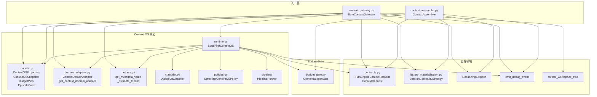
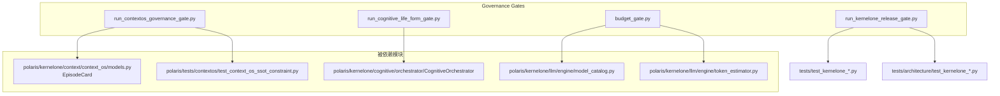

# M0 现状依赖图分析报告

> 生成时间: 2026/04/13
> 分析基于: 实际代码分析

## 1. Context 主链依赖图

### 关键依赖路径

| 路径 | 文件位置 | 行号 |
|------|---------|------|
| `StateFirstContextOS` 初始化 | `runtime.py:134-175` | 134-175 |
| `StateFirstContextOS.project()` | `runtime.py:346-362` | 346 |
| `RoleContextGateway.build_context()` | `context_gateway.py:217-413` | 217 |
| `ContextAssembler.build_context()` | `context_assembler.py:294-327` | 294 |

---

## 2. 认知开关依赖图

### 2.1 开关配置

| 开关名称 | 环境变量 | 默认值 | 行号 |
|---------|---------|-------|------|
| `COGNITIVE_ENABLED` | `KERNELONE_COGNITIVE_ENABLED` | "0" | 8 |
| `PERCEPTION_ENABLED` | `KERNELONE_COGNITIVE_PERCEPTION` | "0" | 9 |
| `REASONING_ENABLED` | `KERNELONE_COGNITIVE_REASONING` | "0" | 10 |
| `EXECUTION_ENABLED` | `KERNELONE_COGNITIVE_EXECUTION` | "0" | 11 |
| `EVOLUTION_ENABLED` | `KERNELONE_COGNITIVE_EVOLUTION` | "0" | 12 |
| `PERSONALITY_ENABLED` | `KERNELONE_COGNITIVE_PERSONALITY` | "0" | 13 |
| `COGNITIVE_ENABLE_GOVERNANCE` | `COGNITIVE_ENABLE_GOVERNANCE` | "0" | 19 |
| `COGNITIVE_ENABLE_VALUE_ALIGNMENT` | `COGNITIVE_ENABLE_VALUE_ALIGNMENT` | "0" | 20 |
| `COGNITIVE_USE_LLM` | `COGNITIVE_USE_LLM` | "0" | 21 |

### 2.2 认知开关依赖表

| 阶段 | 开关 | 依赖开关 | 证据位置 |
|-----|------|---------|---------|
| Phase 0 | `COGNITIVE_ENABLED` | 无 | `config.py:8` |
| Phase 1 | `PERCEPTION_ENABLED` | `COGNITIVE_ENABLED` | `config.py:9` |
| Phase 2 | `REASONING_ENABLED` | `COGNITIVE_ENABLED`, `PERCEPTION_ENABLED` | `config.py:10` |
| Phase 3-4 | `EXECUTION_ENABLED` | 以上全部 | `config.py:11` |
| Phase 5 | `EVOLUTION_ENABLED` | `COGNITIVE_ENABLED`, `EXECUTION_ENABLED` | `config.py:12` |
| Phase 7 | `PERSONALITY_ENABLED` | `COGNITIVE_ENABLED` | `config.py:13` |

---

## 3. 治理脚本路径依赖

---

## 4. 关键发现与风险点

### 4.1 关键发现

1. **Context OS 是单点依赖**
   - `StateFirstContextOS` 是核心引擎，被多个模块依赖
   - 所有入口都通过它进行上下文投影

2. **认知开关环境变量散落**
   - 开关定义在 `config.py` 但使用分散的环境变量
   - 没有统一的开关管理机制

3. **治理 Gate 分散在 docs/ 目录**
   - 所有治理脚本位于 `docs/governance/ci/scripts/`

### 4.2 风险点

| 风险 ID | 描述 | 位置 | 严重性 |
|--------|------|------|--------|
| R1 | `StateFirstContextOS` 可能被绕过（无锁保护） | `runtime.py` | 高 |
| R2 | 认知开关缺少开关间依赖验证 | `config.py` | 中 |
| R3 | `RoleContextGateway` 和 `ContextAssembler` 功能重叠 | `context_gateway.py` vs `context_assembler.py` | 中 |
| R4 | Budget resolution 路径复杂 | `budget_gate.py` | 低 |
| R5 | Gate 脚本使用 AST 分析而非运行时验证 | `run_contextos_governance_gate.py` | 低 |

---

## 5. M0 完成状态

| 子任务 | 状态 | 产物 |
|--------|------|------|
| M0.1 Context主链测绘 | ✅ | m0_context_chain_map.md |
| M0.2 认知开关采集 | ✅ | m0_cognitive_flags.csv, m0_cognitive_orchestrator_arch.md |
| M0.3 治理脚本测试 | ✅ | m0_governance_baseline.md |
| M0.4 依赖图绘制 | ✅ | m0_dependency_graph.md |
| M0.5 回滚脚本 | ✅ | rollback_contextos_v2.sh |
