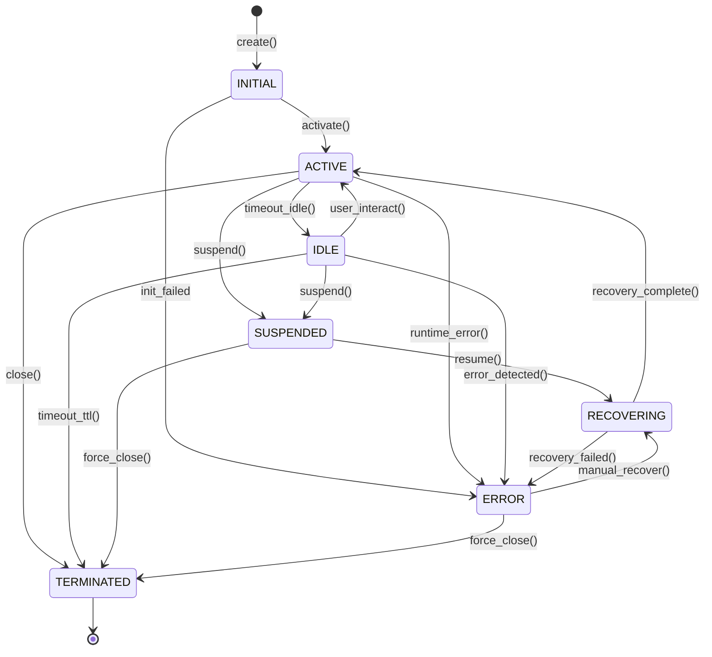
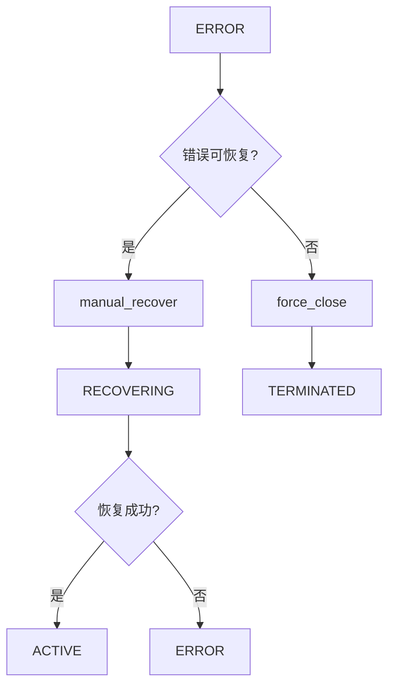

# Session 状态机文档

> 本文档定义了 Session 编排体系中的状态机模型，作为统一编排契约的基础。

## 1. 状态枚举定义

```python
class SessionState(Enum):
    """Session 生命周期状态枚举"""
    INITIAL      = "initial"       # 初始化态
    ACTIVE       = "active"        # 运行态
    IDLE         = "idle"          # 空闲态
    SUSPENDED    = "suspended"     # 挂起态
    RECOVERING   = "recovering"    # 恢复中态
    TERMINATED   = "terminated"    # 终止态
    ERROR        = "error"         # 错误态
```

### 1.1 状态语义

| 状态 | 语义描述 | 典型持续时间 |
|------|----------|--------------|
| `INITIAL` | Session 对象已创建，资源未分配 | < 1s |
| `ACTIVE` | Session 正常运行，上下文中 | 数分钟~数小时 |
| `IDLE` | 无活跃交互，但保持连接 | 数分钟 |
| `SUSPENDED` | 临时挂起，状态已持久化 | 数分钟~数小时 |
| `RECOVERING` | 断点恢复中，数据加载中 | < 10s |
| `TERMINATED` | 正常结束，资源已释放 | 即时 |
| `ERROR` | 异常状态，需要干预 | 需手动处理 |

## 2. 状态转换图



## 3. 状态转换矩阵

| 当前状态 | 目标状态 | 触发条件 | 前置条件 | 后置效果 |
|----------|----------|----------|----------|----------|
| `INITIAL` | `ACTIVE` | `activate()` | 资源配置完成 | 上下文初始化，事件发布 |
| `INITIAL` | `ERROR` | 初始化异常 | - | 错误信息记录，事件发布 |
| `ACTIVE` | `IDLE` | `timeout_idle()` | 无消息N秒 | 计时器启动，资源降级 |
| `ACTIVE` | `SUSPENDED` | `suspend()` | 显式调用 | 状态持久化，连接保持 |
| `ACTIVE` | `TERMINATED` | `close()` | 正常关闭 | 资源释放，事件发布 |
| `ACTIVE` | `ERROR` | 运行时异常 | - | 错误上下文保存 |
| `IDLE` | `ACTIVE` | `user_interact()` | 用户请求 | 上下文恢复，事件发布 |
| `IDLE` | `SUSPENDED` | `suspend()` | 显式调用 | 状态持久化 |
| `IDLE` | `TERMINATED` | `timeout_ttl()` | 超过最大TTL | 资源释放 |
| `IDLE` | `ERROR` | 错误检测 | - | 错误上下文保存 |
| `SUSPENDED` | `RECOVERING` | `resume()` | 恢复请求 | 加载持久化状态 |
| `SUSPENDED` | `TERMINATED` | `force_close()` | 强制关闭 | 资源释放 |
| `RECOVERING` | `ACTIVE` | 恢复成功 | 状态完整 | 上下文重建，事件发布 |
| `RECOVERING` | `ERROR` | 恢复失败 | 状态损坏 | 错误日志，告警 |
| `ERROR` | `RECOVERING` | `manual_recover()` | 手动干预 | 尝试恢复 |
| `ERROR` | `TERMINATED` | `force_close()` | 放弃恢复 | 资源释放 |
| `TERMINATED` | - | - | 最终状态 | 无 |

## 4. 触发场景覆盖

### 4.1 用户交互触发

| 场景 | 触发路径 | 状态转换 |
|------|----------|----------|
| 用户发起新Session | `create()` → `activate()` | INITIAL → ACTIVE |
| 用户继续已有Session | `resume()` → `recovery_complete()` | SUSPENDED → RECOVERING → ACTIVE |
| 用户超时空闲 | `timeout_idle()` | ACTIVE → IDLE |
| 用户重新交互 | `user_interact()` | IDLE → ACTIVE |

### 4.2 系统事件触发

| 场景 | 触发路径 | 状态转换 |
|------|----------|----------|
| WebSocket断连 | `on_disconnect()` | ACTIVE → SUSPENDED |
| WebSocket重连 | `on_reconnect()` | SUSPENDED → RECOVERING |
| TTL超时 | `timeout_ttl()` | IDLE → TERMINATED |
| 运行时异常 | `on_error()` | ACTIVE/IDLE → ERROR |

### 4.3 管理操作触发

| 场景 | 触发路径 | 状态转换 |
|------|----------|----------|
| 管理员挂起 | `suspend()` | ACTIVE/IDLE → SUSPENDED |
| 管理员恢复 | `resume()` | SUSPENDED → RECOVERING |
| 管理员强制关闭 | `force_close()` | SUSPENDED/ERROR → TERMINATED |

## 5. 状态转换事件

每种状态转换均应发布对应事件：

```python
class SessionStateTransitionEvent(SessionEvent):
    """状态转换事件"""
    fields = {
        "session_id": str,
        "from_state": SessionState,
        "to_state": SessionState,
        "trigger": str,           # 触发原因
        "trigger_source": str,    # 触发来源 (user/system/admin)
        "timestamp": datetime,
        "metadata": dict         # 额外上下文
    }
```

### 5.1 状态转换事件列表

| 事件类型 | 触发时机 | 审计级别 |
|----------|----------|----------|
| `session_created` | INITIAL 进入 | INFO |
| `session_activated` | INITIAL → ACTIVE | INFO |
| `session_idle` | ACTIVE → IDLE | DEBUG |
| `session_resumed` | IDLE → ACTIVE | INFO |
| `session_suspended` | ACTIVE/IDLE → SUSPENDED | WARN |
| `session_recovering` | SUSPENDED → RECOVERING | INFO |
| `session_recovered` | RECOVERING → ACTIVE | INFO |
| `session_error` | 任意 → ERROR | ERROR |
| `session_recovered_from_error` | ERROR → RECOVERING | WARN |
| `session_terminated` | 任意 → TERMINATED | INFO |

## 6. 异常处理规则

### 6.1 错误状态进入条件

```
进入ERROR状态的条件：
1. INITIAL 阶段初始化失败（资源配置、依赖注入）
2. ACTIVE 阶段运行时异常（消息处理、上下文更新）
3. IDLE 阶段检测到状态不一致
4. RECOVERING 阶段恢复失败（数据损坏、超时）
```

### 6.2 错误恢复流程



## 7. TTL 与超时策略

| 参数 | 默认值 | 可配置 | 说明 |
|------|--------|--------|------|
| `idle_timeout` | 300s | 是 | 空闲超时进入IDLE |
| `ttl_max` | 3600s | 是 | 最大生命周期 |
| `recovery_timeout` | 10s | 是 | 恢复操作超时 |
| `checkpoint_interval` | 60s | 是 | 持久化间隔 |

## 8. 实现约束

### 8.1 状态机实现要求

1. **单线程访问**: 同一Session的状态转换必须串行化
2. **幂等性**: `activate()` 在ACTIVE态应返回成功而非抛错
3. **超时保护**: RECOVERING 状态必须有时限，防止死锁
4. **事件发布**: 所有转换必须发布对应事件（同步或异步）

### 8.2 持久化要求

| 状态 | 持久化内容 |
|------|------------|
| SUSPENDED | 完整上下文 + 最后活跃时间 |
| RECOVERING | 加载中的checkpoint引用 |
| ERROR | 错误上下文 + 调用栈摘要 |

### 8.3 日志要求

| 级别 | 场景 |
|------|------|
| DEBUG | IDLE/ACTIVE 心跳 |
| INFO | 状态转换、用户交互 |
| WARN | SUSPENDED、ERROR进入 |
| ERROR | 系统异常、未处理错误 |

---

**文档版本**: 1.0  
**创建日期**: 2024  
**维护团队**: Polaris Session Team  
**下一步**: 本文档作为T2（数据契约）开发的基线参考
